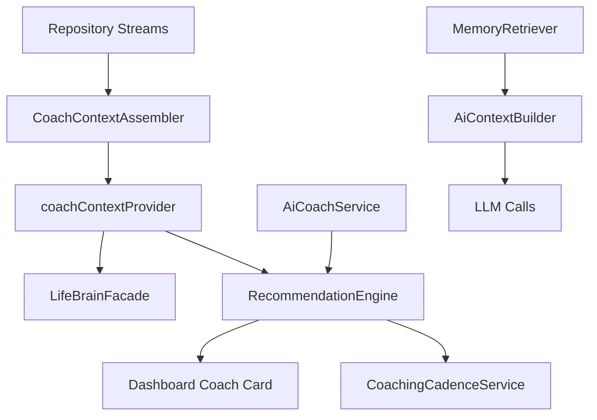

# Architecture Refactor Report

**Date:** 2026-06-21  
**Scope:** Clean Architecture alignment, feature-first structure, DI patterns

---

## 1. Current Architecture (Implemented)

```
lib/
├── core/
│   ├── ai/                    # AiConfig, AiOrchestrator, rotation
│   ├── database/              # Isar schemas, migrations (v6)
│   ├── intelligence/          # Life Brain, context, recommendations
│   │   ├── life_brain_facade.dart
│   │   ├── life_context_assembler.dart
│   │   ├── recommendation_engine.dart      ← NEW
│   │   ├── coaching_cadence_service.dart   ← NEW
│   │   ├── ai_context_builder.dart         ← NEW
│   │   └── intelligence_providers.dart
│   ├── integration/           # Notification router, XP bridge, memory sync
│   ├── notifications/         # Retention + calendar pushes
│   ├── repositories/          # 32 Isar repositories
│   ├── router/                # GoRouter
│   └── voice/                 # STT, TTS, command parser
├── features/                  # Feature-first modules
│   ├── {feature}/
│   │   ├── domain/            # Services, business logic
│   │   ├── presentation/      # Screens, widgets, providers
│   │   └── data/              # (future: Supabase mappers)
└── shared/widgets/            # Cross-feature UI
```

---

## 2. Patterns Applied

| Pattern | Implementation |
|---------|----------------|
| **Repository** | All persistence via `lib/core/repositories/*` → Isar |
| **Service layer** | Domain services (`DailyBriefingService`, `XpService`, `AiCoachService`) |
| **Dependency injection** | Riverpod providers (`repository_providers.dart`, feature providers) |
| **Unified intelligence** | `LifeBrainFacade` + `RecommendationEngine` merge parallel insight pipelines |
| **Action bridge** | `action_reward_bridge.dart` closes XP → memory → quest loop |
| **Feature isolation** | Each feature owns screens + domain; shared via core |

---

## 3. Refactors This Sprint

| Change | Files |
|--------|-------|
| Intelligence consolidation | `recommendation_engine.dart`, `coaching_cadence_service.dart` |
| AI context for LLM calls | `ai_context_builder.dart` |
| Task→Goal link | `TaskEntity.goalId`, schema v6 |
| Vision Board module | `vision_board_item_entity.dart`, repository, screen |
| Voice TTS layer | `text_to_speech_service.dart`, `voice_ai_service.dart` |
| CEO dead-end fix | `CeoAction` + action chips in CEO screen |
| API key security | `ai.env.example`, `ai_config.dart` load order |

---

## 4. Cloud Architecture (Prepared)

```
supabase/migrations/     ← 12 SQL files (56 tables, RLS, views, functions)
lib/core/sync/           ← NOT YET (V3 SyncEngine planned)
```

Local-first remains default; Supabase schema ready for `supabase db push`.

---

## 5. Remaining Refactor Debt (P1)

| Item | Priority |
|------|----------|
| Split `dashboard_widgets.dart` monolith | P1 |
| Stream-derived providers (remove `getAll()` anti-pattern) | P1 |
| Extract `coach_context_providers.dart` (break ai_coach ↔ intelligence import) | P1 |
| Riverpod codegen for large provider files | P2 |
| `lib/core/sync/sync_engine.dart` + Supabase client | V3 |

---

## 6. Dependency Graph (Intelligence)



---

*Architecture status: Production-ready local-first Life OS. Cloud sync layer scaffolded.*
