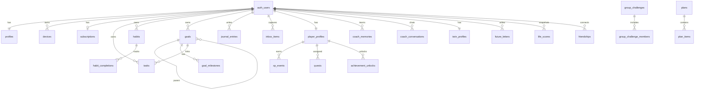

# REJABON AI — Database Architecture

**Version:** 6.1 (Phase 6 + Retention Engine Schema)  
**Date:** 2026-06-21  
**Status:** Canonical database specification  
**Companion:** `PRODUCT_STRATEGY.md`, `LIFE_RPG_SYSTEM.md`, `AI_COACH_SYSTEM.md`, `UI_UX_REDESIGN.md`, `docs/FEATURE_ROADMAP.md`

---

## Table of Contents

1. [Executive Summary](#1-executive-summary)
2. [Architecture Overview](#2-architecture-overview)
3. [Conventions & Types](#3-conventions--types)
4. [Schema Domains](#4-schema-domains)
5. [Entity Relationship Diagram](#5-entity-relationship-diagram)
6. [Tables — Complete DDL](#6-tables--complete-ddl)
7. [Indexes](#7-indexes)
8. [Views](#8-views)
9. [Functions](#9-functions)
10. [Triggers](#10-triggers)
11. [Row Level Security](#11-row-level-security)
12. [Storage Buckets](#12-storage-buckets)
13. [Realtime Subscriptions](#13-realtime-subscriptions)
14. [Sync Strategy](#14-sync-strategy)
15. [Isar → PostgreSQL Mapping](#15-isar--postgresql-mapping)
16. [Migration & Rollout](#16-migration--rollout)
17. [Security & Compliance](#17-security--compliance)
18. [Phase 6 Implementation Sprints](#18-phase-6-implementation-sprints)
19. [Retention Engine — Local & Cloud Schema](#19-retention-engine--local--cloud-schema)

---

## 1. Executive Summary

REJABON AI is **offline-first** today: **32 Isar collections** on device, zero Supabase wiring in Dart. Phase 6 defines the **complete PostgreSQL schema** for Supabase that:

- Maps every shipped Isar entity to a cloud table
- Normalizes embedded arrays (habit completions, plan items, milestones) for sync
- Adds aggregate tables (`life_scores`, `habit_completions`) missing locally
- Enforces **RLS on every user table** — no exceptions
- Supports **last-write-wins** sync with `updated_at` + soft deletes
- Enables **social (V4)** and **premium** without schema churn

**Deploy target:** Supabase project `rejabon-ai` — schema `public`, extensions `pgcrypto`, `uuid-ossp`.

---

## 2. Architecture Overview

### 2.1 Current (V1 — Local)

```
Flutter App → Riverpod → Repositories → Isar (32 collections)
```

### 2.2 Target (V3 — Hybrid Sync)

```
┌─────────────────────────────────────────────────────────────┐
│                      Flutter App                             │
│  Isar (offline cache)  ←→  SyncEngine  ←→  Supabase Client  │
└──────────────────────────────┬──────────────────────────────┘
                               │
┌──────────────────────────────▼──────────────────────────────┐
│                    Supabase Platform                         │
│  Auth │ PostgreSQL + RLS │ Realtime │ Storage │ Edge Fns   │
└─────────────────────────────────────────────────────────────┘
```

### 2.3 Authority Rules

| Data class | Offline authority | Online authority | Conflict |
|------------|-------------------|------------------|----------|
| Tasks, habits, goals, notes | Client | Client LWW | `updated_at` wins |
| Journal (1/day) | Client | Client merge | Mood max; content append |
| Player profile, XP | Client (solo) | Server (social) | Server wins level for leaderboards |
| Inbox | Client | Client until processed | Client wins |
| Future letters | Client | Immutable after create | No conflict |
| Life scores | Server computed | Server | Server only |
| Subscriptions | Server | Server | Server only |

### 2.4 Schema Organization

| Domain | Tables | Phase |
|--------|--------|-------|
| Core / Auth | `profiles`, `devices`, `subscriptions` | V3 |
| Productivity | `tasks`, `habits`, `habit_completions`, `goals`, `goal_milestones` | V3 |
| Knowledge | `notes`, `journal_entries`, `documents`, `inbox_items` | V3 |
| Life modules | `finance_transactions`, `workouts`, `study_subjects`, `study_sessions`, `calendar_events`, `plans`, `plan_items`, `monthly_focus`, `time_logs`, `milestones` | V3 |
| RPG | `player_profiles`, `xp_events`, `quests`, `achievement_unlocks`, `badge_unlocks`, `skill_nodes`, `boss_challenges` | V3 |
| Coach / AI | `coach_memories`, `coach_conversations`, `coach_commitments`, `coach_preferences`, `coach_advice_logs`, `twin_profiles` | V3–V4 |
| Future Self | `future_letters`, `vision_board_items`, `action_plans` | V3 |
| Analytics | `life_scores`, `life_area_scores`, `focus_sessions` | V3 |
| **Retention** | `daily_briefing_logs`, `emotion_snapshots`, `emergency_sessions`, `activity_heatmap_days`, `memory_retrieval_logs` | V3 |
| Social | `friendships`, `partnerships`, `friend_challenges`, `group_challenges`, `group_challenge_members`, `referrals`, `social_settings` | V4 |
| Sync meta | `sync_cursors`, `sync_tombstones` | V3 |

**Total: 56 tables + 12 views + 18 functions**

---

## 3. Conventions & Types

### 3.1 Column Standards

Every user-owned mutable table includes:

```sql
id            UUID PRIMARY KEY DEFAULT gen_random_uuid()
user_id       UUID NOT NULL REFERENCES auth.users(id) ON DELETE CASCADE
created_at    TIMESTAMPTZ NOT NULL DEFAULT now()
updated_at    TIMESTAMPTZ NOT NULL DEFAULT now()
deleted_at    TIMESTAMPTZ          -- soft delete (nullable)
local_id      INTEGER              -- Isar int PK for migration
device_id     UUID REFERENCES devices(id) ON DELETE SET NULL
sync_version  INTEGER NOT NULL DEFAULT 1
```

### 3.2 Enum Types (PostgreSQL)

```sql
CREATE TYPE priority_level AS ENUM ('low', 'medium', 'high');
CREATE TYPE habit_frequency AS ENUM ('daily', 'weekdays', 'weekly', 'custom');
CREATE TYPE finance_tx_type AS ENUM ('income', 'expense');
CREATE TYPE inbox_status AS ENUM ('pending', 'accepted', 'processed', 'archived');
CREATE TYPE capture_type AS ENUM ('note', 'voice', 'photo', 'link', 'document', 'idea');
CREATE TYPE quest_type AS ENUM ('daily', 'weekly', 'boss', 'welcome');
CREATE TYPE stat_type AS ENUM ('discipline', 'focus', 'health', 'knowledge', 'wealth', 'social', 'spiritual');
CREATE TYPE friendship_status AS ENUM ('pending', 'accepted', 'blocked');
CREATE TYPE subscription_tier AS ENUM ('free', 'premium', 'pro');
CREATE TYPE coach_role AS ENUM ('user', 'coach', 'system');
CREATE TYPE life_horizon AS ENUM ('1m', '3m', '6m', '1y', '5y');
```

### 3.3 Extensions

```sql
CREATE EXTENSION IF NOT EXISTS "pgcrypto";
CREATE EXTENSION IF NOT EXISTS "uuid-ossp";
-- Optional: pg_cron for scheduled letter unlocks (Supabase Pro)
```

---

## 4. Schema Domains

### 4.1 Table Inventory

| # | Table | Isar source | Sync | RLS |
|---|-------|-------------|------|-----|
| 1 | `profiles` | settings + onboarding | bidirectional | own |
| 2 | `devices` | new | client register | own |
| 3 | `subscriptions` | new | server | own read |
| 4 | `tasks` | TaskEntity | bidirectional | own |
| 5 | `habits` | HabitEntity | bidirectional | own |
| 6 | `habit_completions` | HabitEntity.completedDates | bidirectional | own |
| 7 | `goals` | GoalEntity | bidirectional | own |
| 8 | `goal_milestones` | MilestoneEmbedded | bidirectional | own |
| 9 | `notes` | NoteEntity | bidirectional | own |
| 10 | `journal_entries` | JournalEntryEntity | bidirectional | own |
| 11 | `documents` | DocumentEntity | bidirectional | own |
| 12 | `inbox_items` | InboxItemEntity | client-first | own |
| 13 | `finance_transactions` | FinanceTransactionEntity | bidirectional | own |
| 14 | `workouts` | WorkoutEntity | bidirectional | own |
| 15 | `study_subjects` | StudySubjectEntity | bidirectional | own |
| 16 | `study_sessions` | StudySessionEntity | bidirectional | own |
| 17 | `calendar_events` | CalendarEventEntity | bidirectional | own |
| 18 | `plans` | PlanEntity | bidirectional | own |
| 19 | `plan_items` | PlanItemEmbedded | bidirectional | own |
| 20 | `monthly_focus` | MonthlyFocusEntity | bidirectional | own |
| 21 | `time_logs` | TimeLogEntity | bidirectional | own |
| 22 | `milestones` | MilestoneEntity | bidirectional | own |
| 23 | `challenges` | ChallengeEntity | bidirectional | own |
| 24 | `player_profiles` | PlayerProfileEntity | bidirectional | own + friends read |
| 25 | `xp_events` | XpEventEntity | append-only | own |
| 26 | `quests` | QuestEntity | bidirectional | own |
| 27 | `achievement_unlocks` | AchievementUnlockEntity | append-only | own + friends read |
| 28 | `badge_unlocks` | BadgeUnlockEntity (V3) | append-only | own |
| 29 | `skill_nodes` | SkillNodeEntity (V3) | bidirectional | own |
| 30 | `boss_challenges` | BossChallengeEntity (V3) | bidirectional | own |
| 31 | `coach_memories` | AiMemoryEntity | bidirectional | own |
| 32 | `coach_conversations` | CoachConversationEntity | bidirectional | own |
| 33 | `coach_commitments` | new (AI_COACH_SYSTEM) | bidirectional | own |
| 34 | `coach_preferences` | new | bidirectional | own |
| 35 | `coach_advice_logs` | new | append-only | own |
| 36 | `twin_profiles` | TwinProfileEntity | bidirectional | own |
| 37 | `future_letters` | FutureLetterEntity | client-create | own |
| 38 | `vision_board_items` | new | bidirectional | own |
| 39 | `action_plans` | ActionPlanEntity | bidirectional | own |
| 40 | `life_scores` | computed | server | own |
| 41 | `life_area_scores` | computed | server | own |
| 42 | `focus_sessions` | new | bidirectional | own |
| 43 | `friendships` | new | bidirectional | participant |
| 44 | `partnerships` | PartnershipEntity | bidirectional | participant |
| 45 | `friend_challenges` | FriendChallengeEntity | bidirectional | participant |
| 46 | `group_challenges` | GroupChallengeEntity | bidirectional | member |
| 47 | `group_challenge_members` | new | bidirectional | member |
| 48 | `referrals` | ReferralEntity | server | own |
| 49 | `social_settings` | SocialSettingsEntity | bidirectional | own |
| 50 | `sync_cursors` | new | client | own |
| 51 | `sync_tombstones` | new | bidirectional | own |
| 52 | `daily_briefing_logs` | computed (V1.6) | append-only | own |
| 53 | `emotion_snapshots` | computed (V1.6) | append-only | own |
| 54 | `emergency_sessions` | computed (V1.6) | append-only | own |
| 55 | `activity_heatmap_days` | computed view | server | own |
| 56 | `memory_retrieval_logs` | AiMemoryEntity refs | append-only | own |

---

## 5. Entity Relationship Diagram



---

## 6. Tables — Complete DDL

> **File:** `supabase/migrations/20260621000000_initial_schema.sql`  
> Run sections in order. All tables enable RLS in [Section 11](#11-row-level-security).

### 6.1 Bootstrap

```sql
-- supabase/migrations/00001_extensions_and_types.sql

CREATE EXTENSION IF NOT EXISTS "pgcrypto";

CREATE TYPE priority_level AS ENUM ('low', 'medium', 'high');
CREATE TYPE habit_frequency AS ENUM ('daily', 'weekdays', 'weekly', 'custom');
CREATE TYPE finance_tx_type AS ENUM ('income', 'expense');
CREATE TYPE inbox_status AS ENUM ('pending', 'accepted', 'processed', 'archived');
CREATE TYPE capture_type AS ENUM ('note', 'voice', 'photo', 'link', 'document', 'idea');
CREATE TYPE quest_type AS ENUM ('daily', 'weekly', 'boss', 'welcome');
CREATE TYPE stat_type AS ENUM ('discipline', 'focus', 'health', 'knowledge', 'wealth', 'social', 'spiritual');
CREATE TYPE friendship_status AS ENUM ('pending', 'accepted', 'blocked');
CREATE TYPE subscription_tier AS ENUM ('free', 'premium', 'pro');
CREATE TYPE coach_role AS ENUM ('user', 'coach', 'system');
CREATE TYPE life_horizon AS ENUM ('1m', '3m', '6m', '1y', '5y');
```

### 6.2 Core — Profiles, Devices, Subscriptions

```sql
-- profiles: extends auth.users (1:1)
CREATE TABLE profiles (
  id              UUID PRIMARY KEY DEFAULT gen_random_uuid(),
  user_id         UUID NOT NULL UNIQUE REFERENCES auth.users(id) ON DELETE CASCADE,
  display_name    TEXT NOT NULL DEFAULT '',
  locale          TEXT NOT NULL DEFAULT 'uz',
  persona         TEXT CHECK (persona IN ('student','professional','health','finance','wellness','all')),
  focus_areas     TEXT[] DEFAULT '{}',
  avatar_emoji    TEXT DEFAULT '🧙',
  onboarding_completed_at TIMESTAMPTZ,
  settings        JSONB NOT NULL DEFAULT '{}',
  created_at      TIMESTAMPTZ NOT NULL DEFAULT now(),
  updated_at      TIMESTAMPTZ NOT NULL DEFAULT now()
);

CREATE TABLE devices (
  id              UUID PRIMARY KEY DEFAULT gen_random_uuid(),
  user_id         UUID NOT NULL REFERENCES auth.users(id) ON DELETE CASCADE,
  device_name     TEXT,
  platform        TEXT CHECK (platform IN ('android','ios','web','desktop')),
  app_version     TEXT,
  last_sync_at    TIMESTAMPTZ,
  push_token      TEXT,
  is_active       BOOLEAN NOT NULL DEFAULT TRUE,
  created_at      TIMESTAMPTZ NOT NULL DEFAULT now(),
  updated_at      TIMESTAMPTZ NOT NULL DEFAULT now(),
  UNIQUE(user_id, device_name)
);

CREATE TABLE subscriptions (
  id              UUID PRIMARY KEY DEFAULT gen_random_uuid(),
  user_id         UUID NOT NULL UNIQUE REFERENCES auth.users(id) ON DELETE CASCADE,
  tier            subscription_tier NOT NULL DEFAULT 'free',
  expires_at      TIMESTAMPTZ,
  provider        TEXT,
  external_id     TEXT,
  metadata        JSONB DEFAULT '{}',
  created_at      TIMESTAMPTZ NOT NULL DEFAULT now(),
  updated_at      TIMESTAMPTZ NOT NULL DEFAULT now()
);
```

### 6.3 Productivity

```sql
CREATE TABLE tasks (
  id                      UUID PRIMARY KEY DEFAULT gen_random_uuid(),
  user_id                 UUID NOT NULL REFERENCES auth.users(id) ON DELETE CASCADE,
  title                   TEXT NOT NULL,
  emoji                   TEXT DEFAULT '',
  description             TEXT,
  is_completed            BOOLEAN NOT NULL DEFAULT FALSE,
  priority                priority_level NOT NULL DEFAULT 'medium',
  category                TEXT NOT NULL DEFAULT 'general',
  life_area_ids           TEXT[] NOT NULL DEFAULT '{}',
  due_date                TIMESTAMPTZ,
  completed_at            TIMESTAMPTZ,
  goal_id                 UUID REFERENCES goals(id) ON DELETE SET NULL,
  recurrence_type         TEXT NOT NULL DEFAULT 'none',
  recurrence_template_id  UUID REFERENCES tasks(id) ON DELETE SET NULL,
  next_recurrence_date    TIMESTAMPTZ,
  recurrence_days         INTEGER[] DEFAULT '{}',
  postpone_count          INTEGER NOT NULL DEFAULT 0,
  local_id                INTEGER,
  device_id               UUID REFERENCES devices(id) ON DELETE SET NULL,
  sync_version            INTEGER NOT NULL DEFAULT 1,
  created_at              TIMESTAMPTZ NOT NULL DEFAULT now(),
  updated_at              TIMESTAMPTZ NOT NULL DEFAULT now(),
  deleted_at              TIMESTAMPTZ
);

CREATE TABLE habits (
  id              UUID PRIMARY KEY DEFAULT gen_random_uuid(),
  user_id         UUID NOT NULL REFERENCES auth.users(id) ON DELETE CASCADE,
  name            TEXT NOT NULL,
  emoji           TEXT DEFAULT '',
  icon            TEXT DEFAULT 'check_circle',
  color           INTEGER NOT NULL DEFAULT 4280391411,
  life_area_ids   TEXT[] NOT NULL DEFAULT '{}',
  frequency_type  habit_frequency NOT NULL DEFAULT 'daily',
  target_per_week INTEGER NOT NULL DEFAULT 7,
  active_days     INTEGER[] DEFAULT '{}',
  current_streak  INTEGER NOT NULL DEFAULT 0,
  longest_streak  INTEGER NOT NULL DEFAULT 0,
  local_id        INTEGER,
  device_id       UUID REFERENCES devices(id) ON DELETE SET NULL,
  sync_version    INTEGER NOT NULL DEFAULT 1,
  created_at      TIMESTAMPTZ NOT NULL DEFAULT now(),
  updated_at      TIMESTAMPTZ NOT NULL DEFAULT now(),
  deleted_at      TIMESTAMPTZ
);

CREATE TABLE habit_completions (
  id              UUID PRIMARY KEY DEFAULT gen_random_uuid(),
  user_id         UUID NOT NULL REFERENCES auth.users(id) ON DELETE CASCADE,
  habit_id        UUID NOT NULL REFERENCES habits(id) ON DELETE CASCADE,
  completed_date  DATE NOT NULL,
  xp_awarded      INTEGER DEFAULT 0,
  local_id        INTEGER,
  created_at      TIMESTAMPTZ NOT NULL DEFAULT now(),
  UNIQUE(user_id, habit_id, completed_date)
);

CREATE TABLE goals (
  id              UUID PRIMARY KEY DEFAULT gen_random_uuid(),
  user_id         UUID NOT NULL REFERENCES auth.users(id) ON DELETE CASCADE,
  title           TEXT NOT NULL,
  emoji           TEXT DEFAULT '',
  description     TEXT,
  progress        REAL NOT NULL DEFAULT 0 CHECK (progress BETWEEN 0 AND 100),
  life_area_ids   TEXT[] NOT NULL DEFAULT '{}',
  horizon         life_horizon,
  parent_goal_id  UUID REFERENCES goals(id) ON DELETE SET NULL,
  target_date     TIMESTAMPTZ,
  is_completed    BOOLEAN NOT NULL DEFAULT FALSE,
  completed_at    TIMESTAMPTZ,
  local_id        INTEGER,
  device_id       UUID REFERENCES devices(id) ON DELETE SET NULL,
  sync_version    INTEGER NOT NULL DEFAULT 1,
  created_at      TIMESTAMPTZ NOT NULL DEFAULT now(),
  updated_at      TIMESTAMPTZ NOT NULL DEFAULT now(),
  deleted_at      TIMESTAMPTZ
);

-- Add FK from tasks.goal_id after goals exists
ALTER TABLE tasks ADD CONSTRAINT tasks_goal_id_fkey
  FOREIGN KEY (goal_id) REFERENCES goals(id) ON DELETE SET NULL;

CREATE TABLE goal_milestones (
  id              UUID PRIMARY KEY DEFAULT gen_random_uuid(),
  user_id         UUID NOT NULL REFERENCES auth.users(id) ON DELETE CASCADE,
  goal_id         UUID NOT NULL REFERENCES goals(id) ON DELETE CASCADE,
  title           TEXT NOT NULL,
  sort_order      INTEGER NOT NULL DEFAULT 0,
  is_completed    BOOLEAN NOT NULL DEFAULT FALSE,
  completed_at    TIMESTAMPTZ,
  local_id        INTEGER,
  created_at      TIMESTAMPTZ NOT NULL DEFAULT now(),
  updated_at      TIMESTAMPTZ NOT NULL DEFAULT now()
);
```

### 6.4 Knowledge & Capture

```sql
CREATE TABLE notes (
  id              UUID PRIMARY KEY DEFAULT gen_random_uuid(),
  user_id         UUID NOT NULL REFERENCES auth.users(id) ON DELETE CASCADE,
  title           TEXT NOT NULL,
  emoji           TEXT DEFAULT '',
  content         TEXT NOT NULL DEFAULT '',
  tags            TEXT[] DEFAULT '{}',
  item_type       TEXT NOT NULL DEFAULT 'note',
  source_url      TEXT,
  category        TEXT NOT NULL DEFAULT 'umumiy',
  life_area_ids   TEXT[] DEFAULT '{}',
  is_favorite     BOOLEAN NOT NULL DEFAULT FALSE,
  local_id        INTEGER,
  device_id       UUID REFERENCES devices(id) ON DELETE SET NULL,
  sync_version    INTEGER NOT NULL DEFAULT 1,
  created_at      TIMESTAMPTZ NOT NULL DEFAULT now(),
  updated_at      TIMESTAMPTZ NOT NULL DEFAULT now(),
  deleted_at      TIMESTAMPTZ
);

CREATE TABLE journal_entries (
  id              UUID PRIMARY KEY DEFAULT gen_random_uuid(),
  user_id         UUID NOT NULL REFERENCES auth.users(id) ON DELETE CASCADE,
  entry_date      DATE NOT NULL,
  content         TEXT NOT NULL DEFAULT '',
  mood            INTEGER NOT NULL DEFAULT 3 CHECK (mood BETWEEN 1 AND 5),
  stress_level    INTEGER CHECK (stress_level BETWEEN 1 AND 5),
  energy_level    INTEGER CHECK (energy_level BETWEEN 1 AND 5),
  ai_tags         TEXT[] DEFAULT '{}',
  local_id        INTEGER,
  device_id       UUID REFERENCES devices(id) ON DELETE SET NULL,
  sync_version    INTEGER NOT NULL DEFAULT 1,
  created_at      TIMESTAMPTZ NOT NULL DEFAULT now(),
  updated_at      TIMESTAMPTZ NOT NULL DEFAULT now(),
  deleted_at      TIMESTAMPTZ,
  UNIQUE(user_id, entry_date)
);

CREATE TABLE documents (
  id              UUID PRIMARY KEY DEFAULT gen_random_uuid(),
  user_id         UUID NOT NULL REFERENCES auth.users(id) ON DELETE CASCADE,
  title           TEXT NOT NULL,
  file_name       TEXT,
  mime_type       TEXT,
  storage_path    TEXT,
  size_bytes      BIGINT,
  tags            TEXT[] DEFAULT '{}',
  local_id        INTEGER,
  device_id       UUID REFERENCES devices(id) ON DELETE SET NULL,
  sync_version    INTEGER NOT NULL DEFAULT 1,
  created_at      TIMESTAMPTZ NOT NULL DEFAULT now(),
  updated_at      TIMESTAMPTZ NOT NULL DEFAULT now(),
  deleted_at      TIMESTAMPTZ
);

CREATE TABLE inbox_items (
  id                UUID PRIMARY KEY DEFAULT gen_random_uuid(),
  user_id           UUID NOT NULL REFERENCES auth.users(id) ON DELETE CASCADE,
  title             TEXT NOT NULL,
  body              TEXT NOT NULL DEFAULT '',
  capture_type      capture_type NOT NULL DEFAULT 'note',
  status            inbox_status NOT NULL DEFAULT 'pending',
  suggested_action  TEXT,
  source_url        TEXT,
  emoji             TEXT DEFAULT '📥',
  processed_entity_id UUID,
  processed_entity_type TEXT,
  local_id          INTEGER,
  device_id         UUID REFERENCES devices(id) ON DELETE SET NULL,
  sync_version      INTEGER NOT NULL DEFAULT 1,
  created_at        TIMESTAMPTZ NOT NULL DEFAULT now(),
  updated_at        TIMESTAMPTZ NOT NULL DEFAULT now(),
  deleted_at        TIMESTAMPTZ
);
```

### 6.5 Life Modules

```sql
CREATE TABLE finance_transactions (
  id              UUID PRIMARY KEY DEFAULT gen_random_uuid(),
  user_id         UUID NOT NULL REFERENCES auth.users(id) ON DELETE CASCADE,
  tx_type         finance_tx_type NOT NULL,
  amount          NUMERIC(14,2) NOT NULL CHECK (amount >= 0),
  category        TEXT NOT NULL,
  description     TEXT,
  tx_date         DATE NOT NULL DEFAULT CURRENT_DATE,
  local_id        INTEGER,
  device_id       UUID REFERENCES devices(id) ON DELETE SET NULL,
  sync_version    INTEGER NOT NULL DEFAULT 1,
  created_at      TIMESTAMPTZ NOT NULL DEFAULT now(),
  updated_at      TIMESTAMPTZ NOT NULL DEFAULT now(),
  deleted_at      TIMESTAMPTZ
);

CREATE TABLE workouts (
  id              UUID PRIMARY KEY DEFAULT gen_random_uuid(),
  user_id         UUID NOT NULL REFERENCES auth.users(id) ON DELETE CASCADE,
  workout_type    TEXT NOT NULL,
  duration_minutes INTEGER,
  calories        INTEGER,
  notes           TEXT,
  workout_date    DATE NOT NULL DEFAULT CURRENT_DATE,
  local_id        INTEGER,
  device_id       UUID REFERENCES devices(id) ON DELETE SET NULL,
  sync_version    INTEGER NOT NULL DEFAULT 1,
  created_at      TIMESTAMPTZ NOT NULL DEFAULT now(),
  updated_at      TIMESTAMPTZ NOT NULL DEFAULT now(),
  deleted_at      TIMESTAMPTZ
);

CREATE TABLE study_subjects (
  id              UUID PRIMARY KEY DEFAULT gen_random_uuid(),
  user_id         UUID NOT NULL REFERENCES auth.users(id) ON DELETE CASCADE,
  name            TEXT NOT NULL,
  emoji           TEXT DEFAULT '📚',
  color           INTEGER,
  total_minutes   INTEGER NOT NULL DEFAULT 0,
  local_id        INTEGER,
  device_id       UUID REFERENCES devices(id) ON DELETE SET NULL,
  sync_version    INTEGER NOT NULL DEFAULT 1,
  created_at      TIMESTAMPTZ NOT NULL DEFAULT now(),
  updated_at      TIMESTAMPTZ NOT NULL DEFAULT now(),
  deleted_at      TIMESTAMPTZ
);

CREATE TABLE study_sessions (
  id              UUID PRIMARY KEY DEFAULT gen_random_uuid(),
  user_id         UUID NOT NULL REFERENCES auth.users(id) ON DELETE CASCADE,
  subject_id      UUID NOT NULL REFERENCES study_subjects(id) ON DELETE CASCADE,
  duration_minutes INTEGER NOT NULL,
  notes           TEXT,
  session_date    DATE NOT NULL DEFAULT CURRENT_DATE,
  local_id        INTEGER,
  created_at      TIMESTAMPTZ NOT NULL DEFAULT now(),
  updated_at      TIMESTAMPTZ NOT NULL DEFAULT now()
);

CREATE TABLE calendar_events (
  id              UUID PRIMARY KEY DEFAULT gen_random_uuid(),
  user_id         UUID NOT NULL REFERENCES auth.users(id) ON DELETE CASCADE,
  title           TEXT NOT NULL,
  description     TEXT,
  start_time      TIMESTAMPTZ NOT NULL,
  end_time        TIMESTAMPTZ NOT NULL,
  is_all_day      BOOLEAN NOT NULL DEFAULT FALSE,
  recurrence_rule TEXT,
  local_id        INTEGER,
  device_id       UUID REFERENCES devices(id) ON DELETE SET NULL,
  sync_version    INTEGER NOT NULL DEFAULT 1,
  created_at      TIMESTAMPTZ NOT NULL DEFAULT now(),
  updated_at      TIMESTAMPTZ NOT NULL DEFAULT now(),
  deleted_at      TIMESTAMPTZ
);

CREATE TABLE plans (
  id              UUID PRIMARY KEY DEFAULT gen_random_uuid(),
  user_id         UUID NOT NULL REFERENCES auth.users(id) ON DELETE CASCADE,
  plan_date       DATE NOT NULL,
  source_text     TEXT,
  life_area_ids   TEXT[] DEFAULT '{}',
  local_id        INTEGER,
  device_id       UUID REFERENCES devices(id) ON DELETE SET NULL,
  sync_version    INTEGER NOT NULL DEFAULT 1,
  created_at      TIMESTAMPTZ NOT NULL DEFAULT now(),
  updated_at      TIMESTAMPTZ NOT NULL DEFAULT now(),
  deleted_at      TIMESTAMPTZ,
  UNIQUE(user_id, plan_date)
);

CREATE TABLE plan_items (
  id              UUID PRIMARY KEY DEFAULT gen_random_uuid(),
  user_id         UUID NOT NULL REFERENCES auth.users(id) ON DELETE CASCADE,
  plan_id         UUID NOT NULL REFERENCES plans(id) ON DELETE CASCADE,
  title           TEXT NOT NULL,
  emoji           TEXT DEFAULT '',
  start_time      TIMESTAMPTZ NOT NULL,
  duration_minutes INTEGER NOT NULL DEFAULT 30,
  is_completed    BOOLEAN NOT NULL DEFAULT FALSE,
  is_missed       BOOLEAN NOT NULL DEFAULT FALSE,
  category        TEXT DEFAULT 'general',
  sort_order      INTEGER NOT NULL DEFAULT 0,
  local_id        INTEGER,
  created_at      TIMESTAMPTZ NOT NULL DEFAULT now(),
  updated_at      TIMESTAMPTZ NOT NULL DEFAULT now()
);

CREATE TABLE monthly_focus (
  id              UUID PRIMARY KEY DEFAULT gen_random_uuid(),
  user_id         UUID NOT NULL REFERENCES auth.users(id) ON DELETE CASCADE,
  focus_month     DATE NOT NULL,
  title           TEXT NOT NULL,
  description     TEXT,
  goal_ids        UUID[] DEFAULT '{}',
  local_id        INTEGER,
  created_at      TIMESTAMPTZ NOT NULL DEFAULT now(),
  updated_at      TIMESTAMPTZ NOT NULL DEFAULT now(),
  UNIQUE(user_id, focus_month)
);

CREATE TABLE time_logs (
  id                UUID PRIMARY KEY DEFAULT gen_random_uuid(),
  user_id           UUID NOT NULL REFERENCES auth.users(id) ON DELETE CASCADE,
  session_type      TEXT NOT NULL,
  duration_seconds  INTEGER NOT NULL CHECK (duration_seconds > 0),
  started_at        TIMESTAMPTZ NOT NULL,
  ended_at          TIMESTAMPTZ NOT NULL,
  label             TEXT,
  notes             TEXT,
  from_timer        BOOLEAN NOT NULL DEFAULT TRUE,
  life_area_id      TEXT,
  task_id           UUID REFERENCES tasks(id) ON DELETE SET NULL,
  local_id          INTEGER,
  device_id         UUID REFERENCES devices(id) ON DELETE SET NULL,
  sync_version      INTEGER NOT NULL DEFAULT 1,
  created_at        TIMESTAMPTZ NOT NULL DEFAULT now(),
  updated_at        TIMESTAMPTZ NOT NULL DEFAULT now(),
  deleted_at        TIMESTAMPTZ
);

CREATE TABLE milestones (
  id              UUID PRIMARY KEY DEFAULT gen_random_uuid(),
  user_id         UUID NOT NULL REFERENCES auth.users(id) ON DELETE CASCADE,
  title           TEXT NOT NULL,
  description     TEXT,
  milestone_date  DATE NOT NULL,
  emoji           TEXT,
  category        TEXT,
  local_id        INTEGER,
  created_at      TIMESTAMPTZ NOT NULL DEFAULT now(),
  updated_at      TIMESTAMPTZ NOT NULL DEFAULT now()
);

CREATE TABLE challenges (
  id              UUID PRIMARY KEY DEFAULT gen_random_uuid(),
  user_id         UUID NOT NULL REFERENCES auth.users(id) ON DELETE CASCADE,
  title           TEXT NOT NULL,
  description     TEXT,
  target_value    INTEGER NOT NULL,
  current_value   INTEGER NOT NULL DEFAULT 0,
  starts_at       TIMESTAMPTZ NOT NULL,
  ends_at         TIMESTAMPTZ NOT NULL,
  is_completed    BOOLEAN NOT NULL DEFAULT FALSE,
  local_id        INTEGER,
  created_at      TIMESTAMPTZ NOT NULL DEFAULT now(),
  updated_at      TIMESTAMPTZ NOT NULL DEFAULT now()
);
```

### 6.6 RPG & Gamification

```sql
CREATE TABLE player_profiles (
  id                UUID PRIMARY KEY DEFAULT gen_random_uuid(),
  user_id           UUID NOT NULL UNIQUE REFERENCES auth.users(id) ON DELETE CASCADE,
  total_xp          INTEGER NOT NULL DEFAULT 0,
  level             INTEGER NOT NULL DEFAULT 1 CHECK (level BETWEEN 1 AND 100),
  stat_discipline   INTEGER NOT NULL DEFAULT 0,
  stat_focus        INTEGER NOT NULL DEFAULT 0,
  stat_health       INTEGER NOT NULL DEFAULT 0,
  stat_knowledge    INTEGER NOT NULL DEFAULT 0,
  stat_wealth       INTEGER NOT NULL DEFAULT 0,
  stat_social       INTEGER NOT NULL DEFAULT 0,
  stat_spiritual    INTEGER NOT NULL DEFAULT 0,
  avatar_emoji      TEXT DEFAULT '🧙',
  title             TEXT DEFAULT 'Hayot o''rganuvchisi',
  last_xp_earned_at TIMESTAMPTZ,
  local_id          INTEGER,
  sync_version      INTEGER NOT NULL DEFAULT 1,
  created_at        TIMESTAMPTZ NOT NULL DEFAULT now(),
  updated_at        TIMESTAMPTZ NOT NULL DEFAULT now()
);

CREATE TABLE xp_events (
  id              UUID PRIMARY KEY DEFAULT gen_random_uuid(),
  user_id         UUID NOT NULL REFERENCES auth.users(id) ON DELETE CASCADE,
  stat_type       stat_type NOT NULL,
  amount          INTEGER NOT NULL CHECK (amount > 0),
  source          TEXT NOT NULL,
  source_id       TEXT,
  description     TEXT,
  earned_at       TIMESTAMPTZ NOT NULL DEFAULT now(),
  local_id        INTEGER,
  device_id       UUID REFERENCES devices(id) ON DELETE SET NULL,
  created_at      TIMESTAMPTZ NOT NULL DEFAULT now()
);

CREATE TABLE quests (
  id                UUID PRIMARY KEY DEFAULT gen_random_uuid(),
  user_id           UUID NOT NULL REFERENCES auth.users(id) ON DELETE CASCADE,
  quest_type        quest_type NOT NULL,
  quest_key         TEXT NOT NULL,
  title             TEXT NOT NULL,
  description       TEXT,
  stat_reward       stat_type NOT NULL,
  xp_reward         INTEGER NOT NULL,
  verification_type TEXT NOT NULL DEFAULT 'auto',
  verification_rule JSONB,
  current_progress  INTEGER NOT NULL DEFAULT 0,
  target_progress   INTEGER NOT NULL DEFAULT 1,
  start_date        DATE NOT NULL,
  end_date          DATE NOT NULL,
  is_completed      BOOLEAN NOT NULL DEFAULT FALSE,
  completed_at      TIMESTAMPTZ,
  local_id          INTEGER,
  device_id         UUID REFERENCES devices(id) ON DELETE SET NULL,
  sync_version      INTEGER NOT NULL DEFAULT 1,
  created_at        TIMESTAMPTZ NOT NULL DEFAULT now(),
  updated_at        TIMESTAMPTZ NOT NULL DEFAULT now()
);

CREATE TABLE achievement_unlocks (
  id              UUID PRIMARY KEY DEFAULT gen_random_uuid(),
  user_id         UUID NOT NULL REFERENCES auth.users(id) ON DELETE CASCADE,
  achievement_key TEXT NOT NULL,
  unlocked_at     TIMESTAMPTZ NOT NULL DEFAULT now(),
  celebrated      BOOLEAN NOT NULL DEFAULT FALSE,
  local_id        INTEGER,
  UNIQUE(user_id, achievement_key)
);

CREATE TABLE badge_unlocks (
  id              UUID PRIMARY KEY DEFAULT gen_random_uuid(),
  user_id         UUID NOT NULL REFERENCES auth.users(id) ON DELETE CASCADE,
  badge_key       TEXT NOT NULL,
  rarity          TEXT NOT NULL CHECK (rarity IN ('common','rare','epic','legendary')),
  emoji           TEXT NOT NULL,
  title           TEXT NOT NULL,
  source          TEXT NOT NULL,
  source_id       TEXT,
  showcased       BOOLEAN NOT NULL DEFAULT FALSE,
  unlocked_at     TIMESTAMPTZ NOT NULL DEFAULT now(),
  local_id        INTEGER,
  UNIQUE(user_id, badge_key)
);

CREATE TABLE skill_nodes (
  id              UUID PRIMARY KEY DEFAULT gen_random_uuid(),
  user_id         UUID NOT NULL REFERENCES auth.users(id) ON DELETE CASCADE,
  branch          stat_type NOT NULL,
  node_key        TEXT NOT NULL,
  tier            INTEGER NOT NULL DEFAULT 1,
  xp_cost         INTEGER NOT NULL,
  is_unlocked     BOOLEAN NOT NULL DEFAULT FALSE,
  unlocked_at     TIMESTAMPTZ,
  local_id        INTEGER,
  created_at      TIMESTAMPTZ NOT NULL DEFAULT now(),
  updated_at      TIMESTAMPTZ NOT NULL DEFAULT now(),
  UNIQUE(user_id, branch, node_key)
);

CREATE TABLE boss_challenges (
  id              UUID PRIMARY KEY DEFAULT gen_random_uuid(),
  user_id         UUID NOT NULL REFERENCES auth.users(id) ON DELETE CASCADE,
  boss_key        TEXT NOT NULL,
  title           TEXT NOT NULL,
  description     TEXT,
  boss_type       TEXT NOT NULL CHECK (boss_type IN ('weekly','monthly','seasonal')),
  required_count  INTEGER NOT NULL,
  current_count   INTEGER NOT NULL DEFAULT 0,
  reward_xp       INTEGER NOT NULL,
  is_defeated     BOOLEAN NOT NULL DEFAULT FALSE,
  defeated_at     TIMESTAMPTZ,
  starts_at       TIMESTAMPTZ NOT NULL,
  ends_at         TIMESTAMPTZ NOT NULL,
  local_id        INTEGER,
  created_at      TIMESTAMPTZ NOT NULL DEFAULT now(),
  updated_at      TIMESTAMPTZ NOT NULL DEFAULT now(),
  UNIQUE(user_id, boss_key)
);
```

### 6.7 Coach & AI

```sql
CREATE TABLE coach_memories (
  id                  UUID PRIMARY KEY DEFAULT gen_random_uuid(),
  user_id             UUID NOT NULL REFERENCES auth.users(id) ON DELETE CASCADE,
  category            TEXT NOT NULL,
  insight             TEXT NOT NULL,
  confidence          REAL NOT NULL DEFAULT 0.8 CHECK (confidence BETWEEN 0 AND 1),
  reference_count     INTEGER NOT NULL DEFAULT 0,
  last_referenced_at  TIMESTAMPTZ NOT NULL DEFAULT now(),
  is_dismissed        BOOLEAN NOT NULL DEFAULT FALSE,
  local_id            INTEGER,
  device_id           UUID REFERENCES devices(id) ON DELETE SET NULL,
  sync_version        INTEGER NOT NULL DEFAULT 1,
  created_at          TIMESTAMPTZ NOT NULL DEFAULT now(),
  updated_at          TIMESTAMPTZ NOT NULL DEFAULT now(),
  deleted_at          TIMESTAMPTZ
);

CREATE TABLE coach_conversations (
  id              UUID PRIMARY KEY DEFAULT gen_random_uuid(),
  user_id         UUID NOT NULL REFERENCES auth.users(id) ON DELETE CASCADE,
  role            coach_role NOT NULL,
  message         TEXT NOT NULL,
  input_type      TEXT NOT NULL DEFAULT 'text',
  context_type    TEXT,
  prompt_version  TEXT,
  local_id        INTEGER,
  created_at      TIMESTAMPTZ NOT NULL DEFAULT now()
);

CREATE TABLE coach_commitments (
  id              UUID PRIMARY KEY DEFAULT gen_random_uuid(),
  user_id         UUID NOT NULL REFERENCES auth.users(id) ON DELETE CASCADE,
  commitment_text TEXT NOT NULL,
  source          TEXT NOT NULL CHECK (source IN ('journal','coach','manual','goal')),
  source_entity_id TEXT,
  due_at          TIMESTAMPTZ,
  is_fulfilled    BOOLEAN NOT NULL DEFAULT FALSE,
  fulfilled_at    TIMESTAMPTZ,
  local_id        INTEGER,
  device_id       UUID REFERENCES devices(id) ON DELETE SET NULL,
  sync_version    INTEGER NOT NULL DEFAULT 1,
  created_at      TIMESTAMPTZ NOT NULL DEFAULT now(),
  updated_at      TIMESTAMPTZ NOT NULL DEFAULT now(),
  deleted_at      TIMESTAMPTZ
);

CREATE TABLE coach_preferences (
  id                    UUID PRIMARY KEY DEFAULT gen_random_uuid(),
  user_id               UUID NOT NULL UNIQUE REFERENCES auth.users(id) ON DELETE CASCADE,
  preferred_tone        TEXT NOT NULL DEFAULT 'encouraging',
  daily_llm_quota_used  INTEGER NOT NULL DEFAULT 0,
  quota_reset_at        DATE NOT NULL DEFAULT CURRENT_DATE,
  dismissed_patterns    JSONB NOT NULL DEFAULT '[]',
  intervention_enabled  BOOLEAN NOT NULL DEFAULT TRUE,
  weekly_review_push    BOOLEAN NOT NULL DEFAULT TRUE,
  updated_at            TIMESTAMPTZ NOT NULL DEFAULT now()
);

CREATE TABLE coach_advice_logs (
  id              UUID PRIMARY KEY DEFAULT gen_random_uuid(),
  user_id         UUID NOT NULL REFERENCES auth.users(id) ON DELETE CASCADE,
  insight_id      TEXT NOT NULL,
  headline        TEXT NOT NULL,
  body            TEXT,
  source_layer    TEXT NOT NULL,
  confidence      TEXT,
  action_taken    BOOLEAN NOT NULL DEFAULT FALSE,
  feedback        TEXT CHECK (feedback IN ('helpful','not_helpful','dismissed')),
  created_at      TIMESTAMPTZ NOT NULL DEFAULT now()
);

CREATE TABLE twin_profiles (
  id                    UUID PRIMARY KEY DEFAULT gen_random_uuid(),
  user_id               UUID NOT NULL UNIQUE REFERENCES auth.users(id) ON DELETE CASCADE,
  chronotype            TEXT NOT NULL DEFAULT 'balanced',
  productivity_style    TEXT NOT NULL DEFAULT 'steady',
  goal_orientation      TEXT NOT NULL DEFAULT 'realistic',
  habit_consistency     TEXT NOT NULL DEFAULT 'medium',
  mood_trend            TEXT NOT NULL DEFAULT 'stable',
  traits                JSONB NOT NULL DEFAULT '{}',
  life_score_snapshot   INTEGER NOT NULL DEFAULT 0,
  local_id              INTEGER,
  updated_at            TIMESTAMPTZ NOT NULL DEFAULT now()
);
```

### 6.8 Future Self & Planning

```sql
CREATE TABLE future_letters (
  id UUID PRIMARY KEY DEFAULT gen_random_uuid(),
  user_id UUID NOT NULL REFERENCES auth.users(id) ON DELETE CASCADE,
  title TEXT, content TEXT NOT NULL,
  delivery_horizon life_horizon NOT NULL,
  deliver_at TIMESTAMPTZ NOT NULL,
  is_delivered BOOLEAN NOT NULL DEFAULT FALSE,
  delivered_at TIMESTAMPTZ, is_read BOOLEAN NOT NULL DEFAULT FALSE,
  mood_at_writing INTEGER CHECK (mood_at_writing BETWEEN 1 AND 5),
  snapshot JSONB, local_id INTEGER, sync_version INTEGER NOT NULL DEFAULT 1,
  created_at TIMESTAMPTZ NOT NULL DEFAULT now(),
  updated_at TIMESTAMPTZ NOT NULL DEFAULT now(), deleted_at TIMESTAMPTZ
);

CREATE TABLE vision_board_items (
  id UUID PRIMARY KEY DEFAULT gen_random_uuid(),
  user_id UUID NOT NULL REFERENCES auth.users(id) ON DELETE CASCADE,
  goal_id UUID REFERENCES goals(id) ON DELETE SET NULL,
  image_url TEXT, storage_path TEXT, caption TEXT,
  position_x REAL DEFAULT 0, position_y REAL DEFAULT 0,
  sort_order INTEGER NOT NULL DEFAULT 0, local_id INTEGER,
  created_at TIMESTAMPTZ NOT NULL DEFAULT now(),
  updated_at TIMESTAMPTZ NOT NULL DEFAULT now(), deleted_at TIMESTAMPTZ
);

CREATE TABLE action_plans (
  id UUID PRIMARY KEY DEFAULT gen_random_uuid(),
  user_id UUID NOT NULL REFERENCES auth.users(id) ON DELETE CASCADE,
  title TEXT NOT NULL, description TEXT,
  steps JSONB NOT NULL DEFAULT '[]',
  goal_id UUID REFERENCES goals(id) ON DELETE SET NULL,
  is_completed BOOLEAN NOT NULL DEFAULT FALSE,
  local_id INTEGER, sync_version INTEGER NOT NULL DEFAULT 1,
  created_at TIMESTAMPTZ NOT NULL DEFAULT now(),
  updated_at TIMESTAMPTZ NOT NULL DEFAULT now(), deleted_at TIMESTAMPTZ
);
```

### 6.9 Analytics, Social & Sync

```sql
CREATE TABLE life_scores (
  id UUID PRIMARY KEY DEFAULT gen_random_uuid(),
  user_id UUID NOT NULL REFERENCES auth.users(id) ON DELETE CASCADE,
  score_date DATE NOT NULL,
  life_score INTEGER NOT NULL CHECK (life_score BETWEEN 0 AND 100),
  task_score INTEGER DEFAULT 0, habit_score INTEGER DEFAULT 0,
  mood_score INTEGER DEFAULT 0, goal_score INTEGER DEFAULT 0,
  time_score INTEGER DEFAULT 0, finance_score INTEGER DEFAULT 0,
  domain_breakdown JSONB DEFAULT '{}',
  computed_at TIMESTAMPTZ NOT NULL DEFAULT now(),
  UNIQUE(user_id, score_date)
);

CREATE TABLE life_area_scores (
  id UUID PRIMARY KEY DEFAULT gen_random_uuid(),
  user_id UUID NOT NULL REFERENCES auth.users(id) ON DELETE CASCADE,
  score_date DATE NOT NULL, area_id TEXT NOT NULL,
  score INTEGER NOT NULL CHECK (score BETWEEN 0 AND 100),
  computed_at TIMESTAMPTZ NOT NULL DEFAULT now(),
  UNIQUE(user_id, score_date, area_id)
);

CREATE TABLE focus_sessions (
  id UUID PRIMARY KEY DEFAULT gen_random_uuid(),
  user_id UUID NOT NULL REFERENCES auth.users(id) ON DELETE CASCADE,
  session_type TEXT NOT NULL,
  task_id UUID REFERENCES tasks(id) ON DELETE SET NULL,
  started_at TIMESTAMPTZ NOT NULL, ended_at TIMESTAMPTZ,
  duration_seconds INTEGER, was_completed BOOLEAN, xp_earned INTEGER DEFAULT 0,
  local_id INTEGER,
  created_at TIMESTAMPTZ NOT NULL DEFAULT now(),
  updated_at TIMESTAMPTZ NOT NULL DEFAULT now()
);

CREATE TABLE friendships (
  id UUID PRIMARY KEY DEFAULT gen_random_uuid(),
  user_id UUID NOT NULL REFERENCES auth.users(id) ON DELETE CASCADE,
  friend_id UUID NOT NULL REFERENCES auth.users(id) ON DELETE CASCADE,
  status friendship_status NOT NULL DEFAULT 'pending',
  created_at TIMESTAMPTZ NOT NULL DEFAULT now(),
  updated_at TIMESTAMPTZ NOT NULL DEFAULT now(),
  UNIQUE(user_id, friend_id), CHECK (user_id <> friend_id)
);

CREATE TABLE partnerships (
  id UUID PRIMARY KEY DEFAULT gen_random_uuid(),
  user_id UUID NOT NULL REFERENCES auth.users(id) ON DELETE CASCADE,
  partner_name TEXT NOT NULL, partner_email TEXT,
  is_active BOOLEAN NOT NULL DEFAULT TRUE, local_id INTEGER,
  created_at TIMESTAMPTZ NOT NULL DEFAULT now(),
  updated_at TIMESTAMPTZ NOT NULL DEFAULT now()
);

CREATE TABLE friend_challenges (
  id UUID PRIMARY KEY DEFAULT gen_random_uuid(),
  user_id UUID NOT NULL REFERENCES auth.users(id) ON DELETE CASCADE,
  partnership_id UUID REFERENCES partnerships(id) ON DELETE SET NULL,
  type_key TEXT NOT NULL, title TEXT NOT NULL, emoji TEXT,
  target_score INTEGER NOT NULL,
  my_score INTEGER NOT NULL DEFAULT 0, my_progress INTEGER NOT NULL DEFAULT 0,
  partner_name TEXT, partner_score INTEGER NOT NULL DEFAULT 0,
  partner_progress INTEGER NOT NULL DEFAULT 0,
  status TEXT NOT NULL DEFAULT 'active', winner_label TEXT,
  started_at TIMESTAMPTZ NOT NULL DEFAULT now(), ends_at TIMESTAMPTZ NOT NULL,
  local_id INTEGER, created_at TIMESTAMPTZ NOT NULL DEFAULT now(),
  updated_at TIMESTAMPTZ NOT NULL DEFAULT now()
);

CREATE TABLE group_challenges (
  id UUID PRIMARY KEY DEFAULT gen_random_uuid(),
  creator_id UUID NOT NULL REFERENCES auth.users(id) ON DELETE CASCADE,
  title TEXT NOT NULL, description TEXT, challenge_type TEXT NOT NULL,
  target_value INTEGER NOT NULL,
  starts_at TIMESTAMPTZ NOT NULL, ends_at TIMESTAMPTZ NOT NULL,
  is_public BOOLEAN NOT NULL DEFAULT FALSE, invite_code TEXT UNIQUE,
  local_id INTEGER, created_at TIMESTAMPTZ NOT NULL DEFAULT now(),
  updated_at TIMESTAMPTZ NOT NULL DEFAULT now()
);

CREATE TABLE group_challenge_members (
  challenge_id UUID NOT NULL REFERENCES group_challenges(id) ON DELETE CASCADE,
  user_id UUID NOT NULL REFERENCES auth.users(id) ON DELETE CASCADE,
  current_value INTEGER NOT NULL DEFAULT 0,
  joined_at TIMESTAMPTZ NOT NULL DEFAULT now(),
  PRIMARY KEY (challenge_id, user_id)
);

CREATE TABLE referrals (
  id UUID PRIMARY KEY DEFAULT gen_random_uuid(),
  user_id UUID NOT NULL REFERENCES auth.users(id) ON DELETE CASCADE,
  referred_label TEXT, source TEXT, used_invite_code TEXT,
  reward_xp INTEGER NOT NULL DEFAULT 0, reward_claimed BOOLEAN NOT NULL DEFAULT FALSE,
  local_id INTEGER, created_at TIMESTAMPTZ NOT NULL DEFAULT now()
);

CREATE TABLE social_settings (
  id UUID PRIMARY KEY DEFAULT gen_random_uuid(),
  user_id UUID NOT NULL UNIQUE REFERENCES auth.users(id) ON DELETE CASCADE,
  display_name TEXT NOT NULL DEFAULT '',
  show_on_leaderboard BOOLEAN NOT NULL DEFAULT TRUE,
  share_streaks BOOLEAN NOT NULL DEFAULT TRUE,
  share_achievements BOOLEAN NOT NULL DEFAULT TRUE,
  allow_friend_challenges BOOLEAN NOT NULL DEFAULT TRUE,
  allow_group_invites BOOLEAN NOT NULL DEFAULT TRUE,
  leaderboard_use_alias BOOLEAN NOT NULL DEFAULT FALSE,
  updated_at TIMESTAMPTZ NOT NULL DEFAULT now()
);

CREATE TABLE sync_cursors (
  id UUID PRIMARY KEY DEFAULT gen_random_uuid(),
  user_id UUID NOT NULL REFERENCES auth.users(id) ON DELETE CASCADE,
  device_id UUID NOT NULL REFERENCES devices(id) ON DELETE CASCADE,
  table_name TEXT NOT NULL,
  last_pulled_at TIMESTAMPTZ, last_pushed_at TIMESTAMPTZ, last_cursor TIMESTAMPTZ,
  UNIQUE(user_id, device_id, table_name)
);

CREATE TABLE sync_tombstones (
  id UUID PRIMARY KEY DEFAULT gen_random_uuid(),
  user_id UUID NOT NULL REFERENCES auth.users(id) ON DELETE CASCADE,
  table_name TEXT NOT NULL, record_id UUID NOT NULL, local_id INTEGER,
  deleted_at TIMESTAMPTZ NOT NULL DEFAULT now(),
  device_id UUID REFERENCES devices(id) ON DELETE SET NULL,
  UNIQUE(user_id, table_name, record_id)
);
```

---

## 7. Indexes

See `supabase/migrations/00007_indexes.sql` — 40+ indexes on `user_id` composites, GIN arrays (`life_area_ids`, `tags`), partial indexes for soft-delete and pending states, full-text on `notes`, and unique `(user_id, local_id)` per sync table.

**Critical indexes:**

| Index | Table | Purpose |
|-------|-------|---------|
| `idx_tasks_user_due` | tasks | Dashboard today strip |
| `idx_tasks_overdue` | tasks | Coach overdue rules |
| `idx_habit_completions_user_date` | habit_completions | Streak + heatmap |
| `idx_journal_user_date` | journal_entries | Mood trend |
| `idx_inbox_pending` | inbox_items | Inbox badge |
| `idx_xp_events_user_earned` | xp_events | RPG history |
| `idx_life_scores_user_date` | life_scores | Analytics hub |
| `idx_coach_memories_user` | coach_memories | Memory retrieval |
| `idx_future_letters_pending` | future_letters | Unlock cron |
| `idx_sync_tombstones_pull` | sync_tombstones | Delta sync |

---

## 8. Views

| View | Purpose |
|------|---------|
| `v_user_dashboard_summary` | Home screen aggregates |
| `v_weekly_productivity` | Analytics Samaradorlik tab |
| `v_habit_completion_rate` | Habit heatmap data |
| `v_mood_trend_7d` | Analytics Kayfiyat tab |
| `v_finance_monthly` | Analytics Moliya tab |
| `v_time_by_area` | Analytics Vaqt tab |
| `v_active_quests` | RPG quest board |
| `v_leaderboard` | Social rankings |
| `v_friend_stats` | Friend challenge context |
| `v_sync_changes` | Unified sync pull helper |

```sql
CREATE OR REPLACE VIEW v_user_dashboard_summary AS
SELECT
  p.user_id, p.display_name, pp.level, pp.total_xp, pp.avatar_emoji,
  (SELECT life_score FROM life_scores ls
   WHERE ls.user_id = p.user_id ORDER BY score_date DESC LIMIT 1) AS latest_life_score,
  (SELECT COUNT(*) FROM tasks t WHERE t.user_id = p.user_id
     AND NOT t.is_completed AND t.deleted_at IS NULL
     AND t.due_date::date <= CURRENT_DATE) AS tasks_due_today,
  (SELECT COUNT(*) FROM inbox_items i WHERE i.user_id = p.user_id
     AND i.status = 'pending' AND i.deleted_at IS NULL) AS inbox_pending
FROM profiles p
LEFT JOIN player_profiles pp ON pp.user_id = p.user_id;
```

---

## 9. Functions

| Function | Purpose |
|----------|---------|
| `touch_updated_at()` | Trigger: bump `updated_at` + `sync_version` |
| `handle_new_user()` | Auth trigger: bootstrap profile rows |
| `compute_daily_life_score(user, date)` | Server life score snapshot |
| `apply_xp_event(...)` | Atomic XP + level update |
| `verify_daily_quests(user)` | Mark completed daily quests |
| `refresh_habit_streak(habit_id)` | Recalculate streak after completion |
| `unlock_due_future_letters()` | Cron: deliver time-capsule letters |
| `reset_daily_llm_quota()` | Cron: reset coach LLM quota |
| `get_leaderboard(limit)` | Masked social leaderboard RPC |
| `pull_sync_changes(user, table, since)` | Delta sync pull (Edge Function helper) |

```sql
CREATE OR REPLACE FUNCTION handle_new_user()
RETURNS TRIGGER LANGUAGE plpgsql SECURITY DEFINER SET search_path = public AS $$
BEGIN
  INSERT INTO profiles (user_id, display_name)
    VALUES (NEW.id, COALESCE(NEW.raw_user_meta_data->>'display_name', ''));
  INSERT INTO player_profiles (user_id) VALUES (NEW.id);
  INSERT INTO coach_preferences (user_id) VALUES (NEW.id);
  INSERT INTO twin_profiles (user_id) VALUES (NEW.id);
  INSERT INTO social_settings (user_id) VALUES (NEW.id);
  INSERT INTO subscriptions (user_id, tier) VALUES (NEW.id, 'free');
  RETURN NEW;
END;
$$;
```

---

## 10. Triggers

| Trigger | Event | Action |
|---------|-------|--------|
| `on_auth_user_created` | `auth.users` INSERT | `handle_new_user()` |
| `trg_*_updated` | BEFORE UPDATE on 35+ tables | `touch_updated_at()` |
| `trg_habit_completion_streak` | `habit_completions` INSERT | `refresh_habit_streak()` |
| `trg_*_tombstone` | BEFORE UPDATE (soft delete) | Insert `sync_tombstones` |

```sql
CREATE OR REPLACE FUNCTION touch_updated_at()
RETURNS TRIGGER LANGUAGE plpgsql AS $$
BEGIN
  NEW.updated_at = now();
  NEW.sync_version = COALESCE(OLD.sync_version, 0) + 1;
  RETURN NEW;
END;
$$;

CREATE TRIGGER on_auth_user_created
  AFTER INSERT ON auth.users
  FOR EACH ROW EXECUTE FUNCTION handle_new_user();
```

---

## 11. Row Level Security

**Rule:** RLS enabled on all 51 tables — no exceptions.

### Policy templates

| Template | Tables | Rule |
|----------|--------|------|
| **Owner** | All user data | `auth.uid() = user_id` |
| **Friends read** | `player_profiles`, `achievement_unlocks` | Owner OR accepted friend |
| **Bidirectional** | `friendships` | `user_id` OR `friend_id` |
| **Group** | `group_challenges`, `group_challenge_members` | Public OR creator OR member |
| **Service only** | `subscriptions` INSERT/UPDATE | Edge Function `service_role` |

```sql
-- Owner template (apply per table):
CREATE POLICY "tasks_select_own" ON tasks FOR SELECT USING (auth.uid() = user_id);
CREATE POLICY "tasks_insert_own" ON tasks FOR INSERT WITH CHECK (auth.uid() = user_id);
CREATE POLICY "tasks_update_own" ON tasks FOR UPDATE
  USING (auth.uid() = user_id) WITH CHECK (auth.uid() = user_id);
CREATE POLICY "tasks_delete_own" ON tasks FOR DELETE USING (auth.uid() = user_id);

-- Friends read player stats:
CREATE POLICY "player_profiles_select" ON player_profiles FOR SELECT USING (
  auth.uid() = user_id OR EXISTS (
    SELECT 1 FROM friendships f WHERE f.status = 'accepted'
      AND ((f.user_id = auth.uid() AND f.friend_id = player_profiles.user_id)
        OR (f.friend_id = auth.uid() AND f.user_id = player_profiles.user_id))
  )
);
```

---

## 12. Storage Buckets

| Bucket | Path | Access |
|--------|------|--------|
| `documents` | `{user_id}/{doc_id}/{file}` | Owner R/W |
| `vision-board` | `{user_id}/{item_id}.jpg` | Owner R/W |
| `avatars` | `{user_id}/avatar.webp` | Owner W; optional public R |
| `voice-captures` | `{user_id}/inbox/{id}.m4a` | Owner only |

---

## 13. Realtime

```sql
ALTER PUBLICATION supabase_realtime ADD TABLE
  tasks, quests, inbox_items, friendships, group_challenge_members;
```

---

## 14. Sync Strategy

| Class | Direction | Conflict |
|-------|-----------|----------|
| A — Bidirectional | tasks, habits, goals, notes, ... | LWW on `updated_at` |
| B — Append-only | xp_events, achievement_unlocks | No update |
| C — Server computed | life_scores | Server only |
| D — Immutable | future_letters (post-create) | No conflict |
| E — Social | friendships, groups | LWW + participant RLS |

**Habit normalization:** `HabitEntity.completedDates[]` ↔ `habit_completions` rows.

**Tombstones:** Soft delete sets `deleted_at` → trigger writes `sync_tombstones` → clients purge on pull.

---

## 15. Isar → PostgreSQL Mapping

| Isar | PostgreSQL | Transform |
|------|------------|-----------|
| TaskEntity | tasks | priority int → enum |
| HabitEntity | habits + habit_completions | Split dates array |
| GoalEntity | goals + goal_milestones | Split embedded |
| PlanEntity | plans + plan_items | Split embedded |
| JournalEntryEntity | journal_entries | `date` → `entry_date` |
| AiMemoryEntity | coach_memories | Rename |
| QuestEntity | quests | `questId` → `quest_key` |
| PlayerProfileEntity | player_profiles | Add `stat_focus` |

Full 32-collection map in Section 4.1.

---

## 16. Migration Files

```
supabase/migrations/
├── 00001_extensions_and_types.sql
├── 00002_core_profiles.sql
├── 00003_productivity.sql
├── 00004_knowledge_life.sql
├── 00005_rpg_coach.sql
├── 00006_future_analytics_social.sql
├── 00007_indexes.sql
├── 00008_functions.sql
├── 00009_triggers.sql
├── 00010_rls_policies.sql
├── 00011_views.sql
└── 00012_storage_realtime.sql
```

---

## 17. Security

- RLS on every table
- No API keys in client or DB
- `service_role` only in Edge Functions
- GDPR: `DELETE auth.users` cascades all FKs
- `xp_events` append-only (no DELETE policy)
- Optional AES for `future_letters.content` (Premium)

---

## 18. Phase 6 Sprints

| Sprint | Deliverable |
|--------|-------------|
| P6-S1 | Auth + profiles + devices |
| P6-S2 | Productivity tables + RLS |
| P6-S3 | RPG + coach + functions |
| P6-S4 | Views + sync engine scaffold |
| P6-S5 | Storage + realtime + habit normalization |
| P6-S6 | Social tables + leaderboard RPC + RLS audit |
| P6-S7 | Retention tables + heatmap materialized view |

---

## 19. Retention Engine — Local & Cloud Schema

### 19.1 Current Local (V1.6 — Shipped)

Retention features run **mostly as derived services** over existing Isar collections — no new collections required for MVP:

| System | Isar sources | Persistence today |
|--------|--------------|-------------------|
| Daily Briefing | tasks, habits, goals, journal | Ephemeral (recomputed) |
| Life Heatmap | tasks, habits, journal, workouts, study | Ephemeral |
| Emotion Intelligence | journal, tasks | Ephemeral |
| Future Predictions | tasks, habits, goals, journal | Ephemeral |
| Emergency Mode | journal, tasks, habits, goals | Ephemeral |
| AI Memory | `AiMemoryEntity` | ✅ persisted + sync throttled |
| Second Brain Q&A | notes, documents, tasks, goals, journal | Search only |
| Achievement Showcase | `AchievementUnlockEntity` | ✅ persisted |

**Optional V2.5 local entities (recommended before cloud sync):**

```dart
// lib/core/database/schemas/ — future Isar additions
@collection
class DailyBriefingLogEntity {
  Id id = Isar.autoIncrement;
  late DateTime date;
  late String prioritiesJson;  // List<String>
  late String advice;
  late int productivityScore;
  late DateTime generatedAt;
}

@collection
class EmotionSnapshotEntity {
  Id id = Isar.autoIncrement;
  late DateTime date;
  late double happiness;
  late double stress;
  late double motivation;
  late double energy;
  late double anxiety;
  late String? topInsight;
}

@collection
class EmergencySessionEntity {
  Id id = Isar.autoIncrement;
  late DateTime triggeredAt;
  late String motivation;
  late String actionPlanJson;
  late String recoveryPlan;
}
```

### 19.2 Cloud Tables (V3 — PostgreSQL)

```sql
-- Daily briefing archive (for push history + LLM audit)
CREATE TABLE daily_briefing_logs (
  id                  UUID PRIMARY KEY DEFAULT gen_random_uuid(),
  user_id             UUID NOT NULL REFERENCES auth.users(id) ON DELETE CASCADE,
  briefing_date       DATE NOT NULL,
  greeting            TEXT NOT NULL,
  priorities          JSONB NOT NULL DEFAULT '[]',
  advice              TEXT NOT NULL,
  productivity_score  INTEGER CHECK (productivity_score BETWEEN 0 AND 100),
  source_layer        TEXT NOT NULL DEFAULT 'rule' CHECK (source_layer IN ('rule','llm')),
  local_id            INTEGER,
  created_at          TIMESTAMPTZ NOT NULL DEFAULT now(),
  UNIQUE(user_id, briefing_date)
);

-- Emotion intelligence snapshots (1 per day max)
CREATE TABLE emotion_snapshots (
  id              UUID PRIMARY KEY DEFAULT gen_random_uuid(),
  user_id         UUID NOT NULL REFERENCES auth.users(id) ON DELETE CASCADE,
  snapshot_date   DATE NOT NULL,
  happiness       REAL NOT NULL CHECK (happiness BETWEEN 0 AND 1),
  stress          REAL NOT NULL CHECK (stress BETWEEN 0 AND 1),
  motivation      REAL NOT NULL CHECK (motivation BETWEEN 0 AND 1),
  energy          REAL NOT NULL CHECK (energy BETWEEN 0 AND 1),
  anxiety         REAL NOT NULL CHECK (anxiety BETWEEN 0 AND 1),
  burnout_level   TEXT CHECK (burnout_level IN ('none','mild','moderate','severe')),
  top_insight     TEXT,
  intervention_id TEXT,
  local_id        INTEGER,
  created_at      TIMESTAMPTZ NOT NULL DEFAULT now(),
  UNIQUE(user_id, snapshot_date)
);

-- Emergency mode usage (retention + wellness analytics)
CREATE TABLE emergency_sessions (
  id              UUID PRIMARY KEY DEFAULT gen_random_uuid(),
  user_id         UUID NOT NULL REFERENCES auth.users(id) ON DELETE CASCADE,
  triggered_at    TIMESTAMPTZ NOT NULL DEFAULT now(),
  motivation      TEXT NOT NULL,
  action_plan     JSONB NOT NULL DEFAULT '[]',
  recovery_plan   TEXT NOT NULL,
  reflection      TEXT,
  completed_at    TIMESTAMPTZ,
  local_id        INTEGER,
  created_at      TIMESTAMPTZ NOT NULL DEFAULT now()
);

-- Precomputed heatmap cells (server-side aggregation for analytics hub)
CREATE TABLE activity_heatmap_days (
  id              UUID PRIMARY KEY DEFAULT gen_random_uuid(),
  user_id         UUID NOT NULL REFERENCES auth.users(id) ON DELETE CASCADE,
  activity_date   DATE NOT NULL,
  intensity       SMALLINT NOT NULL CHECK (intensity BETWEEN 0 AND 4),
  task_count      INTEGER NOT NULL DEFAULT 0,
  habit_count     INTEGER NOT NULL DEFAULT 0,
  journal_count   INTEGER NOT NULL DEFAULT 0,
  workout_minutes INTEGER NOT NULL DEFAULT 0,
  study_minutes   INTEGER NOT NULL DEFAULT 0,
  computed_at     TIMESTAMPTZ NOT NULL DEFAULT now(),
  UNIQUE(user_id, activity_date)
);

-- AI memory usage tracking (feeds smarter retrieval)
CREATE TABLE memory_retrieval_logs (
  id              UUID PRIMARY KEY DEFAULT gen_random_uuid(),
  user_id         UUID NOT NULL REFERENCES auth.users(id) ON DELETE CASCADE,
  memory_id       UUID NOT NULL REFERENCES coach_memories(id) ON DELETE CASCADE,
  surface         TEXT NOT NULL CHECK (surface IN ('dashboard','coach','briefing','qa')),
  retrieved_at    TIMESTAMPTZ NOT NULL DEFAULT now()
);
```

### 19.3 Indexes (Retention)

```sql
CREATE INDEX idx_briefing_logs_user_date ON daily_briefing_logs(user_id, briefing_date DESC);
CREATE INDEX idx_emotion_snapshots_user_date ON emotion_snapshots(user_id, snapshot_date DESC);
CREATE INDEX idx_emergency_sessions_user ON emergency_sessions(user_id, triggered_at DESC);
CREATE INDEX idx_heatmap_days_user_date ON activity_heatmap_days(user_id, activity_date DESC);
CREATE INDEX idx_memory_retrieval_memory ON memory_retrieval_logs(memory_id, retrieved_at DESC);
```

### 19.4 Materialized View — Heatmap

```sql
CREATE MATERIALIZED VIEW v_activity_heatmap_365 AS
SELECT user_id, activity_date, intensity,
       task_count + habit_count + journal_count AS activity_score
FROM activity_heatmap_days
WHERE activity_date >= CURRENT_DATE - INTERVAL '365 days';

CREATE UNIQUE INDEX ON v_activity_heatmap_365(user_id, activity_date);
```

### 19.5 Sync Class

| Table | Sync class | Notes |
|-------|------------|-------|
| `daily_briefing_logs` | B — append-only | One row/day |
| `emotion_snapshots` | B — append-only | Upsert by date |
| `emergency_sessions` | B — append-only | Wellness audit |
| `activity_heatmap_days` | C — server computed | Edge fn nightly |
| `memory_retrieval_logs` | B — append-only | Privacy: own only |
| `coach_memories` | A — bidirectional | Already defined §6.7 |

### 19.6 coach_memories Enhancements (V1.6)

Existing `coach_memories` supports retention via:

| Column | Retention use |
|--------|---------------|
| `reference_count` | Incremented by `MemoryRetriever.markUsed()` |
| `last_referenced_at` | Recency for retrieval ranking |
| `category` | goals, habits, mood, learning, health, preferences |
| `confidence` | Evidence weight in Life Brain |

---

## Appendix — Quick Reference

```
TABLES:    56 (+ auth.users)
INDEXES:   45+
VIEWS:     11 (incl. v_activity_heatmap_365)
FUNCTIONS: 10
TRIGGERS:  35+
RLS:       Owner | Friends | Social | Service templates
SYNC:      LWW + tombstones + local_id UUID mapping
RETENTION: 5 new tables (V3) + coach_memories (shipped)
```

---

*REJABON AI Database — Phase 6. Offline-first local. Cloud-ready global.*
