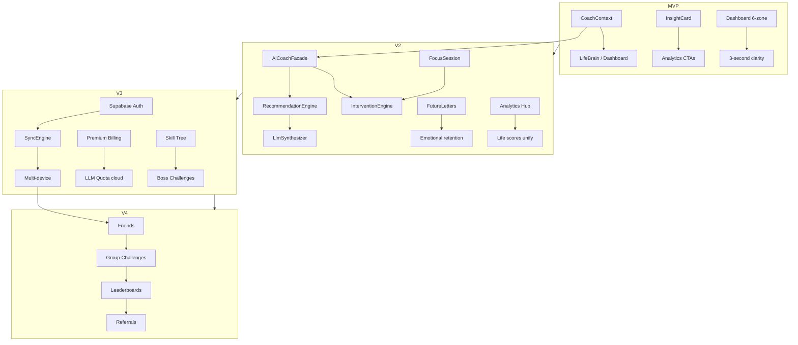

# REJABON AI — Implementation Plan

**Version:** 7.0 (Phase 7 — Master Execution Roadmap)  
**Date:** 2026-06-21  
**Status:** Canonical implementation roadmap  
**Companion:** `PRODUCT_STRATEGY.md`, `FEATURE_ROADMAP.md`, `AI_COACH_SYSTEM.md`, `LIFE_RPG_SYSTEM.md`, `UI_UX_REDESIGN.md`, `DATABASE_ARCHITECTURE.md`

---

## Table of Contents

1. [Executive Summary](#1-executive-summary)
2. [Scoring Methodology](#2-scoring-methodology)
3. [Current State](#3-current-state)
4. [Version Overview](#4-version-overview)
5. [MVP — V1.5 Life Loop Wired](#5-mvp--v15-life-loop-wired)
6. [V2 — Intelligence & Depth](#6-v2--intelligence--depth)
7. [V3 — Platform & Monetization](#7-v3--platform--monetization)
8. [V4 — Network & Growth](#8-v4--network--growth)
9. [Master Priority Matrix](#9-master-priority-matrix)
10. [Dependency Map](#10-dependency-map)
11. [Sprint Calendar](#11-sprint-calendar)
12. [Effort Estimates](#12-effort-estimates)
13. [Architecture Evolution](#13-architecture-evolution)
14. [Testing & Quality Gates](#14-testing--quality-gates)
15. [Success Metrics](#15-success-metrics)
16. [Risks & Mitigations](#16-risks--mitigations)
17. [Definition of Done](#17-definition-of-done)
18. [Immediate Next Actions](#18-immediate-next-actions)

---

## 1. Executive Summary

### 1.1 North Star

Transform REJABON from a **32-route planner** into an **AI Life Operating System** where every screen serves the Life Loop:

```
Capture → Process → Plan → Act → Reward → Reflect → Coach → Repeat
```

### 1.2 Delivery Horizon

| Version | Duration | Cumulative | Theme |
|---------|----------|------------|-------|
| **MVP (V1.5)** | 8 weeks | Week 8 | Wire existing modules into one product |
| **V2** | 12 weeks | Week 20 | Intelligence, Future Self, anti-procrastination |
| **V3** | 16 weeks | Week 36 | Cloud sync, premium, RPG depth |
| **V4** | 20 weeks | Week 56 | Social, viral growth, predictions |

**Total:** ~14 months from MVP complete to V4 GA.

### 1.3 Implementation Principles

1. **Connect before expand** — No new screens until loops work
2. **Offline first** — Every feature works without network
3. **Rules before LLM** — Deterministic fallback required
4. **One hero action per screen** — UI_UX_REDESIGN quality bar
5. **Incremental migration** — Isar schema versions; Supabase in V3 only
6. **Test the loop** — Integration tests for capture → act → reward

### 1.4 Design Docs → Code Map

| Design phase | Document | Implementation version |
|--------------|----------|------------------------|
| Phase 1 | V1.5 wiring | **MVP** (partial ✅) |
| Phase 2 | `PRODUCT_STRATEGY.md` | **V2** |
| Phase 3 | `LIFE_RPG_SYSTEM.md` | **V2–V3** |
| Phase 4 | `AI_COACH_SYSTEM.md` | **V2** |
| Phase 5 | `UI_UX_REDESIGN.md` | **MVP–V2** |
| Phase 6 | `DATABASE_ARCHITECTURE.md` | **V3** |
| Phase 7 | This document | **All versions** |

---

## 2. Scoring Methodology

### 2.1 Impact (1–5)

| Score | Label | Definition |
|-------|-------|------------|
| 5 | Critical | Directly moves D7 retention or revenue |
| 4 | High | Strong loop closure or differentiation |
| 3 | Medium | Improves existing flow |
| 2 | Low | Polish or edge case |
| 1 | Minimal | Nice-to-have |

### 2.2 Complexity (1–5)

| Score | Label | Engineering effort |
|-------|-------|------------------|
| 1 | Trivial | <4 hours, 1 file |
| 2 | Low | 1–2 days, 2–3 files |
| 3 | Medium | 3–5 days, cross-module |
| 4 | High | 1–2 weeks, new entities + UI |
| 5 | Very High | 2+ weeks, architecture change |

### 2.3 Priority Score

```
Priority Score = (Impact × 2) − Complexity
```

Higher = ship sooner. P0 = score ≥6 or audit blocker.

### 2.4 Priority Tiers

| Tier | Rule | Examples |
|------|------|----------|
| **P0** | Data loss, security, loop broken, score ≥7 | RPG backup, coach on dashboard |
| **P1** | Retention drivers, score 4–6 | Analytics CTAs, dashboard slim |
| **P2** | Differentiation, score 2–3 | Vision board, skill tree |
| **P3** | V4+ or polish, score ≤1 | Tablet layout, season pass |

### 2.5 Revenue Tags

| Tag | Meaning |
|-----|---------|
| `$$$` | Direct subscription driver |
| `$$` | Premium feature gate |
| `$` | Conversion assist |
| `—` | Free core |

---

## 3. Current State

### 3.1 Shipped Foundation (V1.0)

| Area | Status | Notes |
|------|--------|-------|
| 32 Isar collections | ✅ | 38 routes, offline-first |
| Tasks, habits, goals | ✅ | Core productivity |
| Capture + Inbox | ✅ | Needs swipe triage (V2) |
| RPG (6 stats) | ✅ | Focus stat missing |
| AI Coach (rules + 1 LLM) | ⚠️ | Parallel pipelines |
| 5-tab navigation | ✅ | Finance orphaned |
| Onboarding (5 steps) | ✅ | Redesign in V2 |
| Backup v1.1.0 | ✅ | RPG entities included |

### 3.2 Phase 1 Complete ✅

| Deliverable | Status |
|-------------|--------|
| RPG entities in backup | ✅ |
| Time logs → life area scores | ✅ |
| MoodTrendService + chart | ✅ |
| LifeContextAssembler + CoachContext | ⚠️ Partial |
| DashboardCoachCard + LifeBrain | ✅ |
| XP bridge (journal, workout, finance) | ✅ |
| Capture → Inbox CTA | ✅ |
| provider_sync extensions | ✅ |
| platform_providers fix | ✅ |

### 3.3 Remaining MVP Gaps

| Gap | Priority | Blocks |
|-----|----------|--------|
| 11 dead dashboard widgets | P1 | UX clarity |
| Finance not in Life hub | P1 | Navigation |
| Analytics dead-end insights | P1 | Loop |
| `getAll()` hot paths | P1 | Performance |
| API keys in release APK | P0 | Security |
| AI memory unwired | P1 | Coach depth |
| Broken/flaky tests | P0 | CI |
| CoachContext incomplete | P1 | Life Brain |

### 3.4 Design Complete, Code Pending

| System | Design doc | Code status |
|--------|------------|-------------|
| AiCoachFacade | AI_COACH_SYSTEM.md | Not built |
| RecommendationEngine | AI_COACH_SYSTEM.md | Partial (rules only) |
| Dashboard 6-zone | UI_UX_REDESIGN.md | 11 cards still |
| Analytics 5-tab hub | UI_UX_REDESIGN.md | 2 separate screens |
| Focus stat + skill tree | LIFE_RPG_SYSTEM.md | Design only |
| Supabase 51 tables | DATABASE_ARCHITECTURE.md | Zero Dart wiring |

---

## 4. Version Overview

```
Week 0        Week 8         Week 20        Week 36        Week 56
  │─────────────│──────────────│──────────────│──────────────│
  │    MVP      │      V2      │      V3      │      V4      │
  │  V1.5 Loop  │ Intelligence │   Platform   │   Network    │
  │─────────────│──────────────│──────────────│──────────────│
  Wire + UX     Coach + Future  Sync + Premium Social + Viral
  slim dash     Self + Focus    RPG depth      Predictions
```

| Version | Goal | Exit metric |
|---------|------|-------------|
| **MVP** | Feel like one product | D7 retention baseline; coach CTR >15% |
| **V2** | System knows you | WAU weekly loop >25%; evidence insights |
| **V3** | Multi-device + revenue | 4% premium conversion; 30% multi-device |
| **V4** | Growth engine | Viral coefficient >0.3; D30 >20% |

---

## 5. MVP — V1.5 Life Loop Wired

**Duration:** 8 weeks (4 sprints × 2 weeks)  
**Theme:** Connect existing modules. No major new features.  
**North star:** User opens app → one clear action in 3 seconds.

### 5.1 MVP Feature List

| # | Feature | P | Impact | Cx | Score | Revenue | Status |
|---|---------|---|--------|-----|-------|---------|--------|
| M1 | RPG backup round-trip | P0 | 4 | 1 | 7 | — | ✅ Done |
| M2 | Mood trend service + chart | P0 | 4 | 2 | 6 | — | ✅ Done |
| M3 | Time logs → life area scores | P0 | 3 | 1 | 5 | — | ✅ Done |
| M4 | Dashboard coach card (Life Brain) | P0 | 5 | 2 | 8 | $ | ✅ Done |
| M5 | XP bridge (journal, workout, finance) | P0 | 4 | 2 | 6 | — | ✅ Done |
| M6 | Capture → inbox snackbar CTA | P1 | 3 | 1 | 5 | — | ✅ Done |
| M7 | provider_sync invalidation | P1 | 3 | 1 | 5 | — | ✅ Done |
| M8 | API keys out of release APK | P0 | 5 | 2 | 8 | — | ❌ Pending |
| M9 | Fix test suite / CI green | P0 | 4 | 2 | 6 | — | ⚠️ Partial |
| M10 | Expand CoachContext (goals, RPG, inbox) | P0 | 5 | 3 | 7 | $ | ⚠️ Partial |
| M11 | Dashboard 6-zone redesign | P0 | 5 | 3 | 7 | — | ❌ Pending |
| M12 | Delete 11 dead dashboard widgets | P1 | 3 | 2 | 4 | — | ❌ Pending |
| M13 | Finance card in Life hub | P1 | 3 | 1 | 5 | — | ❌ Pending |
| M14 | Analytics insight action routes | P1 | 4 | 2 | 6 | — | ❌ Pending |
| M15 | Stream-derived providers (no getAll) | P1 | 3 | 3 | 3 | — | ❌ Pending |
| M16 | Life area picker on habit/goal forms | P1 | 3 | 2 | 4 | — | ❌ Pending |
| M17 | CEO review action CTAs | P1 | 3 | 1 | 5 | — | ❌ Pending |
| M18 | AppRoutes constants file | P2 | 2 | 1 | 3 | — | ❌ Pending |
| M19 | More hub curate to 8 items | P1 | 4 | 2 | 6 | — | ❌ Pending |
| M20 | InsightCard shared widget | P1 | 4 | 2 | 6 | — | ❌ Pending |

### 5.2 MVP Sprint Plan

#### Sprint MVP-1 (Weeks 1–2) — P0 Security & Context ✅ mostly done

| Task | Est. | Owner | Status |
|------|------|-------|--------|
| RPG backup | 4h | Flutter | ✅ |
| MoodTrendService + chart | 14h | Flutter | ✅ |
| LifeContextAssembler scaffold | 8h | Flutter | ✅ |
| DashboardCoachCard | 8h | Flutter | ✅ |
| Time logs → life scores | 4h | Flutter | ✅ |
| API key build flavor | 8h | Flutter | ❌ |
| Fix broken tests | 8h | Flutter | ⚠️ |

**Exit:** Backup includes RPG; mood chart visible; coach on dashboard.

#### Sprint MVP-2 (Weeks 3–4) — Coach Context + Memory

| Task | Est. | Depends |
|------|------|---------|
| Full CoachContext (15 slices) | 16h | LifeContextAssembler |
| RecommendationEngine L0 rules extract | 12h | ai_coach_service |
| Wire ai_memory analyzeAndStore (weekly) | 8h | CEO review trigger |
| Pattern engine → LifeBrain ranker | 12h | CoachPatternEngine |
| Dashboard coach evidence UI | 8h | UI_UX_REDESIGN §6.3 |

**Exit:** Coach cites real data; memory writes on weekly review.

#### Sprint MVP-3 (Weeks 5–6) — Dashboard & Hubs

| Task | Est. | Depends |
|------|------|---------|
| Dashboard 6-zone refactor | 24h | UI_UX_REDESIGN |
| Split dashboard_widgets.dart | 12h | — |
| InsightCard widget | 8h | — |
| Finance in Life hub + route `/hayot/moliya` | 4h | — |
| More hub curate (8 visible) | 8h | UI_UX_REDESIGN §5.4 |
| Analytics action chips | 8h | InsightCard |
| Stream-derived life_os providers | 12h | — |

**Exit:** Dashboard ≤6 sections; no dead insight cards; finance discoverable.

#### Sprint MVP-4 (Weeks 7–8) — Polish + Gates

| Task | Est. | Depends |
|------|------|---------|
| Focus stat migration (Isar v3) | 8h | LIFE_RPG_SYSTEM |
| Level-up overlay + XpToast | 12h | gamification |
| Onboarding minor fixes | 4h | — |
| Integration test: life loop | 12h | — |
| CI pipeline (analyze + test) | 4h | — |
| AppRoutes constants | 4h | — |
| Performance audit (dashboard <300ms) | 8h | — |

**Exit:** 40+ tests green; D7 instrumentation live; MVP ship candidate.

### 5.3 MVP Explicitly NOT In Scope

- Supabase / auth / sync
- Future letters UI
- Focus mode / Pomodoro
- Skill tree / boss challenges
- Social features
- Premium billing
- Unified analytics hub (starts V2)
- AiCoachFacade LLM JSON (starts V2)

---

## 6. V2 — Intelligence & Depth

**Duration:** 12 weeks (6 sprints × 2 weeks)  
**Theme:** AI-first differentiation + emotional retention.  
**North star:** User feels the system knows them — evidence-backed, one action.

### 6.1 V2 Feature List

| # | Feature | P | Impact | Cx | Score | Revenue | Sprint |
|---|---------|---|--------|-----|-------|---------|--------|
| V2-01 | AiCoachFacade + RecommendationEngine | P0 | 5 | 4 | 6 | $$ | V2-S1 |
| V2-02 | LlmSynthesizer JSON prompts | P0 | 5 | 3 | 7 | $$ | V2-S1 |
| V2-03 | Life Brain unified (deprecate 6 pipelines) | P0 | 5 | 4 | 6 | $$ | V2-S1 |
| V2-04 | Unified analytics hub (5 tabs) | P0 | 4 | 4 | 4 | $$ | V2-S2 |
| V2-05 | Future Letters UI + unlock scheduler | P0 | 5 | 3 | 7 | $$ | V2-S2 |
| V2-06 | Focus Mode + Pomodoro | P0 | 4 | 3 | 5 | $$ | V2-S3 |
| V2-07 | InterventionEngine + shell banner | P0 | 5 | 4 | 6 | $$ | V2-S3 |
| V2-08 | CoachCommitmentEntity + extractor | P1 | 4 | 3 | 5 | $ | V2-S3 |
| V2-09 | Onboarding v2 (4 steps, <90s) | P1 | 4 | 3 | 5 | — | V2-S4 |
| V2-10 | Goals + Kelajak tab merge | P1 | 3 | 3 | 3 | — | V2-S4 |
| V2-11 | Unified coach screen (absorb Twin) | P1 | 4 | 3 | 5 | $$ | V2-S4 |
| V2-12 | Weekly LLM CEO narrative | P0 | 4 | 3 | 5 | $$ | V2-S4 |
| V2-13 | Vision board | P1 | 4 | 3 | 5 | $$ | V2-S5 |
| V2-14 | AI Journal emotion tags (L2) | P1 | 4 | 4 | 4 | $$ | V2-S5 |
| V2-15 | Habit heatmap (Duolingo-style) | P1 | 4 | 2 | 6 | — | V2-S5 |
| V2-16 | Inbox swipe triage | P1 | 4 | 3 | 5 | — | V2-S5 |
| V2-17 | Tasks quick-add bar + today default | P1 | 4 | 2 | 6 | — | V2-S6 |
| V2-18 | TwinProfile in coach context | P1 | 4 | 2 | 6 | $ | V2-S1 |
| V2-19 | MemoryRetriever + tone adaptation | P1 | 4 | 3 | 5 | $$ | V2-S2 |
| V2-20 | Monthly coach review | P2 | 3 | 3 | 3 | $$ | V2-S6 |
| V2-21 | 2-minute rule micro-tasks | P1 | 4 | 2 | 6 | — | V2-S3 |
| V2-22 | Document ↔ goal linking | P2 | 3 | 2 | 4 | — | V2-S6 |
| V2-23 | Settings profile header | P2 | 2 | 1 | 3 | — | V2-S4 |
| V2-24 | Hide Life Twin / Decision / Action routes | P1 | 3 | 1 | 5 | — | V2-S4 |

### 6.2 V2 Sprint Plan

| Sprint | Weeks | Focus | Key deliverables | Success metric |
|--------|-------|-------|------------------|----------------|
| **V2-S1** | 9–10 | AI Coach core | AiCoachFacade, RecommendationEngine, LlmSynthesizer, deprecate parallel services | JSON coach advice with fallback |
| **V2-S2** | 11–12 | Analytics + Memory | 5-tab analytics hub, MemoryRetriever, wire weekly analyzeAndStore | 0 dead-end insights |
| **V2-S3** | 13–14 | Anti-procrastination | FocusSessionEntity, Pomodoro, InterventionBanner, commitments | Procrastination trigger works |
| **V2-S4** | 15–16 | UX consolidation | Onboarding v2, unified coach screen, goals tabs, CEO LLM narrative | Onboarding <90s |
| **V2-S5** | 17–18 | Future Self | Future letters polish, vision board, habit heatmap, inbox triage | Letter unlock celebration |
| **V2-S6** | 19–20 | Polish | Tasks UX, monthly review, document linking, route redirects | V2 ship candidate |

### 6.3 V2 Engineering Priorities

1. **Single coach brain** — highest architectural ROI
2. **Evidence UI everywhere** — trust pattern from AI_COACH_SYSTEM
3. **Future Self** — emotional moat for D30 retention
4. **Focus mode** — closes anti-procrastination loop

### 6.4 V2 NOT In Scope

- Supabase sync (V3)
- Premium billing (V3)
- Skill tree / boss challenges (V3)
- Social / leaderboards (V4)
- Voice coach premium (V3–V4)
- Prediction engine (V4)

---

## 7. V3 — Platform & Monetization

**Duration:** 16 weeks (8 sprints × 2 weeks)  
**Theme:** Multi-device, accounts, revenue.  
**North star:** User trusts cloud with their life data; pays for depth.

### 7.1 V3 Feature List

| # | Feature | P | Impact | Cx | Score | Revenue | Sprint |
|---|---------|---|--------|-----|-------|---------|--------|
| V3-01 | Supabase project + auth (email, Google) | P0 | 5 | 4 | 6 | — | V3-S1 |
| V3-02 | Core table migrations (profiles, tasks, habits, goals) | P0 | 5 | 4 | 6 | — | V3-S1 |
| V3-03 | SyncEngine (push/pull LWW) | P0 | 5 | 5 | 5 | $$$ | V3-S2 |
| V3-04 | habit_completions normalization | P0 | 4 | 3 | 5 | — | V3-S2 |
| V3-05 | Sync expand (RPG, journal, inbox, coach) | P0 | 4 | 4 | 4 | $$$ | V3-S3 |
| V3-06 | RLS policies (51 tables) | P0 | 5 | 4 | 6 | — | V3-S3 |
| V3-07 | Realtime (tasks, quests, inbox) | P1 | 3 | 3 | 3 | $$ | V3-S4 |
| V3-08 | Storage buckets (documents, vision) | P1 | 3 | 3 | 3 | $$ | V3-S4 |
| V3-09 | Premium paywall + tier gates | P0 | 5 | 3 | 7 | $$$ | V3-S5 |
| V3-10 | RevenueCat or Payme integration | P0 | 5 | 4 | 6 | $$$ | V3-S5 |
| V3-11 | Skill tree (7 branches) | P1 | 4 | 4 | 4 | $$ | V3-S6 |
| V3-12 | Boss challenges (weekly/monthly) | P1 | 4 | 3 | 5 | $$ | V3-S6 |
| V3-13 | Badge system (24 badges) | P1 | 3 | 3 | 3 | $ | V3-S6 |
| V3-14 | Focus stat full RPG integration | P1 | 4 | 2 | 6 | — | V3-S6 |
| V3-15 | life_scores server cron | P1 | 4 | 3 | 5 | $$ | V3-S4 |
| V3-16 | Encrypted backup passphrase | P1 | 4 | 3 | 5 | $$ | V3-S5 |
| V3-17 | Multi-device conflict tests | P0 | 4 | 4 | 4 | $$$ | V3-S7 |
| V3-18 | Cloud coach memory sync | P1 | 3 | 3 | 3 | $$ | V3-S3 |
| V3-19 | Voice coach sessions (quota) | P2 | 3 | 4 | 2 | $$ | V3-S7 |
| V3-20 | Tablet responsive layouts | P3 | 2 | 3 | 1 | — | V3-S8 |
| V3-21 | Isar → cloud first-login migration | P0 | 5 | 4 | 6 | — | V3-S2 |
| V3-22 | Offline queue + retry | P0 | 4 | 4 | 4 | $$$ | V3-S3 |

### 7.2 V3 Sprint Plan

| Sprint | Weeks | Focus |
|--------|-------|-------|
| V3-S1 | 21–22 | Supabase setup, auth, profiles, devices |
| V3-S2 | 23–24 | SyncEngine MVP, tasks/habits/goals, first-login migration |
| V3-S3 | 25–26 | Sync expand, RLS audit, tombstones, offline queue |
| V3-S4 | 27–28 | Realtime, storage, life_scores cron |
| V3-S5 | 29–30 | Premium billing, paywall, encrypted backup |
| V3-S6 | 31–32 | Skill tree, boss challenges, badges, Focus stat |
| V3-S7 | 33–34 | Multi-device QA, conflict tests, voice quota |
| V3-S8 | 35–36 | Tablet polish, V3 hardening, app store prep |

### 7.3 V3 Monetization Tiers

| Tier | Price (UZS/mo) | Gates |
|------|----------------|-------|
| Free | 0 | Rules coach, 1 LLM/day, 7-day analytics |
| Premium | ~39,000 | Unlimited coach, 90-day analytics, Future letters |
| Pro | ~59,000 | Multi-device sync, voice, export, accountability |

---

## 8. V4 — Network & Growth

**Duration:** 20 weeks (10 sprints × 2 weeks)  
**Theme:** Social accountability + viral loops.  
**North star:** Users invite friends; retention compounds.

### 8.1 V4 Feature List

| # | Feature | P | Impact | Cx | Score | Revenue | Sprint |
|---|---------|---|--------|-----|-------|---------|--------|
| V4-01 | Friends system + invites | P0 | 5 | 4 | 6 | $$ | V4-S1 |
| V4-02 | Accountability partners | P0 | 5 | 3 | 7 | $$ | V4-S2 |
| V4-03 | Group challenges | P0 | 5 | 4 | 6 | $$ | V4-S3 |
| V4-04 | Leaderboards (masked) | P1 | 4 | 3 | 5 | $ | V4-S3 |
| V4-05 | Friend habit duels | P0 | 5 | 3 | 7 | $$ | V4-S4 |
| V4-06 | Achievement share cards | P0 | 5 | 2 | 8 | $$$ | V4-S4 |
| V4-07 | Referral program (XP + premium days) | P0 | 5 | 3 | 7 | $$$ | V4-S5 |
| V4-08 | Social hub unhide + polish | P1 | 4 | 2 | 6 | — | V4-S2 |
| V4-09 | Prediction engine (life trends) | P1 | 4 | 5 | 3 | $$ | V4-S6 |
| V4-10 | Guild quests (group RPG) | P2 | 4 | 4 | 4 | $$ | V4-S7 |
| V4-11 | Season pass (quarterly) | P2 | 4 | 4 | 4 | $$$ | V4-S8 |
| V4-12 | Voice journal full pipeline | P1 | 3 | 4 | 2 | $$ | V4-S6 |
| V4-13 | Smart capture auto-classify | P1 | 4 | 4 | 4 | $$ | V4-S7 |
| V4-14 | Priority Oracle (AI task rank) | P1 | 4 | 3 | 5 | $$ | V4-S7 |
| V4-15 | Anomaly detection (finance) | P2 | 3 | 3 | 3 | $ | V4-S8 |
| V4-16 | CEO report PDF export | P2 | 3 | 2 | 4 | $$ | V4-S5 |
| V4-17 | Push notification intelligence | P1 | 4 | 3 | 5 | $ | V4-S9 |
| V4-18 | Class system (Builder/Warrior/Sage) | P3 | 3 | 4 | 2 | $ | V4-S9 |
| V4-19 | Central Asia localization prep | P2 | 3 | 3 | 3 | $$$ | V4-S10 |
| V4-20 | Growth analytics dashboard | P1 | 4 | 3 | 5 | — | V4-S10 |

### 8.2 V4 Sprint Plan

| Sprint | Weeks | Focus |
|--------|-------|-------|
| V4-S1 | 37–38 | Friends, invites, social_settings sync |
| V4-S2 | 39–40 | Partners, social hub, privacy controls |
| V4-S3 | 41–42 | Group challenges, leaderboards RPC |
| V4-S4 | 43–44 | Friend duels, achievement share cards |
| V4-S5 | 45–46 | Referrals, PDF export, viral loops |
| V4-S6 | 47–48 | Prediction engine, voice journal |
| V4-S7 | 49–50 | Smart capture, Priority Oracle, guild quests |
| V4-S8 | 51–52 | Season pass, finance anomalies |
| V4-S9 | 53–54 | Push intelligence, class system |
| V4-S10 | 55–56 | Growth dashboard, expansion prep, V4 GA |

---

## 9. Master Priority Matrix

### 9.1 All Features Sorted by Priority Score

| Rank | Feature | Version | P | I | C | Score | $ |
|------|---------|---------|---|---|---|-------|---|
| 1 | Dashboard coach hero + evidence | MVP | P0 | 5 | 2 | 8 | $ |
| 2 | API keys out of release APK | MVP | P0 | 5 | 2 | 8 | — |
| 3 | RPG backup | MVP | P0 | 4 | 1 | 7 | — |
| 4 | Expand CoachContext | MVP | P0 | 5 | 3 | 7 | $ |
| 5 | Dashboard 6-zone redesign | MVP | P0 | 5 | 3 | 7 | — |
| 6 | Future Letters UI | V2 | P0 | 5 | 3 | 7 | $$ |
| 7 | LlmSynthesizer JSON prompts | V2 | P0 | 5 | 3 | 7 | $$ |
| 8 | Premium paywall | V3 | P0 | 5 | 3 | 7 | $$$ |
| 9 | Friend habit duels | V4 | P0 | 5 | 3 | 7 | $$ |
| 10 | Accountability partners | V4 | P0 | 5 | 3 | 7 | $$ |
| 11 | Referral program | V4 | P0 | 5 | 3 | 7 | $$$ |
| 12 | Achievement share cards | V4 | P0 | 5 | 2 | 8 | $$$ |
| 13 | Mood trend + chart | MVP | P0 | 4 | 2 | 6 | — |
| 14 | XP bridge extended | MVP | P0 | 4 | 2 | 6 | — |
| 15 | Analytics action routes | MVP | P1 | 4 | 2 | 6 | — |
| 16 | AiCoachFacade | V2 | P0 | 5 | 4 | 6 | $$ |
| 17 | Life Brain unification | V2 | P0 | 5 | 4 | 6 | $$ |
| 18 | Intervention engine | V2 | P0 | 5 | 4 | 6 | $$ |
| 19 | Supabase auth | V3 | P0 | 5 | 4 | 6 | — |
| 20 | Friends system | V4 | P0 | 5 | 4 | 6 | $$ |
| 21 | Habit heatmap | V2 | P1 | 4 | 2 | 6 | — |
| 22 | Tasks quick-add + today view | V2 | P1 | 4 | 2 | 6 | — |
| 23 | Focus stat RPG integration | V3 | P1 | 4 | 2 | 6 | — |
| 24 | More hub curation | MVP | P1 | 4 | 2 | 6 | — |
| 25 | InsightCard widget | MVP | P1 | 4 | 2 | 6 | — |

### 9.2 Shipped Features (Maintain Only)

| Feature | Module | Action |
|---------|--------|--------|
| Tasks + recurrence | tasks | Polish in V2 |
| Habits + streaks | life | Heatmap V2 |
| Goals + horizons | life | Tab merge V2 |
| Journal | life | AI tags V2 |
| Finance tracking | finance | Hub link MVP |
| Time tracker | time_tracking | Pomodoro V2 |
| Character / RPG | gamification | Depth V3 |
| CEO review | ceo_review | LLM V2 |
| Second brain | second_brain | Search V2 |
| AI planning | ai_planning | Dashboard embed V2 |
| Voice coach | voice_ai | Quota V3 |
| Life twin | life_twin | Absorb V2 |
| Social (partial) | social | Complete V4 |

### 9.3 Deprecation Schedule

| Item | Action | Version |
|------|--------|---------|
| 11 dead dashboard widgets | Delete | MVP |
| Life Twin standalone route | Redirect → murabbiy | V2 |
| Decision Assistant route | Redirect → murabbiy | V2 |
| Action Engine route | Remove | V2 |
| `/boshqa/vaqt-analitika` | Merge → analitika hub | V2 |
| `/moliya` orphan | Move → `/hayot/moliya` | MVP |
| Parallel insight services | Absorb → AiCoachFacade | V2 |
| `getAll()` FutureProviders | Stream-derived | MVP |
| Social hub (premature) | Hide until V4 | MVP |

---

## 10. Dependency Map



### 10.1 Hard Dependencies

| Feature | Requires |
|---------|----------|
| AiCoachFacade | Full CoachContext, RecommendationEngine |
| LlmSynthesizer | AiCoachFacade, JSON prompt registry |
| InterventionEngine | FocusSession, CoachContext |
| Analytics hub | InsightCard, life_scores computation |
| SyncEngine | Supabase auth, DATABASE_ARCHITECTURE tables |
| Premium gates | Subscription provider, tier entity |
| Leaderboards | Supabase sync, player_profiles RLS |
| Referrals | Auth, subscriptions, share cards |
| Prediction engine | 90-day history, life_scores, ML or rules |

---

## 11. Sprint Calendar

### 11.1 Full Timeline (56 Weeks)

| Week | Sprint | Version | Theme |
|------|--------|---------|-------|
| 1–2 | MVP-1 | MVP | P0 fixes ✅ |
| 3–4 | MVP-2 | MVP | Coach context + memory |
| 5–6 | MVP-3 | MVP | Dashboard + hubs |
| 7–8 | MVP-4 | MVP | Polish + ship |
| 9–10 | V2-S1 | V2 | AiCoachFacade |
| 11–12 | V2-S2 | V2 | Analytics hub + memory |
| 13–14 | V2-S3 | V2 | Focus + interventions |
| 15–16 | V2-S4 | V2 | Onboarding + coach UX |
| 17–18 | V2-S5 | V2 | Future Self |
| 19–20 | V2-S6 | V2 | Polish + ship |
| 21–22 | V3-S1 | V3 | Supabase + auth |
| 23–24 | V3-S2 | V3 | Sync MVP |
| 25–26 | V3-S3 | V3 | Sync expand + RLS |
| 27–28 | V3-S4 | V3 | Realtime + storage |
| 29–30 | V3-S5 | V3 | Premium billing |
| 31–32 | V3-S6 | V3 | RPG depth |
| 33–34 | V3-S7 | V3 | Multi-device QA |
| 35–36 | V3-S8 | V3 | Ship V3 |
| 37–56 | V4-S1–S10 | V4 | Social + growth |

### 11.2 Release Cadence

| Cadence | Content |
|---------|---------|
| Weekly | Bug fixes, connection PRs |
| Bi-weekly | Sprint deliverable |
| Monthly | Themed release notes |
| Quarterly | Major version (V2, V3, V4) |

---

## 12. Effort Estimates

### 12.1 By Version (Engineering Hours)

| Version | Sprints | Est. hours | Calendar |
|---------|---------|------------|----------|
| MVP (remaining) | 3 | ~280h | 6 weeks |
| V2 | 6 | ~720h | 12 weeks |
| V3 | 8 | ~960h | 16 weeks |
| V4 | 10 | ~1200h | 20 weeks |
| **Total** | **27** | **~3160h** | **54 weeks** |

*Assumes 1 FTE Flutter + 0.25 FTE backend/design. Add 40% for QA, design, PM.*

### 12.2 Solo Dev Critical Path

If **1 developer**, strict order:

1. MVP-2 → MVP-3 → MVP-4 (finish loop)
2. V2-S1 (coach facade) — blocks most V2 value
3. V2-S3 (focus) — retention hook
4. V2-S2 (analytics) — closes insight loop
5. V3-S1–S3 (sync) — before any social
6. V3-S5 (billing) — revenue
7. V4-S1–S5 (social core)

**Defer:** Tablet, season pass, class system, voice journal full pipeline.

### 12.3 Complexity Heatmap

| Complexity | Count | Examples |
|------------|-------|----------|
| C1–C2 (Low) | 28 | Hub links, CTAs, constants |
| C3 (Medium) | 35 | Facades, onboarding, heatmaps |
| C4 (High) | 22 | Sync engine, skill tree, social |
| C5 (Very High) | 5 | Full sync conflict, prediction engine |

---

## 13. Architecture Evolution

### 13.1 Folder Structure by Version

```
MVP:   core/intelligence/ expanded; dashboard/widgets split
V2:    features/coach/ (facade); features/analytics/ (hub); features/future_self/
V3:    core/sync/; features/billing/; supabase/migrations/
V4:    features/social/ complete; edge functions/
```

### 13.2 Isar Migration Roadmap

| Version | Schema | Changes |
|---------|--------|---------|
| v2 | Shipped | PlayerProfile init |
| v3 | MVP-4 | `focusXp` on PlayerProfile |
| v4 | V2-S3 | `CoachCommitmentEntity`, `FocusSessionEntity` |
| v5 | V3-S6 | `SkillNodeEntity`, `BossChallengeEntity`, `BadgeUnlockEntity` |
| v6 | V3-S2 | `serverId`, `lastSyncedAt` on sync entities |

### 13.3 Service Consolidation

| Current (fragmented) | Target | Version |
|---------------------|--------|---------|
| ai_coach_service | RecommendationEngine | V2 |
| life_brain_facade | AiCoachFacade ranking | V2 |
| coach_pattern_engine | core/intelligence/pattern_engine | V2 |
| analytics_insight_service | Analytics hub tabs | V2 |
| life_twin_service | AiCoachFacade.chat() | V2 |
| decision_assistant_service | RecommendationEngine | V2 |
| ceo_weekly_review_service | AiCoachFacade.getWeeklyReview() | V2 |

---

## 14. Testing & Quality Gates

### 14.1 Coverage Targets

| Version | Unit | Widget | Integration |
|---------|------|--------|-------------|
| MVP | 40% services | Dashboard, tasks | Life loop |
| V2 | 60% services | Coach, analytics | Coach + focus |
| V3 | 60% + sync | Paywall | Multi-device sync |
| V4 | 50% social | Share cards | Friend challenge |

### 14.2 Version Ship Gates

| Gate | MVP | V2 | V3 | V4 |
|------|-----|----|----|-----|
| `flutter analyze` clean | ✅ | ✅ | ✅ | ✅ |
| Tests passing | 40+ | 80+ | 120+ | 150+ |
| Offline works | ✅ | ✅ | ✅ | ✅ |
| No P0 audit items | ✅ | ✅ | ✅ | ✅ |
| Coach evidence UI | ✅ | ✅ | ✅ | ✅ |
| Backup round-trip | ✅ | ✅ | ✅ | ✅ |
| RLS audit | — | — | ✅ | ✅ |
| Premium E2E | — | — | ✅ | ✅ |
| Social privacy review | — | — | — | ✅ |

### 14.3 Performance Targets

| Metric | Target |
|--------|--------|
| Cold start | <2s |
| Dashboard first frame | <300ms |
| Coach context assemble | <200ms |
| Isar indexed query | <50ms |
| Sync delta push | <5s |
| LLM coach call | <5s (skeleton UI) |

---

## 15. Success Metrics

| Milestone | Primary metric | Target |
|-----------|----------------|--------|
| MVP ship | D7 retention | Baseline + 5pp |
| MVP ship | Coach card CTR | >15% DAU |
| V2 ship | Weekly loop completion | >25% WAU |
| V2 ship | Evidence insight views | >40% DAU |
| V2 ship | Premium waitlist | 1,000 signups |
| V3 ship | Premium conversion | 4% |
| V3 ship | Multi-device users | 30% MAU |
| V3 ship | Sync success rate | >99% |
| V4 ship | Viral coefficient | >0.3 |
| V4 ship | D30 retention | >20% |
| V4 ship | Referral activation | 10% of new users |

### 15.1 Instrumentation (MVP)

| Event | Purpose |
|-------|---------|
| `coach_impression` | Dashboard coach views |
| `coach_action_tap` | CTA conversion |
| `task_complete` | Loop act stage |
| `xp_earned` | Reward stage |
| `journal_write` | Reflect stage |
| `onboarding_complete` | Activation |
| `day_7_return` | Retention |

---

## 16. Risks & Mitigations

| Risk | Likelihood | Impact | Mitigation |
|------|------------|--------|------------|
| Scope explosion | High | High | Version gates; MVP before V2 |
| Solo dev bandwidth | High | High | Ruthless P0; defer P3 |
| AI API costs | Med | Med | Quotas; rules-first; Premium |
| Sync data loss | Med | Critical | Tombstones; conflict tests V3-S7 |
| Supabase bill | Low | Med | RLS; pagination; edge functions |
| Social privacy (UZ) | Med | High | Alias leaderboards; opt-in V4 |
| Test debt | High | Med | MVP-4 CI mandate |
| Monolith widgets | Med | Med | MVP-3 split mandatory |

---

## 17. Definition of Done

Per feature, all must pass:

- [ ] Works offline (or graceful degrade documented)
- [ ] Uzbek strings in `app_strings.dart`
- [ ] Provider invalidation in `provider_sync.dart`
- [ ] XP bridge if user action (where applicable)
- [ ] Coach context includes new data (where applicable)
- [ ] Unit test for service logic
- [ ] No new `getAll()` in hot paths
- [ ] Backup includes new entities
- [ ] Accessibility semantics on interactive elements
- [ ] Serves a Life Loop stage (document which)
- [ ] No dead-end insights (action CTA if insight)

---

## 18. Immediate Next Actions

### This Sprint (MVP-2 — Weeks 3–4)

| # | Action | P | Est. | Doc ref |
|---|--------|---|------|---------|
| 1 | Expand CoachContext (goals, RPG, inbox, finance) | P0 | 16h | AI_COACH_SYSTEM §5 |
| 2 | Extract RecommendationEngine from ai_coach_service | P0 | 12h | AI_COACH_SYSTEM §9 |
| 3 | Wire analyzeAndStore on CEO review open | P1 | 8h | AI_COACH_SYSTEM §7 |
| 4 | API key build flavor (release empty ai.env) | P0 | 8h | AUDIT P0-01 |
| 5 | Fix achievement + social entity tests | P0 | 8h | — |
| 6 | Analytics InsightCard with action routes | P1 | 8h | UI_UX_REDESIGN §7.3 |
| 7 | Finance link in LifeHubScreen | P1 | 2h | UI_UX_REDESIGN §10.1 |

**Sprint total:** ~62 hours

### Next Sprint Preview (MVP-3)

- Dashboard 6-zone refactor
- Delete dead widgets
- More hub curation
- Stream-derived providers

---

## Appendix A — Document Index

| Document | Purpose |
|----------|---------|
| `AUDIT_REPORT.md` | Current gaps, P0/P1 issues |
| `PRODUCT_STRATEGY.md` | Vision, pillars, Life Loop |
| `FEATURE_ROADMAP.md` | 50 WOW features |
| `AI_COACH_SYSTEM.md` | Coach architecture (Phase 4) |
| `LIFE_RPG_SYSTEM.md` | RPG schema, quests, skill tree |
| `UI_UX_REDESIGN.md` | Navigation, dashboard, UX (Phase 5) |
| `DATABASE_ARCHITECTURE.md` | Supabase schema (Phase 6) |
| `IMPLEMENTATION_PLAN.md` | **This file** — execution roadmap |

---

## Appendix B — Quick Reference

```
MVP (8w):   Wire loops → dashboard 6-zone → coach evidence → ship
V2 (12w):   AiCoachFacade → analytics hub → focus → Future Self
V3 (16w):   Supabase → sync → premium → skill tree + bosses
V4 (20w):   friends → challenges → referrals → predictions

PRIORITY:   (Impact × 2) − Complexity  |  P0 if ≥6 or audit blocker
PRINCIPLE:  Connect before expand | Offline first | Rules before LLM
NEXT:       MVP-2 CoachContext + RecommendationEngine + API keys
```

---

*REJABON AI Implementation — Phase 7. One loop at a time. Ship MVP. Earn V2.*
