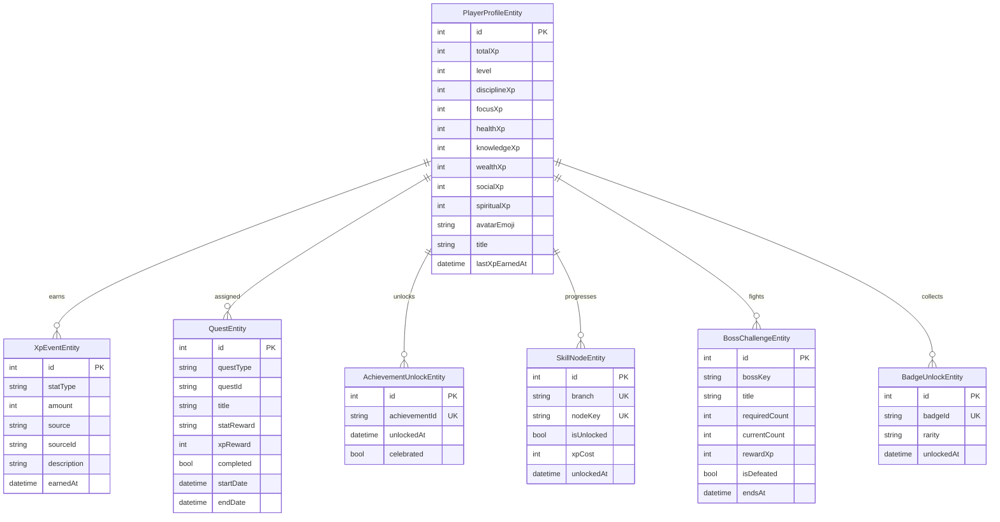

# REJABON AI — Life RPG System

**Version:** 3.0 (Phase 3 — Complete Design)  
**Date:** 2026-06-21  
**Status:** Canonical RPG specification  
**Stack:** Isar (local, shipped) → PostgreSQL/Supabase (V4 sync)  
**Companion:** `PRODUCT_STRATEGY.md`, `docs/DATABASE_ARCHITECTURE.md`

---

## Table of Contents

1. [Design Philosophy](#1-design-philosophy)
2. [System Architecture](#2-system-architecture)
3. [Database Schema](#3-database-schema)
4. [Seven Stats System](#4-seven-stats-system)
5. [XP System](#5-xp-system)
6. [Level System](#6-level-system)
7. [Quest System](#7-quest-system)
8. [Boss Challenges](#8-boss-challenges)
9. [Achievements](#9-achievements)
10. [Badges & Rarity](#10-badges--rarity)
11. [Skill Trees](#11-skill-trees)
12. [Streaks & Recovery](#12-streaks--recovery)
13. [Unlockables & Cosmetics](#13-unlockables--cosmetics)
14. [Anti-Abuse Rules](#14-anti-abuse-rules)
15. [Integration Map](#15-integration-map)
16. [Screens & Routes](#16-screens--routes)
17. [Services & Repositories](#17-services--repositories)
18. [Migration Plan](#18-migration-plan)
19. [Localization](#19-localization)
20. [Phase 3 Implementation Sprints](#20-phase-3-implementation-sprints)

---

## 1. Design Philosophy

### Core Principle

**Life RPG turns real behavior into game progression.** Every XP point must trace to a verified user action in the Life OS data layer. No vanity points. No pay-to-win.

| Rule | Rationale |
|------|-----------|
| Real actions only | Trust — users must believe the game reflects their life |
| Recoverable failure | Duolingo psychology without shame loops |
| Stats mirror pillars | RPG reinforces the 10 Life OS pillars |
| Quests = real tasks | Quest completion verifies against TaskEntity, HabitEntity, etc. |
| Skill tree unlocks features | XP spent unlocks tools (Pomodoro), not power |
| Offline-first | All RPG logic runs on Isar without network |

**Emotional target (Uzbek):**  
*"Men haqiqatan ham Level 12 bo'ldim — chunki haqiqatan ish qildim."*

### RPG vs Habitica vs Duolingo

| Dimension | Habitica | Duolingo | REJABON Life RPG |
|-----------|----------|----------|------------------|
| Fantasy skin | Heavy | Owl mascot | Adult, life-grounded |
| Data source | Manual checkboxes | Lessons only | 10 life pillars |
| Social | Core | Leaderboards | V4 opt-in |
| Offline | Limited | Limited | Full |
| Language | English | Many | Uzbek-native |

---

## 2. System Architecture

```
┌─────────────────────────────────────────────────────────────┐
│                    PRESENTATION LAYER                        │
│  CharacterScreen · DashboardRpgCard · LevelUpOverlay        │
│  QuestBoard · SkillTreeScreen · BossScreen · Achievements   │
└──────────────────────────┬──────────────────────────────────┘
                           │
┌──────────────────────────▼──────────────────────────────────┐
│                     DOMAIN SERVICES                          │
│  XpService · QuestService · AchievementService              │
│  BossService · SkillTreeService · StreakService             │
└──────────────────────────┬──────────────────────────────────┘
                           │
┌──────────────────────────▼──────────────────────────────────┐
│              action_reward_bridge (integration)              │
│  task · habit · journal · workout · finance · study         │
│  inbox · focus · quest · boss                               │
└──────────────────────────┬──────────────────────────────────┘
                           │
┌──────────────────────────▼──────────────────────────────────┐
│                    ISAR COLLECTIONS                          │
│  PlayerProfile · XpEvent · Quest · AchievementUnlock        │
│  SkillNode · BossChallenge · BadgeUnlock (Phase 3)          │
└─────────────────────────────────────────────────────────────┘
```

### Event Flow (XP Award)

```
User completes action (e.g. task)
  → action_reward_bridge.rewardTaskComplete()
  → XpService.award() — duplicate guard, oncePerDay check
  → XpEventEntity created (audit)
  → PlayerProfileEntity updated (totalXp, statXp, level, title)
  → QuestService.verifyAndCompleteQuests()
  → AchievementService.computeAndSync()
  → provider_sync invalidates RPG providers
  → UI: XpGainToast + optional LevelUpOverlay
```

---

## 3. Database Schema

### 3.1 Entity Relationship Diagram



---

### 3.2 PlayerProfileEntity (Isar — Shipped)

**File:** `lib/core/database/schemas/player_profile_entity.dart`  
**Cardinality:** Singleton (one row per device/user)

| Field | Type | Index | Description |
|-------|------|-------|-------------|
| `id` | `Id` | PK | Auto-increment |
| `totalXp` | `int` | — | Lifetime XP (level source) |
| `level` | `int` | — | Derived from `totalXp` via `LevelCalculator` |
| `disciplineXp` | `int` | — | Cumulative discipline stat XP |
| `focusXp` | `int` | — | **Phase 3 add** — focus stat |
| `healthXp` | `int` | — | Health stat XP |
| `knowledgeXp` | `int` | — | Knowledge stat XP |
| `wealthXp` | `int` | — | Wealth stat XP |
| `socialXp` | `int` | — | Social stat XP |
| `spiritualXp` | `int` | — | Spiritual stat XP |
| `avatarEmoji` | `String` | — | Display emoji (default `🧙`) |
| `title` | `String` | — | Level-derived title |
| `lastXpEarnedAt` | `DateTime?` | — | Last XP event timestamp |
| `createdAt` | `DateTime` | — | Profile creation |
| `updatedAt` | `DateTime` | — | Last mutation |

**Computed (not stored):**

```dart
int statLevel(int statXp) => (statXp / 100).floor().clamp(1, 50);
double statProgress(int statXp) => (statXp % 100) / 100.0;
```

**Phase 3 migration:** Add `focusXp int default 0`; bump `DatabaseMigrationService` to v4.

---

### 3.3 XpEventEntity (Isar — Shipped)

**File:** `lib/core/database/schemas/xp_event_entity.dart`

| Field | Type | Index | Description |
|-------|------|-------|-------------|
| `id` | `Id` | PK | |
| `statType` | `String` | ✅ | `discipline` \| `focus` \| `health` \| ... |
| `amount` | `int` | — | XP awarded |
| `source` | `String` | ✅ | See [XP Sources](#51-xp-source-registry) |
| `sourceId` | `String?` | — | Entity ID (task, habit, quest) |
| `description` | `String?` | — | Uzbek display string |
| `earnedAt` | `DateTime` | ✅ | Event timestamp |

**Indexes for anti-cheat:**

```dart
// Query: hasSourceToday(source, sourceId)
// xp_event_entity: compound index on (source, sourceId, earnedAt)
```

---

### 3.4 QuestEntity (Isar — Shipped)

**File:** `lib/core/database/schemas/quest_entity.dart`

| Field | Type | Index | Description |
|-------|------|-------|-------------|
| `id` | `Id` | PK | |
| `questType` | `String` | ✅ | `daily` \| `weekly` \| `boss` \| `recovery` \| `event` |
| `questId` | `String` | ✅ | Template key (e.g. `tasks_3`) |
| `title` | `String` | — | Uzbek title |
| `description` | `String` | — | Uzbek description |
| `statReward` | `String` | — | Primary stat for XP |
| `xpReward` | `int` | — | XP on completion |
| `verificationType` | `String` | — | `auto` \| `manual` |
| `verificationRule` | `String?` | — | JSON rule (Phase 3 generic engine) |
| `startDate` | `DateTime` | ✅ | Quest window start |
| `endDate` | `DateTime` | ✅ | Quest window end |
| `completed` | `bool` | — | Default false |
| `completedAt` | `DateTime?` | — | Completion timestamp |
| `currentProgress` | `int` | — | **Phase 3 add** — partial progress |
| `targetProgress` | `int` | — | **Phase 3 add** — target count |

---

### 3.5 AchievementUnlockEntity (Isar — Shipped)

| Field | Type | Index | Description |
|-------|------|-------|-------------|
| `id` | `Id` | PK | |
| `achievementId` | `String` | ✅ unique | Stable achievement key |
| `unlockedAt` | `DateTime` | — | First unlock time |
| `celebrated` | `bool` | — | User saw celebration UI |

---

### 3.6 SkillNodeEntity (Phase 3 — New)

**File:** `lib/core/database/schemas/skill_node_entity.dart`

```dart
@collection
class SkillNodeEntity {
  Id id = Isar.autoIncrement;

  /// discipline | focus | health | knowledge | wealth | social | spiritual
  @Index()
  late String branch;

  /// e.g. focus_pomodoro, discipline_streak_shield
  @Index(composite: [CompositeIndex('branch')])
  late String nodeKey;

  late int tier;           // 1 | 2 | 3
  late int xpCost;
  bool isUnlocked = false;
  DateTime? unlockedAt;

  /// Prerequisite node keys (JSON array string)
  String? prerequisitesJson;
}
```

**Unique constraint:** `(branch, nodeKey)` — one unlock per node per profile.

---

### 3.7 BossChallengeEntity (Phase 3 — New)

```dart
@collection
class BossChallengeEntity {
  Id id = Isar.autoIncrement;

  @Index()
  late String bossKey;       // monthly_2026_03, weekly_boss_12

  late String title;
  String? narrative;         // LLM flavor text (optional)
  late String bossType;      // weekly | monthly | seasonal

  late int requiredCount;
  late int currentCount;

  late String statReward;
  late int rewardXp;
  String? badgeId;           // Badge granted on defeat

  @Index()
  late DateTime startsAt;
  @Index()
  late DateTime endsAt;

  bool isDefeated = false;
  DateTime? defeatedAt;

  /// JSON: {"entity":"task","filter":"goal_linked","min":10}
  String? verificationRule;
}
```

---

### 3.8 BadgeUnlockEntity (Phase 3 — New)

```dart
@collection
class BadgeUnlockEntity {
  Id id = Isar.autoIncrement;

  @Index(unique: true, replace: true)
  late String badgeId;

  /// common | rare | epic | legendary
  late String rarity;

  late String emoji;
  late String title;

  /// achievement | boss | quest | secret | season
  late String source;

  String? sourceId;
  DateTime unlockedAt = DateTime.now();
  bool showcased = false;    // pinned on profile
}
```

---

### 3.9 PostgreSQL / Supabase Schema (V4 Sync)

```sql
-- player_profiles
CREATE TABLE player_profiles (
  id UUID PRIMARY KEY DEFAULT gen_random_uuid(),
  user_id UUID NOT NULL REFERENCES auth.users(id) ON DELETE CASCADE,
  total_xp INTEGER NOT NULL DEFAULT 0,
  level INTEGER NOT NULL DEFAULT 1,
  stat_discipline INTEGER NOT NULL DEFAULT 0,
  stat_focus INTEGER NOT NULL DEFAULT 0,
  stat_health INTEGER NOT NULL DEFAULT 0,
  stat_knowledge INTEGER NOT NULL DEFAULT 0,
  stat_wealth INTEGER NOT NULL DEFAULT 0,
  stat_social INTEGER NOT NULL DEFAULT 0,
  stat_spiritual INTEGER NOT NULL DEFAULT 0,
  avatar_emoji TEXT DEFAULT '🧙',
  title TEXT DEFAULT 'Hayot o''rganuvchisi',
  last_xp_earned_at TIMESTAMPTZ,
  created_at TIMESTAMPTZ DEFAULT now(),
  updated_at TIMESTAMPTZ DEFAULT now(),
  local_id INTEGER,
  UNIQUE(user_id)
);

-- xp_events
CREATE TABLE xp_events (
  id UUID PRIMARY KEY DEFAULT gen_random_uuid(),
  user_id UUID NOT NULL REFERENCES auth.users(id) ON DELETE CASCADE,
  stat_type TEXT NOT NULL,
  amount INTEGER NOT NULL,
  source TEXT NOT NULL,
  source_id TEXT,
  description TEXT,
  earned_at TIMESTAMPTZ NOT NULL DEFAULT now(),
  local_id INTEGER
);
CREATE INDEX idx_xp_events_user_earned ON xp_events(user_id, earned_at DESC);
CREATE INDEX idx_xp_events_source ON xp_events(user_id, source, source_id);

-- quests
CREATE TABLE quests (
  id UUID PRIMARY KEY DEFAULT gen_random_uuid(),
  user_id UUID NOT NULL REFERENCES auth.users(id) ON DELETE CASCADE,
  quest_type TEXT NOT NULL,
  quest_id TEXT NOT NULL,
  title TEXT NOT NULL,
  stat_reward TEXT NOT NULL,
  xp_reward INTEGER NOT NULL,
  completed BOOLEAN DEFAULT FALSE,
  current_progress INTEGER DEFAULT 0,
  target_progress INTEGER DEFAULT 1,
  start_date DATE NOT NULL,
  end_date DATE NOT NULL,
  completed_at TIMESTAMPTZ,
  local_id INTEGER
);
CREATE INDEX idx_quests_active ON quests(user_id, completed, end_date);

-- skill_nodes
CREATE TABLE skill_nodes (
  id UUID PRIMARY KEY DEFAULT gen_random_uuid(),
  user_id UUID NOT NULL REFERENCES auth.users(id) ON DELETE CASCADE,
  branch TEXT NOT NULL,
  node_key TEXT NOT NULL,
  tier INTEGER NOT NULL,
  xp_cost INTEGER NOT NULL,
  is_unlocked BOOLEAN DEFAULT FALSE,
  unlocked_at TIMESTAMPTZ,
  UNIQUE(user_id, branch, node_key)
);

-- boss_challenges
CREATE TABLE boss_challenges (
  id UUID PRIMARY KEY DEFAULT gen_random_uuid(),
  user_id UUID NOT NULL REFERENCES auth.users(id) ON DELETE CASCADE,
  boss_key TEXT NOT NULL,
  title TEXT NOT NULL,
  boss_type TEXT NOT NULL,
  required_count INTEGER NOT NULL,
  current_count INTEGER DEFAULT 0,
  reward_xp INTEGER NOT NULL,
  is_defeated BOOLEAN DEFAULT FALSE,
  starts_at TIMESTAMPTZ NOT NULL,
  ends_at TIMESTAMPTZ NOT NULL,
  UNIQUE(user_id, boss_key)
);

-- RLS: auth.uid() = user_id on all tables
```

---

### 3.10 Backup Inclusion

All RPG collections **must** be in `backup_service.dart` (shipped Phase 1):

| Collection | Backup key | Version |
|------------|------------|---------|
| `PlayerProfileEntity` | `playerProfiles` | 1.1.0 |
| `XpEventEntity` | `xpEvents` | 1.1.0 |
| `QuestEntity` | `quests` | 1.1.0 |
| `AchievementUnlockEntity` | `achievementUnlocks` | 1.1.0 |
| `SkillNodeEntity` | `skillNodes` | 1.2.0 |
| `BossChallengeEntity` | `bossChallenges` | 1.2.0 |
| `BadgeUnlockEntity` | `badgeUnlocks` | 1.2.0 |

---

## 4. Seven Stats System

### 4.1 Stat Registry

| Stat | Key | Uzbek | Emoji | Life Pillar | Primary XP sources |
|------|-----|-------|-------|-------------|-------------------|
| Discipline | `discipline` | Intizom | 💪 | Habits, Goals | Habits, daily quests, streaks |
| Focus | `focus` | Diqqat | 🎯 | Tasks | Tasks, focus sessions, time logs |
| Health | `health` | Sog'liq | ❤️ | Health | Workouts, sleep (V4), rest quests |
| Knowledge | `knowledge` | Bilim | 🧠 | Knowledge | Study, notes, inbox triage |
| Wealth | `wealth` | Boylik | 💰 | Finance | Finance logs, savings goals |
| Social | `social` | Ijtimoiy | 🤝 | Social (V4) | Friend challenges, accountability |
| Spiritual | `spiritual` | Ma'naviyat | 🕊️ | Future Self | Journal, future letters, CEO reflection |

### 4.2 Stat Level Formula

Each stat has an independent **stat level** (1–50) derived from cumulative stat XP:

```
statLevel = floor(statXp / 100).clamp(1, 50)
statProgress = (statXp % 100) / 100
```

**Display:** Character screen shows stat level + progress bar per stat. Hexagonal radar uses normalized stat levels (1–50 → 0–100 scale).

### 4.3 Stat Display Layout

```
              [Spiritual 🕊️]
         [Social 🤝]   [Knowledge 🧠]
    [Wealth 💰]   🧙 YOU   [Health ❤️]
         [Focus 🎯]   [Discipline 💪]
```

### 4.4 Optional Stat Decay (Premium opt-out)

| Stat | Decay trigger | Amount | Floor |
|------|---------------|--------|-------|
| Discipline | 0 habits completed in 14 days | -5 stat XP/week | Level 1 |
| Focus | 0 focus minutes in 14 days | -5 stat XP/week | Level 1 |
| Health | 0 health actions in 14 days | -3 stat XP/week | Level 1 |

**Default:** Decay disabled. User enables in settings for "hardcore mode."

### 4.5 Phase 3 Code Changes

```dart
// rpg_models.dart — add focus
abstract final class StatType {
  static const focus = 'focus';
  static const all = [discipline, focus, health, knowledge, wealth, social, spiritual];
}

// player_profile_entity.dart — add focusXp
int focusXp = 0;

// xp_service.dart — task XP → focus (not discipline)
awardTaskComplete → StatType.focus
```

---

## 5. XP System

### 5.1 XP Source Registry

| Source key | Trigger | Base XP | Stat | oncePerDay | Status |
|------------|---------|---------|------|------------|--------|
| `task_complete` | Task marked complete | 10 | focus | no | ✅ Shipped |
| `task_complete_high` | High priority task | 20 | focus | no | Phase 3 |
| `habit_complete` | Habit checked today | 15 | discipline | yes | ✅ Shipped |
| `habit_streak_7` | 7-day streak milestone | 50 | discipline | — | Phase 3 |
| `habit_streak_30` | 30-day streak | 150 | discipline | — | Phase 3 |
| `habit_streak_100` | 100-day streak | 500 | discipline | — | Phase 3 |
| `workout` | Workout logged | 20 | health | no | ✅ Shipped |
| `journal` | Journal saved today | 20 | spiritual | yes | ✅ Shipped |
| `study` | Study session | 1/min | knowledge | no | ✅ Shipped |
| `finance` | Finance transaction | 10 | wealth | yes | ✅ Shipped |
| `inbox_process` | Inbox item triaged | 5 | knowledge | no | Phase 3 |
| `focus_session` | Focus/Pomodoro complete | 15 | focus | no | Phase 3 |
| `focus_session_45` | 45+ min deep work | 30 | focus | no | Phase 3 |
| `quest` | Quest completed | varies | varies | — | ✅ Shipped |
| `boss_defeat` | Boss challenge won | 200–500 | varies | — | Phase 3 |
| `goal_milestone` | Goal milestone hit | 50 | discipline | — | Phase 3 |
| `recovery_quest` | Streak recovery | 25 | discipline | yes | Phase 3 |
| `rest_quest` | Burnout rest day | 20 | health | yes | Phase 3 |
| `friend_challenge` | Social duel win | 75 | social | — | V4 |
| `referral` | Referral signup | 100 | social | — | V4 |

### 5.2 XP Multipliers

| Condition | Multiplier | Cap |
|-----------|------------|-----|
| Skill: Flow State unlocked | 2× on focus sessions | — |
| Recovery quest active | 2× on target habit | 1 day |
| Weekly boss active + matching action | 1.5× | boss period |
| Premium XP boost (cosmetic season) | 1.25× | optional |
| Random daily bonus ("Baxtli kun") | 1.5× next action | 1/day |

**No pay-to-win multiplier on base task/habit XP.**

### 5.3 XpService.award() Contract

```dart
Future<XpAwardResult?> award({
  required String statType,
  required int amount,
  required String source,
  String? sourceId,
  String? description,
  bool oncePerDay = false,
});
```

**Steps:**
1. Reject if `amount <= 0`
2. If `oncePerDay`: check `XpEventRepository.hasSourceToday(source, sourceId)`
3. Create `XpEventEntity`
4. Load `PlayerProfileEntity` (getOrCreate)
5. Add to `statXp` field + `totalXp`
6. Recalculate `level` via `LevelCalculator.levelFromTotalXp()`
7. Update `title` via `LevelCalculator.titleForLevel()`
8. Save profile
9. Return `XpAwardResult` with `leveledUp` flag

### 5.4 XpAwardResult

```dart
class XpAwardResult {
  final int amount;
  final String statType;
  final bool leveledUp;
  final int? newLevel;
  final String? description;
}
```

**UI response:**
- Always: `XpGainToast` — "+15 XP 🎯"
- If `leveledUp`: `LevelUpOverlay` + haptic heavy

---

## 6. Level System

### 6.1 Level Formula (Shipped)

```dart
/// Cumulative XP required to REACH this level.
static int xpForLevel(int level) {
  if (level <= 1) return 0;
  return (100 * pow(level - 1, 1.5)).round();
}

static int levelFromTotalXp(int totalXp) {
  var level = 1;
  while (xpForLevel(level + 1) <= totalXp && level < 100) level++;
  return level;
}
```

**Curve type:** Polynomial — early levels fast (hook), later levels aspirational.

### 6.2 Level Threshold Table

| Level | XP Required (cumulative) | XP to Next | Title (Uzbek) |
|-------|--------------------------|------------|---------------|
| 1 | 0 | 100 | Hayot o'rganuvchisi |
| 2 | 100 | 183 | Hayot o'rganuvchisi |
| 3 | 283 | 237 | Hayot o'rganuvchisi |
| 4 | 520 | 280 | Hayot o'rganuvchisi |
| 5 | 800 | 317 | Hayot o'rganuvchisi |
| 6 | 1,117 | 352 | Intizomli |
| 7 | 1,469 | 384 | Intizomli |
| 8 | 1,853 | 414 | Intizomli |
| 9 | 2,267 | 443 | Intizomli |
| 10 | 2,710 | 470 | Intizomli |
| 11 | 3,180 | 496 | Intizom quruvchi |
| 15 | 5,196 | 583 | Intizom quruvchi |
| 20 | 8,366 | 678 | Intizom quruvchi |
| 25 | 12,124 | 766 | Hayot arxitekti |
| 30 | 16,454 | 849 | Hayot arxitekti |
| 40 | 27,055 | 1,003 | Hayot arxitekti |
| 50 | 39,791 | 1,144 | Ustoz |
| 60 | 54,221 | 1,277 | Ustoz |
| 75 | 81,339 | 1,470 | Hayot strategi |
| 100 | 127,279 | — | Hayot afsonasi |

### 6.3 Title Bands

| Level range | Title | Unlock |
|-------------|-------|--------|
| 1–5 | Hayot o'rganuvchisi | Basic quests |
| 6–10 | Intizomli | Daily quest slot +1 |
| 11–25 | Intizom quruvchi | Skill tree Tier 1 |
| 26–50 | Hayot arxitekti | Weekly bosses |
| 51–75 | Ustoz | Premium cosmetics |
| 76–99 | Hayot strategi | Skill tree Tier 3 |
| 100 | Hayot afsonasi | Legendary badge |

### 6.4 Level-Up Ceremony (Phase 3)

```
XP threshold crossed
  → HapticFeedback.heavyImpact()
  → LevelUpOverlay (600ms animation)
  → Show: new level, title, stat highlight
  → If skill point earned: "Yangi qobiliyat ochish mumkin"
  → Optional: ShareAchievementCard
  → Dismiss → return to previous screen
```

### 6.5 Progress Bar

```dart
LevelCalculator.levelProgress(totalXp, currentLevel)
// Returns 0.0–1.0 for XP bar between current and next level
```

---

## 7. Quest System

### 7.1 Quest Types

| Type | Regeneration | Max active | XP range |
|------|--------------|------------|----------|
| `daily` | Midnight local | 3 | 20–40 |
| `weekly` | Monday 00:00 | 3 | 100–150 |
| `boss` | Monthly / event | 1 | 200–500 |
| `recovery` | On streak break | 1 | 25 (2× habit XP) |
| `rest` | On burnout signal | 1 | 20 |
| `event` | Seasonal manual | varies | 50–300 |

### 7.2 Daily Quest Templates (Shipped + Phase 3)

| questId | Title (UZ) | Condition | XP | Stat | Status |
|---------|------------|-----------|-----|------|--------|
| `tasks_3` | 3 ta vazifa | ≥3 tasks completed today | 30 | discipline→focus | ✅ |
| `habits_all` | Barcha odatlar | All habits checked today | 40 | discipline | ✅ |
| `journal` | Kundalik yozish | Journal entry today | 20 | spiritual | ✅ |
| `inbox_5` | Inbox saralash | 5 inbox items processed | 25 | knowledge | Phase 3 |
| `focus_25` | 25 daqiqa fokus | ≥25 min focus session | 35 | focus | Phase 3 |
| `goal_task_1` | Maqsadli vazifa | 1 goal-linked task done | 30 | discipline | Phase 3 |
| `mood_log` | Kayfiyat belgilash | Mood logged in journal | 15 | spiritual | Phase 3 |

**Selection algorithm (Phase 3):** Pick 3 from pool weighted by neglected stats (lowest stat level gets priority).

### 7.3 Weekly Quest Templates (Shipped + Phase 3)

| questId | Title (UZ) | Condition | XP | Stat | Status |
|---------|------------|-----------|-----|------|--------|
| `workouts_5` | 5 ta mashq | ≥5 workouts in week | 150 | health | ✅ |
| `study_120` | 2 soat o'qish | ≥120 study minutes | 100 | knowledge | ✅ |
| `journal_5` | 5 kun kundalik | ≥5 journal days | 100 | spiritual | ✅ |
| `week_tasks_15` | 15 ta vazifa | ≥15 tasks in week | 120 | focus | Phase 3 |
| `week_habits_80` | 80% odatlar | ≥80% habit rate | 130 | discipline | Phase 3 |
| `ceo_review` | CEO hisobot | CEO review opened | 80 | spiritual | Phase 3 |
| `life_areas_4` | 4 ta soha | Activity in 4+ life areas | 100 | discipline | Phase 3 |
| `finance_5` | 5 ta moliya | ≥5 finance logs | 75 | wealth | Phase 3 |

### 7.4 Quest Verification Engine (Phase 3)

Generic rule format stored in `verificationRule`:

```json
{
  "entity": "task",
  "filter": { "isCompleted": true, "updatedToday": true },
  "aggregate": "count",
  "min": 3
}
```

**Shipped:** Hardcoded `switch (quest.questId)` in `QuestService._isQuestComplete`.  
**Phase 3:** Rule interpreter + hardcoded fallback.

### 7.5 Quest Lifecycle

```
ensureQuestsForToday()
  → delete quests older than 30 days
  → for each daily template: create if not exists for today
  → for each weekly template: create if not exists for week

verifyAndCompleteQuests() [called on every rewarding action]
  → load active quests for today
  → evaluate each against live data
  → on complete: mark quest, award XP, add to completed list
  → trigger achievement check for quest_master
```

### 7.6 Recovery Quest

**Trigger:** Habit streak breaks after ≥7 days.

```
QuestEntity.create(
  questType: 'recovery',
  questId: 'recovery_habit_{habitId}',
  title: 'Qaytish kuchi',
  description: 'Bugun "${habit.name}" odatini bajaring — 2× XP',
  xpReward: 25,
  ...
)
```

On complete: award 50 XP (2×) to discipline.

---

## 8. Boss Challenges

### 8.1 Boss Types

| Type | Spawn | Duration | Reward XP | Badge |
|------|-------|----------|-----------|-------|
| Weekly Mini-Boss | Monday | 7 days | 200 | Rare |
| Monthly Boss | 1st of month | 30 days | 400 | Epic |
| Season Boss | Quarter start | 90 days | 500 | Legendary |
| Event Boss | Manual | varies | 300 | Event |

### 8.2 Monthly Boss Catalog (2026)

| bossKey | Title (UZ) | Condition | Stat |
|---------|------------|-----------|------|
| `boss_2026_01` | Yanvar Bossi: Yangi Boshlanish | 20 tasks in month | focus |
| `boss_2026_02` | Fevral Bossi: Intizom | 25 habit completions | discipline |
| `boss_2026_03` | Mart Bossi: Bilim | 300 study minutes | knowledge |
| `boss_2026_04` | Aprel Bossi: Sog'lom hayot | 12 workouts | health |
| `boss_2026_05` | May Bossi: Maqsad sari | 10 goal-linked tasks | discipline |
| `boss_2026_06` | Iyun Bossi: Muvozanat | 4 life areas active | spiritual |

### 8.3 Boss UI

```
┌─────────────────────────────────────┐
│  👹 MART OYINING BOSSI              │
│  Bilim — 300 daqiqa o'qish        │
│                                     │
│  ████████░░░░░░░░  180/300 min     │
│                                     │
│  Mukofot: +400 XP 🧠 + Epic badge  │
│  Qolgan vaqt: 12 kun               │
│                                     │
│  [O'qishni boshlash →]             │
└─────────────────────────────────────┘
```

### 8.4 Boss Defeat Flow

```
currentCount >= requiredCount
  → isDefeated = true, defeatedAt = now
  → XpService.award(boss_defeat)
  → BadgeUnlockEntity created
  → BossDefeatOverlay (celebration)
  → Life timeline event
  → Optional LLM narrative (Premium)
```

---

## 9. Achievements

### 9.1 Achievement Model

```dart
class Achievement {
  final String id;
  final String emoji;
  final String title;
  final String description;
  final bool unlocked;
  final double? progress;      // 0.0–1.0
  final DateTime? unlockedAt;
  final String category;
  final String rarity;
}
```

### 9.2 Full Achievement Catalog (40)

#### Tasks (8)

| id | Emoji | Title (UZ) | Condition | Rarity |
|----|-------|------------|-----------|--------|
| `first_task` | ✅ | Birinchi qadam | 1 task complete | common |
| `task_10` | 📋 | Vazifa ustasi | 10 tasks | common |
| `task_50` | 📋 | Vazifa professionali | 50 tasks | rare |
| `task_100` | 🏅 | Vazifa afsonasi | 100 tasks | epic |
| `task_500` | 👑 | Vazifa qiroli | 500 tasks | legendary |
| `overdue_comeback` | 💪 | Qaytish | Complete 5 overdue tasks | rare |
| `early_bird` | 🌅 | Erta qush | Complete task before 7 AM | secret |
| `night_owl` | 🦉 | Tun chiroydi | Complete task after 11 PM | secret |

#### Habits (8)

| id | Emoji | Title (UZ) | Condition | Rarity |
|----|-------|------------|-----------|--------|
| `streak_7` | 🔥 | 7 kunlik olov | 7-day habit streak | common |
| `streak_30` | 🔥 | 30 kunlik olov | 30-day streak | rare |
| `streak_100` | 🔥 | 100 kun afsonasi | 100-day streak | legendary |
| `habit_hero` | 💪 | Odat qahramoni | 5 habits created | common |
| `habit_10` | 🌿 | Odat bog'i | 10 habits created | rare |
| `perfect_week` | ⭐ | Mukammal hafta | 100% habits 7 days | epic |
| `recovery_hero` | 🔄 | Qaytish kuchi | Complete recovery quest | rare |
| `rest_warrior` | 🧘 | Dam olish ustaligi | Complete rest quest | common |

#### Goals (5)

| id | Emoji | Title (UZ) | Condition | Rarity |
|----|-------|------------|-----------|--------|
| `goal_setter` | 🎯 | Maqsad qo'yuvchi | 1 goal created | common |
| `half_way` | 🏆 | Yarim yo'l | Goal ≥50% progress | common |
| `goal_complete` | 🎉 | Maqsadga yetdi | 1 goal 100% | rare |
| `goals_5` | 🚀 | Ko'p maqsadli | 5 active goals | rare |
| `horizon_5y` | 🔭 | Uzoq ko'ruvchi | 5-year horizon goal | epic |

#### RPG (6)

| id | Emoji | Title (UZ) | Condition | Rarity |
|----|-------|------------|-----------|--------|
| `level_10` | ⭐ | 10-daraja | Level 10 | common |
| `level_25` | 🌟 | 25-daraja | Level 25 | rare |
| `level_50` | 💫 | 50-daraja | Level 50 | epic |
| `level_100` | 👑 | Hayot afsonasi | Level 100 | legendary |
| `quest_master` | 📜 | Quest ustasi | 10 quests complete | rare |
| `boss_slayer` | 👹 | Boss mag'lubi | Defeat 1 boss | epic |

#### Life (6)

| id | Emoji | Title (UZ) | Condition | Rarity |
|----|-------|------------|-----------|--------|
| `journal_3` | 📔 | O'zini tushunish | 3 journal entries | common |
| `journal_30` | 📖 | Kundalik ustasi | 30 journal entries | rare |
| `life_areas_6` | ⚖️ | Hayot muvozanati | All 6 areas active in week | epic |
| `ceo_4` | 📊 | CEO | 4 CEO reviews | rare |
| `inbox_zero` | 📥 | Inbox nol | Inbox empty | rare |
| `future_letter` | ✉️ | Kelajakga xat | Write future letter | common |

#### Knowledge (4)

| id | Emoji | Title (UZ) | Condition | Rarity |
|----|-------|------------|-----------|--------|
| `study_60` | 📚 | 1 soat o'qish | 60 study min in week | common |
| `study_500` | 🎓 | Bilim izlagan | 500 total study min | rare |
| `notes_20` | 📝 | Eslatma yig'uvchi | 20 notes | rare |
| `second_brain` | 🧠 | Ikkinchi miya | 50 search queries | epic |

#### Social (3) — V4

| id | Emoji | Title (UZ) | Condition | Rarity |
|----|-------|------------|-----------|--------|
| `first_friend` | 🤝 | Birinchi do'st | Add accountability partner | common |
| `challenge_win` | 🏆 | Musobaqa g'olibi | Win friend challenge | rare |
| `referral_3` | 🎁 | Elchi | 3 referrals | epic |

### 9.3 Shipped vs Target

| Metric | Shipped | Phase 3 target |
|--------|---------|----------------|
| Achievement definitions | 10 | 40 |
| Persisted unlocks | ✅ | ✅ |
| Progress display | ✅ | ✅ |
| Celebration UI | partial | full |

---

## 10. Badges & Rarity

### 10.1 Badge vs Achievement

| Concept | Purpose | Persistence |
|---------|---------|-------------|
| **Achievement** | Milestone recognition | `AchievementUnlockEntity` |
| **Badge** | Collectible with rarity | `BadgeUnlockEntity` |

Achievements auto-grant badges on unlock. Bosses and seasons grant badges directly.

### 10.2 Rarity System

| Rarity | Color | Drop rate | XP bonus |
|--------|-------|-----------|----------|
| Common | `#9E9E9E` gray | ~60% | — |
| Rare | `#2196F3` blue | ~25% | +10 XP |
| Epic | `#9C27B0` purple | ~12% | +25 XP |
| Legendary | `#FFD700` gold | ~3% | +50 XP |
| Secret | `#FF5722` orange | hidden | +100 XP |

### 10.3 Badge Catalog (Phase 3 — 24 badges)

#### Quest Badges (6)

| badgeId | Emoji | Title | Source |
|---------|-------|-------|--------|
| `badge_daily_first` | ☀️ | Kun boshlovchi | First daily quest |
| `badge_daily_7` | 📅 | 7 kun quest | 7 consecutive daily quests |
| `badge_daily_30` | 🗓️ | Quest ustasi | 30 daily quests |
| `badge_weekly_first` | 📆 | Hafta quest | First weekly quest |
| `badge_weekly_4` | 🔄 | 4 hafta | 4 weekly quests in row |
| `badge_quest_100` | 💯 | 100 quest | 100 total quests |

#### Boss Badges (6)

| badgeId | Emoji | Title | Source |
|---------|-------|-------|--------|
| `badge_boss_first` | 👹 | Birinchi boss | First boss defeat |
| `badge_boss_3` | ⚔️ | Boss ovchisi | 3 bosses |
| `badge_boss_12` | 🏰 | Boss qiroli | 12 monthly bosses |
| `badge_weekly_boss` | 🐉 | Hafta bossi | Weekly boss |
| `badge_season_spring` | 🌸 | Bahor bossi | Q2 season |
| `badge_season_winter` | ❄️ | Qish bossi | Q4 season |

#### Stat Badges (7 — one per stat at level 25)

| badgeId | Emoji | Title | Source |
|---------|-------|-------|--------|
| `badge_discipline_25` | 💪 | Intizom ustasi | Discipline stat 25 |
| `badge_focus_25` | 🎯 | Diqqat ustasi | Focus stat 25 |
| `badge_health_25` | ❤️ | Sog'liq ustasi | Health stat 25 |
| `badge_knowledge_25` | 🧠 | Bilim ustasi | Knowledge stat 25 |
| `badge_wealth_25` | 💰 | Boylik ustasi | Wealth stat 25 |
| `badge_social_25` | 🤝 | Ijtimoiy ustasi | Social stat 25 |
| `badge_spiritual_25` | 🕊️ | Ma'naviyat ustasi | Spiritual stat 25 |

#### Secret Badges (5)

| badgeId | Emoji | Title | Condition |
|---------|-------|-------|-----------|
| `badge_midnight` | 🌙 | Tun yulduzi | XP at midnight |
| `badge_new_year` | 🎆 | Yangi yil | Active on Jan 1 |
| `badge_perfect_day` | ✨ | Mukammal kun | All daily quests + all habits |
| `badge_comeback` | 🔄 | Qaytib keldi | Return after 30-day absence |
| `badge_generous` | 💝 | Saxiy | Share 5 achievement cards |

### 10.4 Badge Display

- Profile: up to 3 **showcased** badges
- Character screen: horizontal scroll of all badges
- Tap badge → detail sheet with unlock date + source

---

## 11. Skill Trees

### 11.1 Tree Structure

7 branches (one per stat) × 5 nodes × 3 tiers = **105 total nodes**.  
**Phase 3 MVP:** Ship **35 nodes** (5 per branch, Tier 1 only).

```
Tier 1 (Level 6+):   Basic feature unlocks     100–200 XP each
Tier 2 (Level 20+):  Enhanced capabilities     300–500 XP each
Tier 3 (Level 40+):  Mastery abilities         600–1000 XP each
```

**Unlock currency:** XP is **spent** (deducted from `totalXp`, level may drop — intentional tradeoff).

### 11.2 Discipline Branch 💪

| nodeKey | Tier | Cost XP | Unlock |
|---------|------|---------|--------|
| `disc_streak_view` | 1 | 100 | Advanced streak analytics |
| `disc_recovery` | 1 | 150 | Auto recovery quest on break |
| `disc_streak_shield` | 2 | 350 | 1 streak freeze/month |
| `disc_habit_stack` | 2 | 400 | Habit stacking suggestions |
| `disc_master` | 3 | 900 | 2× discipline XP on perfect week |

### 11.3 Focus Branch 🎯

| nodeKey | Tier | Cost XP | Unlock |
|---------|------|---------|--------|
| `focus_pomodoro` | 1 | 100 | Pomodoro timer (25/5) |
| `focus_deep_45` | 1 | 150 | 45-min deep work mode |
| `focus_distraction_log` | 2 | 350 | Log interruptions |
| `focus_flow` | 2 | 500 | 2× XP during focus sessions |
| `focus_master` | 3 | 1000 | Custom focus sounds + themes |

### 11.4 Health Branch ❤️

| nodeKey | Tier | Cost XP | Unlock |
|---------|------|---------|--------|
| `health_rest_quest` | 1 | 100 | Rest day quest auto-offer |
| `health_workout_remind` | 1 | 120 | Workout reminder intelligence |
| `health_mood_link` | 2 | 300 | Mood-health correlation card |
| `health_sleep_log` | 2 | 400 | Manual sleep logging |
| `health_master` | 3 | 800 | Recovery protocol automation |

### 11.5 Knowledge Branch 🧠

| nodeKey | Tier | Cost XP | Unlock |
|---------|------|---------|--------|
| `know_inbox_boost` | 1 | 100 | 2× XP on inbox triage |
| `know_search` | 1 | 120 | Global search from dashboard |
| `know_link_notes` | 2 | 300 | Link notes to goals |
| `know_study_streak` | 2 | 400 | Study streak tracking |
| `know_master` | 3 | 900 | AI study summary |

### 11.6 Wealth Branch 💰

| nodeKey | Tier | Cost XP | Unlock |
|---------|------|---------|--------|
| `wealth_category_insight` | 1 | 100 | Category spending insight |
| `wealth_budget` | 1 | 150 | Simple monthly budget |
| `wealth_goal_link` | 2 | 350 | Finance → goal linking |
| `wealth_trend` | 2 | 400 | 90-day spending trend |
| `wealth_master` | 3 | 800 | AI finance tips |

### 11.7 Social Branch 🤝 (V4 nodes locked until social ships)

| nodeKey | Tier | Cost XP | Unlock |
|---------|------|---------|--------|
| `social_partner` | 1 | 100 | Accountability partner |
| `social_challenge` | 1 | 150 | Friend challenges |
| `social_leaderboard` | 2 | 300 | Opt-in leaderboard |
| `social_share` | 2 | 400 | Achievement share cards |
| `social_master` | 3 | 900 | Group quests |

### 11.8 Spiritual Branch 🕊️

| nodeKey | Tier | Cost XP | Unlock |
|---------|------|---------|--------|
| `spir_journal_prompt` | 1 | 100 | AI journal prompts |
| `spir_future_letter` | 1 | 120 | Extra future letter slot |
| `spir_ceo_deep` | 2 | 300 | Enhanced CEO narrative |
| `spir_gratitude` | 2 | 400 | Gratitude journal mode |
| `spir_master` | 3 | 900 | Monthly spiritual review |

### 11.9 Skill Tree UI

```
┌─────────────────────────────────────┐
│  [Discipline] [Focus] [Health] ...    │  ← branch tabs
├─────────────────────────────────────┤
│                                     │
│    Tier 3  ○───○───○  (locked)     │
│              │                      │
│    Tier 2  ●───○───○               │
│              │                      │
│    Tier 1  ●───●───○  ← Pomodoro   │
│                                     │
│  Tanlangan: Pomodoro (100 XP)       │
│  [Ochish — 100 XP sarflash]        │
└─────────────────────────────────────┘
```

### 11.10 SkillTreeService

```dart
Future<bool> unlockNode(String branch, String nodeKey) async {
  // 1. Check prerequisites all unlocked
  // 2. Check player level >= tier requirement
  // 3. Check totalXp >= xpCost
  // 4. Deduct XP, create SkillNodeEntity, recalculate level
  // 5. Enable feature flag for unlocked capability
}
```

---

## 12. Streaks & Recovery

### 12.1 Streak Types

| Streak | Source | Display | RPG effect |
|--------|--------|---------|------------|
| Habit streak | `HabitEntity.completedDates` | Habit card flame | Milestone XP at 7/30/100 |
| Daily quest streak | Consecutive daily quest days | Character screen | quest badge progress |
| App open streak | Local `SharedPreferences` | Dashboard | login quest (Phase 3) |
| Life loop streak | Full loop in 1 day | Dashboard badge | weekly bonus XP |

### 12.2 Streak Freeze (Premium / Skill)

- Skill `disc_streak_shield`: 1 miss forgiven per month per habit
- Premium: same without skill unlock
- UI: ❄️ icon on streak, "Muzlatilgan" label

### 12.3 Recovery Protocol

```
Streak breaks (was ≥7 days)
  → No shame notification
  → Recovery quest auto-generated
  → Coach message: "Har kim tanaffus qiladi. Bugun qaytish kuni."
  → 2× XP on target habit completion
```

---

## 13. Unlockables & Cosmetics

### 13.1 Feature Unlockables (via Skill Tree)

See [Skill Trees](#11-skill-trees).

### 13.2 Cosmetic Unlockables (Level / Premium)

| Item | Unlock | Premium shortcut |
|------|--------|------------------|
| Avatar emoji pack | Level 10, 25, 50 | Premium: all |
| Profile card themes | Level 15, 30, 45 | Premium: 5 themes |
| XP toast styles | Level 20 | Premium |
| Level-up animations | Level 30 | Premium: 3 variants |
| Title customization | Level 40 | — |

**No stat boosts from Premium.**

---

## 14. Anti-Abuse Rules

| Attack | Prevention |
|--------|------------|
| Task toggle spam | XP only on `false → true`; no XP on un-complete |
| Same task repeat | `sourceId` + daily window dedup |
| Habit double-check | `oncePerDay: true` on habit XP |
| Clock manipulation | Quest windows use normalized local dates; monotonic timer for focus |
| Journal empty save | Require `content.trim().isNotEmpty` OR mood set |
| XP event flooding | Max 100 XP events per hour (rate limit) |
| Skill tree exploit | Prerequisites enforced; XP deducted atomically in txn |

### 14.1 Audit Queries

```dart
// Duplicate check
XpEventRepository.hasSourceToday(source, sourceId: id)

// Rate limit
XpEventRepository.countInLastHour() < 100

// Anomaly flag (analytics)
XpEventRepository.xpInLastDay() > 500 → flag for review (no block)
```

---

## 15. Integration Map

### 15.1 action_reward_bridge.dart

| Function | XP call | Trigger site |
|----------|---------|--------------|
| `rewardTaskComplete` | `awardTaskComplete` | `tasks_screens.dart` |
| `rewardHabitComplete` | `awardHabitComplete` | `life_screens.dart` |
| `rewardJournal` | `awardJournal` | `life_screens.dart` |
| `rewardWorkout` | `awardWorkout` | `life_screens.dart` |
| `rewardFinanceLog` | `awardFinanceLog` | `finance_screen.dart` |
| `rewardStudy` | `awardStudy` | study screens (Phase 3 wire) |
| `rewardInboxProcess` | `award(inbox)` | `inbox_screen.dart` (Phase 3) |
| `rewardFocusComplete` | `award(focus_session)` | focus screen (Phase 3) |

**Every reward function:**
1. Awards XP
2. `invalidate(playerProfileProvider)`
3. `verifyAndCompleteQuests()`
4. `invalidate(dailyQuestsProvider)`
5. Shows toast / level-up overlay

### 15.2 Provider Invalidation

On XP event, invalidate:
- `playerProfileProvider`
- `dailyQuestsProvider` / `weeklyQuestsProvider`
- `xpEventsProvider`
- `achievementsProvider`
- `lifeBrainInsightsProvider` (coach may reference RPG)

### 15.3 Life Timeline

`XpEventEntity` + `AchievementUnlockEntity` + `BossChallengeEntity.defeatedAt` → unified timeline events in `life_timeline_screen.dart`.

### 15.4 Life Brain Context

```dart
class RpgSnapshot {
  final int level;
  final String title;
  final int totalXp;
  final int dailyQuestsCompleted;
  final int dailyQuestsTotal;
  final String? activeBossTitle;
}
```

Coach references: *"Siz Level 12 siz — bugungi quest 2/3. Boss mag'lub etish uchun 2 ta vazifa qoldi."*

---

## 16. Screens & Routes

| Route | Screen | Phase |
|-------|--------|-------|
| `/qahramon` | `CharacterScreen` | Shipped |
| `/qahramon/skill-tree` | `SkillTreeScreen` | Phase 3 |
| `/qahramon/boss` | `BossChallengeScreen` | Phase 3 |
| `/qahramon/yutuqlar` | `AchievementsScreen` | Phase 3 |
| `/qahramon/badges` | `BadgeCollectionScreen` | Phase 3 |
| `/hayot/yutuqlar` | Redirect → `/qahramon/yutuqlar` | Phase 3 |

### CharacterScreen Layout (Phase 3)

```
┌─────────────────────────────────────┐
│  🧙 Level 12 · Intizom quruvchi     │
│  ████████████░░░░  3,180 / 3,676 XP │
├─────────────────────────────────────┤
│  [Hexagonal stat radar]             │
├─────────────────────────────────────┤
│  KUNLIK VAZIFALAR (2/3)             │
│  ● 3 ta vazifa        ████░ 2/3    │
│  ● Kundalik yozish    █████ ✅     │
│  ○ Barcha odatlar     ██░░░ 1/3    │
├─────────────────────────────────────┤
│  👹 MART BOSSI  ████████░░ 180/300  │
├─────────────────────────────────────┤
│  YUTUQLAR  [✅][🔥][⭐][○][○] →     │
├─────────────────────────────────────┤
│  [Skill Tree]  [Badges]  [Timeline] │
└─────────────────────────────────────┘
```

---

## 17. Services & Repositories

| Component | Path | Responsibility |
|-----------|------|----------------|
| `XpService` | `gamification/domain/xp_service.dart` | Award, level calc |
| `LevelCalculator` | same file | Thresholds, titles, progress |
| `QuestService` | `gamification/domain/quest_service.dart` | Generate, verify |
| `AchievementService` | `gamification/domain/achievement_service.dart` | Compute, unlock |
| `BossService` | `gamification/domain/boss_service.dart` | Spawn, track, defeat (P3) |
| `SkillTreeService` | `gamification/domain/skill_tree_service.dart` | Unlock, prereqs (P3) |
| `BadgeService` | `gamification/domain/badge_service.dart` | Grant, showcase (P3) |
| `StreakService` | `gamification/domain/streak_service.dart` | Milestones, freeze (P3) |
| `RpgSummaryService` | `gamification/domain/rpg_summary_service.dart` | Dashboard aggregation (P3) |
| `PlayerProfileRepository` | `core/repositories/` | Profile CRUD |
| `XpEventRepository` | `core/repositories/` | Event audit |
| `QuestRepository` | `core/repositories/` | Quest CRUD |
| `AchievementUnlockRepository` | `core/repositories/` | Unlock persistence |

### Provider Map

| Provider | Type | Source |
|----------|------|--------|
| `playerProfileProvider` | Stream | `PlayerProfileRepository.watch()` |
| `dailyQuestsProvider` | Future | `QuestService.ensure + getActive` |
| `xpEventsProvider` | Stream | `XpEventRepository.watchRecent()` |
| `achievementsProvider` | Future | `AchievementService.computeAndSync` |
| `bossChallengeProvider` | Future | `BossService.getActive` (P3) |
| `skillNodesProvider` | Stream | `SkillNodeRepository.watchAll` (P3) |
| `unlockedBadgesProvider` | Stream | `BadgeRepository.watchAll` (P3) |

---

## 18. Migration Plan

### Schema v4 (Phase 3)

```dart
// DatabaseMigrationService — version 4
Future<void> _migrateToV4() async {
  // 1. Add focusXp = 0 to existing PlayerProfileEntity
  final profile = await isar.playerProfileEntitys.where().findFirst();
  if (profile != null) {
    profile.focusXp = 0;
    await isar.playerProfileEntitys.put(profile);
  }

  // 2. Register new collections (SkillNode, BossChallenge, BadgeUnlock)
  //    — handled by Isar schema registration in isar_service.dart

  // 3. Seed default skill tree nodes (locked) if empty

  // 4. Spawn current month boss if none active

  await _writeMeta(version: 4);
}
```

### Data Migration Notes

- Existing task XP was awarded to `discipline` — **do not retroactively move** (avoid level drops)
- New task XP uses `focus` stat going forward
- `QuestEntity` gains `currentProgress` / `targetProgress` with default 0/1

---

## 19. Localization

All RPG strings in `lib/core/constants/app_strings.dart`:

```dart
// Levels
static const levelTitleLearner = 'Hayot o\'rganuvchisi';
static const levelTitleDisciplined = 'Intizomli';
static const levelTitleBuilder = 'Intizom quruvchi';
static const levelTitleArchitect = 'Hayot arxitekti';
static const levelTitleMaster = 'Ustoz';
static const levelTitleStrategist = 'Hayot strategi';
static const levelTitleLegend = 'Hayot afsonasi';

// XP
static String xpGained(int amount, String statEmoji) => '+$amount XP $statEmoji';
static String levelUp(int level) => '🎉 $level-darajaga yetdingiz!';

// Quests
static String questProgress(int current, int target) => '$current/$target';

// Boss
static const bossDefeated = 'Boss mag\'lub etildi!';
static String bossProgress(int current, int required) => '$current/$required';

// Skill tree
static String skillUnlockCost(int xp) => 'Ochish: $xp XP';
static const skillPrereqLocked = 'Avval oldingi qobiliyatni oching';

// Badges
static String badgeUnlocked(String title) => 'Yangi nishon: $title';
```

---

## 20. Phase 3 Implementation Sprints

| Sprint | Weeks | Deliverables | Exit criteria |
|--------|-------|--------------|---------------|
| **P3-S1** | 1–2 | Focus stat migration, task XP → focus, `SkillNodeEntity`, `BossChallengeEntity`, `BadgeUnlockEntity` | Schema v4; build_runner clean |
| **P3-S2** | 3–4 | `BossService`, monthly boss UI, boss defeat flow | 1 boss completable end-to-end |
| **P3-S3** | 5–6 | `SkillTreeService`, Focus branch (5 nodes), Pomodoro unlock | Skill unlock deducts XP |
| **P3-S4** | 7–8 | Achievement expansion (40), `BadgeService`, badge UI | All achievements computable |
| **P3-S5** | 9–10 | Level-up overlay, quest progress bars, recovery quests | DAU quest engagement ≥30% |
| **P3-S6** | 11–12 | Remaining skill branches (Tier 1), character screen redesign, `/qahramon/skill-tree` route | Character screen Phase 3 complete |

### Definition of Done (RPG features)

- [ ] Entity in Isar + backup
- [ ] Repository + service
- [ ] Provider + `provider_sync` invalidation
- [ ] `action_reward_bridge` hook (if action-triggered)
- [ ] Unit test for service logic
- [ ] Uzbek strings
- [ ] Character or dashboard surface

---

## Appendix A — Quick Reference Card

```
STATS:     discipline · focus · health · knowledge · wealth · social · spiritual
XP:        Actions → XpEvent → Profile.totalXp → Level
LEVELS:    1–100, xpForLevel(n) = 100 × (n-1)^1.5
QUESTS:    3 daily + 3 weekly, auto-verify on action
BOSSES:    1 monthly, progress bar, defeat → badge + XP
ACHIEVEMENTS: 40 milestones, persisted unlocks
BADGES:    common · rare · epic · legendary · secret
SKILLS:    7 branches × 5 nodes, XP cost to unlock features
```

---

*REJABON AI Life RPG — Phase 3. Real life. Real progress. Real levels.*
