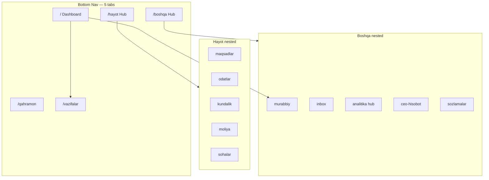

# REJABON AI — UI/UX Redesign

**Version:** 5.1 (Phase 5 + Dashboard 2.0 Retention)  
**Date:** 2026-06-21  
**Status:** Canonical UX design document  
**Companion:** `PRODUCT_STRATEGY.md`, `AI_COACH_SYSTEM.md`, `LIFE_RPG_SYSTEM.md`, `docs/FEATURE_ROADMAP.md`

---

## Table of Contents

1. [Executive Summary](#1-executive-summary)
2. [Current State Audit](#2-current-state-audit)
3. [UX Diagnosis](#3-ux-diagnosis)
4. [Design North Star](#4-design-north-star)
5. [New Navigation](#5-new-navigation)
6. [New Dashboard](#6-new-dashboard)
7. [New Widget Library](#7-new-widget-library)
8. [New Onboarding](#8-new-onboarding)
9. [New Analytics](#9-new-analytics)
10. [Hub Redesigns](#10-hub-redesigns)
11. [Screen-by-Screen Specs](#11-screen-by-screen-specs)
12. [App Shell & Global Patterns](#12-app-shell--global-patterns)
13. [Motion & Micro-interactions](#13-motion--micro-interactions)
14. [Accessibility & Responsiveness](#14-accessibility--responsiveness)
15. [Premium Visual Layer](#15-premium-visual-layer)
16. [Route Migration Map](#16-route-migration-map)
17. [Dashboard 2.0 — Retention Layout](#17-dashboard-20--retention-layout-shipped)
18. [Implementation Sprints](#18-implementation-sprints)

---

## 1. Executive Summary

### The Problem (Original Audit)

REJABON had **38 routable screens** across **26 feature modules** — UX felt like a **feature dump**. Dashboard had 11 stacked cards with no clear priority.

### Current State (2026-06-21)

**Dashboard 2.0 shipped** — retention command center with briefing, coach, memory, heatmap, predictions, emotion, emergency FAB, voice FAB. Still needs: analytics hub merge, More hub curation, focus mode entry.

### The Goal

Transform REJABON into a **command center** where:

1. **3 seconds** — user knows what to do today ✅ (briefing + today strip)
2. **One hero action** — coach insight or priority task ✅
3. **Every insight has a CTA** — partial (analytics hub pending)
4. **5 tabs, 2 hubs** — everything else is one tap deep
5. **Uzbek-native calm** — Apple clarity × Duolingo delight
6. **Daily reopen hook** — briefing + heatmap + XP reward ✅

### Phase 5 Deliverables

| Deliverable | Outcome | Status |
|-------------|---------|--------|
| New navigation | Curated IA, route constants, hub restructure | 🟡 |
| New dashboard | Retention zones (see §18) | ✅ |
| New widgets | Shared library v2 + retention widgets | 🟡 |
| New onboarding | 4 screens, <90s, first quest | ❌ |
| New analytics | Unified 5-tab hub | ❌ |

---

## 2. Current State Audit

### 2.1 Route Inventory (40+ screens)

#### Shell tabs (bottom nav visible)

| Route | Screen | File |
|-------|--------|------|
| `/` | `DashboardScreen` (2.0) | `dashboard_screen.dart` |
| `/qahramon` | `CharacterScreen` | `character_screen.dart` |
| `/vazifalar` | `TasksListScreen` | `tasks_screens.dart` |
| `/hayot` | `LifeHubScreen` | `life_hub_screen.dart` |
| `/boshqa` | `MoreHubScreen` | `more_hub_screen.dart` |

#### Retention routes (NEW — V1.6)

| Route | Screen | Role |
|-------|--------|------|
| `/favqulodda` | `EmergencyModeScreen` | Crisis recovery — heart FAB |
| `/qahramon/yutuqlar` | `AchievementShowcaseScreen` | Trophy wall public/private |
| `/boshqa/xotira` | `AiMemoryScreen` | AI memory browser |

#### Orphan shell route (no bottom nav)

| Route | Screen | Issue |
|-------|--------|-------|
| `/moliya` | `FinanceScreen` | Redirect → `/hayot/moliya` ✅ |

#### Outside shell

| Route | Screen |
|-------|--------|
| `/onboarding` | `OnboardingScreen` |
| `/reja` | `AiPlanningScreen` |

#### Nested `/vazifalar`

| Route | Screen |
|-------|--------|
| `/vazifalar/yangi` | `TaskFormScreen` |
| `/vazifalar/tahrirlash/:id` | `TaskFormScreen` |
| `/vazifalar/:id` | `TaskDetailScreen` |

#### Nested `/hayot` (11 routes)

| Route | Screen |
|-------|--------|
| `/hayot/odatlar` | `HabitsScreen` |
| `/hayot/maqsadlar` | `GoalsScreen` |
| `/hayot/kundalik` | `JournalScreen` |
| `/hayot/mashq` | `WorkoutScreen` |
| `/hayot/ta'lim` | `StudyScreen` |
| `/hayot/sohalar` | `LifeAreasScreen` |
| `/hayot/kelajak` | `FuturePlanningScreen` |
| `/hayot/simulyator` | `FutureSimulatorScreen` |
| `/hayot/vaqt` | `TimeTrackerScreen` |
| `/hayot/timeline` | `LifeTimelineScreen` |
| `/hayot/yutuqlar` | `MilestonesScreen` |

#### Nested `/boshqa` (17 routes)

| Route | Screen | Phase 5 status |
|-------|--------|----------------|
| `/boshqa/analitika` | `AnalyticsScreen` | → merge to hub |
| `/boshqa/vaqt-analitika` | `TimeAnalyticsScreen` | → merge to hub |
| `/boshqa/ikkinchi-miya` | `SecondBrainScreen` | keep |
| `/boshqa/ceo-hisobot` | `CeoReviewScreen` | keep |
| `/boshqa/inbox` | `InboxScreen` | keep, promote |
| `/boshqa/musobaqalar` | `ChallengesScreen` | hide until V4 |
| `/boshqa/eslatmalar` | `NotesScreen` | keep |
| `/boshqa/kalendar` | `CalendarScreen` | keep |
| `/boshqa/hujjatlar` | `DocumentsScreen` | keep |
| `/boshqa/murabbiy` | `AiCoachScreen` | keep, redesign |
| `/boshqa/murabbiy/ovoz` | `VoiceCoachScreen` | keep |
| `/boshqa/life-twin` | `LifeTwinScreen` | absorb → murabbiy |
| `/boshqa/qaror-yordam` | `DecisionAssistantScreen` | absorb → murabbiy |
| `/boshqa/action-engine` | `ActionEngineScreen` | hide |
| `/boshqa/life-map` | `LifeMapScreen` | merge → maqsadlar |
| `/boshqa/ijtimoiy` | `SocialScreen` | hide until V4 |
| `/boshqa/sozlamalar` | `SettingsScreen` | keep, add profile |

### 2.2 Dashboard Widget Audit (Dashboard 2.0 — Shipped)

**Active zones in `dashboard_screen.dart`:**

| Zone | Widget | File | Role |
|------|--------|------|------|
| A | `DashboardHeaderWithScore` | `dashboard_today_strip.dart` | Greeting + life score + streak |
| B | `DailyBriefingCard` | `retention_dashboard_widgets.dart` | Morning priorities + advice |
| C | `DashboardCoachCard` | `dashboard_coach_card.dart` | Life Brain insight hero |
| D | `MemoryStripCard` | `retention_dashboard_widgets.dart` | Top AI memory (if any) |
| E | `DashboardTodayStrip` | `dashboard_today_strip.dart` | Task + habits + inbox |
| F | `EmotionInsightCard` | `retention_dashboard_widgets.dart` | 5 emotion bars + insight |
| G | `DashboardPredictionsStrip` | `retention_dashboard_widgets.dart` | Goal/streak predictions |
| H | `DashboardRpgSummaryCard` | `dashboard_widgets.dart` | Level + XP + quests |
| I | `LifeHeatmapWidget` | `life_heatmap.dart` | 365-day GitHub grid |
| J | `DashboardLifeBalanceCard` | `dashboard_widgets.dart` | Balance wheel |
| K | `DashboardLifeDirectionCard` | `dashboard_widgets.dart` | Direction score |
| L | `DashboardYesterdayCard` | `dashboard_widgets.dart` | CEO preview |
| — | Quick links row | inline | Achievements + Second Brain |
| FAB | Emergency + Voice | `dashboard_screen.dart` | `/favqulodda`, voice coach |

**Global overlays:** `XpRewardOverlay` on task/habit XP award.

**Target polish:** Collapse zones J–L into analytics hub; reduce scroll to 8 zones max.

### 2.3 Hub Audit

**Life Hub (`LifeHubScreen`):** 11 `HubModuleCard` items, flat list, no grouping by daily vs planning, **no finance link**.

**More Hub (`MoreHubScreen`):** 20 items in 3 sections (MVP, Phase 2, Extras) — overwhelming; duplicates coach surfaces (Murabbiy, Life Twin, Decision Assistant, Voice, Action Engine).

### 2.4 Onboarding Audit

**Current:** 5 steps — welcome/name → persona → goal → habits → notifications.  
**Time:** ~2–3 minutes.  
**Creates:** 1 goal, 3 habits, settings.  
**Missing:** First task, coach welcome, first quest, life area selection.

### 2.5 Analytics Audit

| Surface | Content | Actions |
|---------|---------|---------|
| `/boshqa/analitika` | Rule-based insights by category | None — dead ends |
| `/boshqa/vaqt-analitika` | Time logs by period | Link to tracker only |
| Dashboard cards | Balance, direction, yesterday | Partial CTAs |
| Journal | `MoodTrendChart` widget | No dedicated analytics tab |
| Finance screen | Spending chart | Isolated from analytics |

---

## 3. UX Diagnosis

### 3.1 Severity Matrix

| Issue | Severity | User impact |
|-------|----------|-------------|
| Dashboard scroll fatigue (11 cards) | **Critical** | Users miss coach CTA |
| More hub overload (20 items) | **Critical** | Discovery paralysis |
| Orphan `/moliya` route | **High** | Lost navigation context |
| Duplicate AI surfaces (5 coach routes) | **High** | Confusion about "the AI" |
| Analytics dead ends | **High** | Insights feel useless |
| No route constants | **Medium** | Dev drift, broken links |
| Mixed Uzbek/English routes | **Medium** | Inconsistent IA |
| 11 dead dashboard widgets | **Medium** | Maintenance burden |
| Onboarding too long | **Medium** | Drop-off before value |
| Settings without profile | **Low** | No identity anchor |

### 3.2 Life Loop UX Gaps

| Loop stage | Current UX | Target UX |
|------------|------------|-----------|
| Capture | FAB + inbox CTA ✅ | Swipe triage inbox |
| Process | Inbox buried in More | Inbox badge on More tab |
| Plan | `/reja` full-screen orphan | Embedded in dashboard |
| Act | Tasks tab ✅ | Today view default |
| Reward | RPG tab ✅ | XP toast on complete |
| Reflect | Journal in Hayot hub | Evening prompt on dashboard |
| Coach | Dashboard card ✅ | Hero position, evidence UI |
| Review | CEO in More | Sunday push + dashboard card |

### 3.3 Cognitive Load Score

| Screen | Items visible | Target max | Verdict |
|--------|---------------|------------|---------|
| Dashboard 2.0 | 12 zones + 2 FABs | 8 zones | ⚠️ Collapse context row to hub |
| More hub | 20 cards | 8 visible + 4 hidden | ❌ Curate |
| Life hub | 11 cards | 9 grouped | ⚠️ Add finance ✅ |
| Tasks | List + filters | OK | ✅ Minor polish |
| Character | 4 sections | OK | ✅ + showcase link |

---

## 4. Design North Star

### 4.1 Emotional Target

**"Apple calm × Duolingo delight × Notion clarity"**

| Attribute | Specification |
|-----------|---------------|
| Primary emotion | Calm confidence — user feels in control |
| Secondary emotion | Playful progress — XP moments spark joy |
| Density | Low on dashboard; medium in lists; high only in analytics |
| Motion | Purposeful 200–400ms; celebrations 600ms |
| Typography | `app_typography.dart` — clear hierarchy, Uzbek diacritics |
| Color | `app_colors.dart` — deep navy base, life area gradients |
| Spacing | 8pt grid; 16px horizontal; 24px section gaps |
| Touch targets | Minimum 48×48dp |
| Language | Uzbek primary; emoji user-controlled |

### 4.2 Screen Quality Bar (Apple Test)

Before shipping any screen:

- [ ] One clear primary action visible without scroll
- [ ] Perceived load <300ms (skeleton/shimmer)
- [ ] Empty state with CTA
- [ ] Error state with retry
- [ ] Back navigation clear
- [ ] Haptic on meaningful complete
- [ ] No dead-end insights
- [ ] Uzbek copy reviewed
- [ ] Serves a Life Loop stage

### 4.3 Visual Hierarchy Rules

```
Level 1 — Hero     : Coach card, Life Score ring, primary CTA
Level 2 — Today    : Task strip, habit dots, inbox badge
Level 3 — Context  : RPG mini, balance wheel, direction
Level 4 — Explore  : Quick links, hub cards
Level 5 — Settings : Preferences, rarely used modules
```

---

## 5. New Navigation

### 5.1 Bottom Navigation (Unchanged — 5 Tabs)

| Index | Label | Route | Icon | Role |
|-------|-------|-------|------|------|
| 0 | Bosh sahifa | `/` | `home_rounded` | Command center |
| 1 | Qahramon | `/qahramon` | `shield_rounded` | RPG identity |
| 2 | Vazifalar | `/vazifalar` | `check_circle_rounded` | Task execution |
| 3 | Hayot | `/hayot` | `spa_rounded` | Life pillars |
| 4 | Boshqa | `/boshqa` | `more_horiz_rounded` | Knowledge + coach |

**Shell behavior changes:**

| Change | Before | After |
|--------|--------|-------|
| Finance route | `/moliya` orphan | `/hayot/moliya` nested |
| More tab badge | None | Inbox count when >0 |
| Coach intervention | None | Dismissible banner below timer bar |
| Tab re-tap | No-op | Scroll to top |

### 5.2 Information Architecture (Target)

```
REJABON AI
│
├── 🏠 Bosh sahifa (/)
│   └── Dashboard — coach, today, RPG, balance
│
├── 🛡️ Qahramon (/qahramon)
│   └── Character — stats, quests, achievements, skill tree (V3)
│
├── ✓ Vazifalar (/vazifalar)
│   ├── Bugun (default)
│   ├── Hafta
│   ├── Barchasi
│   ├── /yangi — form
│   ├── /tahrirlash/:id — form
│   └── /:id — detail
│
├── 🌿 Hayot (/hayot)
│   ├── HUB — grouped cards
│   ├── /maqsadlar — tabs: Faol | Uzoq muddat | Kelajak
│   ├── /odatlar
│   ├── /kundalik
│   ├── /moliya          ← moved from /moliya
│   ├── /mashq
│   ├── /ta'lim
│   ├── /sohalar
│   ├── /vaqt
│   ├── /timeline
│   ├── /yutuqlar
│   ├── /kelajak         ← absorbed into maqsadlar tab (redirect)
│   └── /simulyator
│
├── ••• Boshqa (/boshqa)
│   ├── HUB — curated 8 items
│   ├── /murabbiy        ← unified AI (coach + twin + decisions)
│   │   └── /ovoz
│   ├── /inbox
│   ├── /analitika       ← unified 5-tab hub
│   ├── /ikkinchi-miya
│   ├── /ceo-hisobot
│   ├── /kalendar
│   ├── /eslatmalar
│   ├── /hujjatlar
│   └── /sozlamalar
│
├── /reja — AI planning (modal or push from dashboard)
└── /onboarding
```

### 5.3 Hayot Hub — New Structure

Grouped sections replace flat 11-card scroll:

```
┌─────────────────────────────────────┐
│ HAYOT                               │
│ Bugun va rivojlanish                │
├─────────────────────────────────────┤
│ BUGUN                               │
│ ┌─────────┐ ┌─────────┐ ┌────────┐│
│ │ Odatlar │ │Kundalik │ │ Moliya ││  ← 3-up grid
│ │ 2/5 ✓   │ │ Yozilmagan│ Balans ││
│ └─────────┘ └─────────┘ └────────┘│
├─────────────────────────────────────┤
│ RIVOJLANISH                         │
│ [Maqsadlar & Kelajak]  72% ████░   │
│ [Odatlar]              5 odat 🔥3 │
│ [Jismoniy mashq]       2/hafta     │
│ [Ta'lim]               45 daq      │
├─────────────────────────────────────┤
│ TIZIM                               │
│ [Hayot sohalari]  [Vaqt kuzatuv]   │
│ [Timeline]        [Yutuqlar]       │
└─────────────────────────────────────┘
```

### 5.4 Boshqa Hub — Curated (8 Visible)

**Primary row (always visible):**

| # | Module | Route | Badge |
|---|--------|-------|-------|
| 1 | AI Murabbiy | `/boshqa/murabbiy` | Daily insight dot |
| 2 | Smart Inbox | `/boshqa/inbox` | Count |
| 3 | Analitika | `/boshqa/analitika` | — |
| 4 | CEO hisobot | `/boshqa/ceo-hisobot` | Sunday highlight |

**Secondary row:**

| # | Module | Route |
|---|--------|-------|
| 5 | Ikkinchi miya | `/boshqa/ikkinchi-miya` |
| 6 | Kalendar | `/boshqa/kalendar` |
| 7 | Eslatmalar | `/boshqa/eslatmalar` |
| 8 | Sozlamalar | `/boshqa/sozlamalar` |

**Collapsed "Yana" section (tap to expand):**

- Hujjatlar
- AI rejalashtirish (`/reja`)
- Kelajak simulyatori (`/hayot/simulyator`)
- Ovozli murabbiy (`/boshqa/murabbiy/ovoz`)

**Hidden until V4 (remove from hub):**

- Life Twin → absorbed into Murabbiy profile tab
- Decision Assistant → absorbed into Murabbiy recommendations
- Action Engine → merged into coach interventions
- Life Map → merged into Maqsadlar detail
- Social, Challenges → V4 social layer

### 5.5 Route Constants (New File)

```dart
// lib/core/router/app_routes.dart
abstract class AppRoutes {
  static const home = '/';
  static const character = '/qahramon';
  static const tasks = '/vazifalar';
  static const life = '/hayot';
  static const more = '/boshqa';
  static const onboarding = '/onboarding';
  static const planning = '/reja';

  // Life
  static const lifeGoals = '/hayot/maqsadlar';
  static const lifeHabits = '/hayot/odatlar';
  static const lifeJournal = '/hayot/kundalik';
  static const lifeFinance = '/hayot/moliya';
  static const lifeWorkout = '/hayot/mashq';
  static const lifeStudy = '/hayot/ta\'lim';
  static const lifeAreas = '/hayot/sohalar';
  static const lifeTime = '/hayot/vaqt';
  static const lifeTimeline = '/hayot/timeline';
  static const lifeMilestones = '/hayot/yutuqlar';
  static const lifeFuture = '/hayot/kelajak';
  static const lifeSimulator = '/hayot/simulyator';

  // More
  static const coach = '/boshqa/murabbiy';
  static const coachVoice = '/boshqa/murabbiy/ovoz';
  static const inbox = '/boshqa/inbox';
  static const analytics = '/boshqa/analitika';
  static const ceoReview = '/boshqa/ceo-hisobot';
  static const secondBrain = '/boshqa/ikkinchi-miya';
  static const calendar = '/boshqa/kalendar';
  static const notes = '/boshqa/eslatmalar';
  static const documents = '/boshqa/hujjatlar';
  static const settings = '/boshqa/sozlamalar';
}
```

### 5.6 Navigation Diagram



---

## 6. New Dashboard

### 6.1 Design Principle

**"Open app → know what to do in 3 seconds."**

Reduce from **11 scroll sections** to **6 intentional zones**. Remove duplicate data. Coach is always hero.

### 6.2 New Layout

```
┌─────────────────────────────────────────┐
│ Salom, Ali          [Life Score 72] ⓘ  │  Zone A: Header
│ Yakshanba, 21 iyun                      │
├─────────────────────────────────────────┤
│ 🤖 COACH HERO                           │  Zone B: Intelligence
│ ┌─────────────────────────────────────┐ │
│ │ "Bugun Career maqsadi ustuvor"      │ │
│ │ Portfolio 9 kundan harakatsiz...    │ │
│ │ Ishonch: ●●●○○  [Boshlash →]       │ │
│ └─────────────────────────────────────┘ │
├─────────────────────────────────────────┤
│ BUGUN                                   │  Zone C: Execution
│ ┌──────────────────────────────────────┐│
│ │ → Task 1  ●●●  Career               ││  horizontal scroll
│ │ → Task 2  ●●   —                    ││  max 3 tasks
│ │ → Task 3  ●    Health             ││
│ └──────────────────────────────────────┘│
│ ○○●○○ 2/5 odat  ·  Inbox: 3          │  habit dots + inbox
├─────────────────────────────────────────┤
│ Lv.12 ████████░░  +340 XP  Quest 2/3   │  Zone D: RPG strip
├─────────────────────────────────────────┤
│ ┌──────────────┐  ┌──────────────┐     │  Zone E: Context
│ │ Hayot balansi│  │ Yo'nalish    │     │  2-column
│ │   [radar]    │  │  ████░░ 68%  │     │
│ └──────────────┘  └──────────────┘     │
├─────────────────────────────────────────┤
│ Kecha: 4/6 vazifa · Mood 4/5  [→]      │  Zone F: Reflection
└─────────────────────────────────────────┘
                              [Capture FAB]
```

### 6.3 Zone Specifications

#### Zone A — `DashboardHeader`

| Element | Spec |
|---------|------|
| Greeting | Time-based: "Xayrli tong/kun/kech, {name}" |
| Date | `AppDateFormat.formatDate` — secondary text |
| Life Score | `ProgressRing` 40dp, tap → `/boshqa/analitika` tab Hayot |
| Streak | Removed from header — shown in habit dots only |

**Removes:** Duplicate streak in `DashboardCommandHeader`.

#### Zone B — `DashboardCoachHero` (upgrade `DashboardCoachCard`)

| Element | Spec |
|---------|------|
| Source | `dailyCoachAdviceProvider` (Phase 4 facade) |
| Layout | Gradient hero card, 20px radius |
| Content | Headline (max 2 lines) + body (max 3 lines) |
| Evidence | 1–2 bullet metrics below body |
| Confidence | Dot indicator: ●●●○○ |
| CTA | Primary button — route from `CoachAction` |
| Feedback | Thumbs up/down icons (optional Phase 5) |
| Empty | "3 kun ma'lumot to'plang" + explainer link |
| Premium | Gold border accent |

#### Zone C — `DashboardTodayStrip`

| Element | Spec |
|---------|------|
| Tasks | Horizontal `ListView` — max 3 priority tasks |
| Task chip | Checkbox, title (1 line), priority dots, life area color |
| Tap task | Navigate to detail or complete inline |
| Habits | 5 dots max (● done, ○ pending), tap → `/hayot/odatlar` |
| Inbox | "Inbox: N" badge if N>0, tap → `/boshqa/inbox` |
| Empty tasks | "Bugun vazifalar yo'q" + [+ Qo'shish] |

**Replaces:** `DashboardPriorityTaskCard` + `DashboardTodayPlan` (duplicate).

#### Zone D — `DashboardRpgStrip` (slim `DashboardRpgSummaryCard`)

| Element | Spec |
|---------|------|
| Layout | Single row, dark gradient background |
| Level | "Lv.{n}" + XP progress bar |
| Quest | "Quest 2/3" if active daily quests |
| Tap | → `/qahramon` |
| Animation | XP gain floats on task complete (global overlay) |

#### Zone E — `DashboardContextRow`

| Element | Spec |
|---------|------|
| Layout | 2 equal cards side-by-side |
| Left | Life balance mini radar → `/hayot/sohalar` |
| Right | Life direction score → `/hayot/maqsadlar` |
| Height | Fixed 120dp |

**Replaces:** Full-width `DashboardLifeBalanceCard` + `DashboardLifeDirectionCard`.

#### Zone F — `DashboardReflectionCard` (slim `DashboardYesterdayCard`)

| Element | Spec |
|---------|------|
| Content | "Kecha: X/Y vazifa · Mood Z/5" |
| Tap | → `/boshqa/ceo-hisobot` |
| Visibility | Only if yesterday data exists |
| Evening variant | After 18:00 show "Bugun qanday o'tdi?" → journal |

### 6.4 Removed from Dashboard

| Widget | Reason |
|--------|--------|
| `DashboardMonthlyFocusCard` | Move to Goals screen header |
| `DashboardDayBuilderCard` | Move to `/reja` entry or evening prompt |
| `DashboardMvpQuickActions` | Capture FAB + hubs replace 6-icon grid |
| All 11 dead widgets | Delete from codebase |

### 6.5 Dashboard File Structure

```
lib/features/dashboard/presentation/
├── screens/
│   └── dashboard_screen.dart          # ~80 lines, composes zones
└── widgets/
    ├── dashboard_header.dart
    ├── dashboard_coach_hero.dart      # upgrade coach_card
    ├── dashboard_today_strip.dart
    ├── dashboard_rpg_strip.dart
    ├── dashboard_context_row.dart
    └── dashboard_reflection_card.dart
```

### 6.6 Dashboard Provider Dependencies

| Zone | Providers |
|------|-----------|
| Header | `settingsProvider`, `lifeScoreProvider` |
| Coach | `dailyCoachAdviceProvider` |
| Today | `tasksProvider`, `habitsProvider`, `inboxProvider` |
| RPG | `playerProfileProvider`, `dailyQuestsProvider` |
| Context | `lifeBalanceProvider`, `lifeDirectionProvider` |
| Reflection | `yesterdayReviewProvider` |

---

## 7. New Widget Library

### 7.1 Shared Widgets (New / Upgrade)

| Widget | File | Purpose |
|--------|------|---------|
| `InsightCard` | `insight_card.dart` | Coach + analytics — evidence + action chip |
| `LifeAreaChip` | `life_area_chip.dart` | Consistent 7-area colors |
| `PriorityDots` | `priority_dots.dart` | 1–3 dots for task priority |
| `HabitDotRow` | `habit_dot_row.dart` | ○●○●○ today habit status |
| `XpToast` | `xp_reward_overlay.dart` | Global "+15 XP" float overlay ✅ |
| `LifeHeatmapWidget` | `life_heatmap.dart` | 365-day activity grid ✅ |
| `DailyBriefingCard` | `retention_dashboard_widgets.dart` | Morning briefing hero ✅ |
| `EmotionInsightCard` | `retention_dashboard_widgets.dart` | 5-axis emotion + burnout ✅ |
| `MemoryStripCard` | `retention_dashboard_widgets.dart` | AI memory teaser ✅ |
| `ConfidenceIndicator` | `confidence_indicator.dart` | ●●●○○ for AI insights |
| `QuickInputBar` | `quick_input_bar.dart` | Inline task/note create |
| `HubSection` | `hub_section.dart` | Grouped hub with label |
| `HubGridCard` | `hub_grid_card.dart` | Compact 3-up grid card |
| `StatMiniCard` | `stat_mini_card.dart` | Dashboard context pair |
| `EmptyStateIllustration` | `empty_state_illustration.dart` | Per-module SVG/emoji art |
| `SkeletonCard` | `skeleton_card.dart` | Shimmer loading placeholder |
| `CoachInterventionBanner` | `coach_intervention_banner.dart` | Shell-level nudge |

### 7.2 Card System

| Type | Style | Use |
|------|-------|-----|
| **Hero** | Gradient bg, white text, 20px radius | Coach, onboarding finale |
| **Standard** | `surfaceContainer` + 1px border, 16px radius | Lists, hubs |
| **Insight** | Left accent bar (life area color) + action chip | Analytics, coach list |
| **RPG** | Dark gradient + gold XP accent | Character, RPG strip |
| **Compact** | 12px radius, reduced padding | Grid cards, strips |

### 7.3 InsightCard Specification

```
┌─────────────────────────────────────┐
│ ▌ 📊 Kayfiyat ↔ Samaradorlik        │  ← life area accent bar
│                                     │
│ Kayfiyat past kunlarda vazifa       │
│ bajarish 34% kamroq                 │
│                                     │
│ • 14 kun ma'lumot                   │  ← evidence bullets
│ • 23 ta vazifa tahlil qilindi       │
│                                     │
│ Ishonch: ●●●○○        [Harakat →]  │  ← confidence + CTA
└─────────────────────────────────────┘
```

```dart
class InsightCard extends StatelessWidget {
  const InsightCard({
    required this.title,
    required this.body,
    required this.evidence,
    required this.confidence,
    this.emoji,
    this.accentColor,
    this.actionLabel,
    this.onAction,
    this.onDismiss,
  });
}
```

### 7.4 Hub Widgets

#### `HubSection`

```dart
class HubSection extends StatelessWidget {
  const HubSection({
    required this.label,
    required this.children,
  });
  final String label;
  final List<Widget> children;
}
```

#### `HubGridCard` (3-up for Life hub "Bugun")

```dart
class HubGridCard extends StatelessWidget {
  const HubGridCard({
    required this.title,
    required this.subtitle,
    required this.icon,
    required this.accentColor,
    this.badge,
    required this.onTap,
  });
}
```

### 7.5 Split `dashboard_widgets.dart`

Delete monolith. Extract 6 dashboard zone widgets + move reusable pieces to `lib/shared/widgets/`.

**Target:** No file >400 lines in dashboard feature.

---

## 8. New Onboarding

### 8.1 Design Goals

| Goal | Metric |
|------|--------|
| Time to value | <90 seconds |
| Steps | 4 screens (down from 5) |
| First action | User creates 1 task |
| First reward | Welcome quest auto-generated |
| Personalization | Life areas, not abstract persona |

### 8.2 New Flow

```
Step 1          Step 2           Step 3            Step 4
WELCOME    →    FOCUS AREAS  →   FIRST CAPTURE  →  READY
"name"          pick 2 areas     1 task inline     notifications
                + persona        + 1 habit         + coach welcome
```

### 8.3 Step Specifications

#### Step 1 — Welcome (15s)

```
┌─────────────────────────────────────┐
│         [REJABON logo]              │
│                                     │
│   Hayotingizning operatsion         │
│   tizimi                            │
│                                     │
│   REJABON AI sizning ma'lumotlaringiz│
│   asosida shaxsiy murabbiy bo'ladi. │
│                                     │
│   Ismingiz                          │
│   ┌─────────────────────────────┐   │
│   │ Ali                         │   │
│   └─────────────────────────────┘   │
│                                     │
│              [Davom etish →]        │
└─────────────────────────────────────┘
```

**Data:** `userName`

#### Step 2 — Focus Areas (20s)

```
┌─────────────────────────────────────┐
│   Qaysi sohalarga e'tibor           │
│   qilmoqchisiz?                     │
│                                     │
│   Eng muhim 2 tasini tanlang        │
│                                     │
│   ┌────────┐ ┌────────┐            │
│   │ 💼     │ │ 🏃     │            │
│   │Karyera │ │Sog'lik │            │
│   └────────┘ └────────┘            │
│   ┌────────┐ ┌────────┐            │
│   │ 📚     │ │ 💰     │            │
│   │Ta'lim  │ │Moliya  │            │
│   └────────┘ └────────┘            │
│   ... (7 life areas)                │
│                                     │
│   Kim siz? (ixtiyoriy)              │
│   [Talaba] [Mutaxassis] [Hammasi]   │
│                                     │
│              [Davom etish →]        │
└─────────────────────────────────────┘
```

**Data:** `focusAreas[]` (max 2), `persona` (optional, defaults from areas)

**Replaces:** Abstract persona-first step. Areas map to coach priorities and default goal suggestions.

#### Step 3 — First Capture (30s)

```
┌─────────────────────────────────────┐
│   Keling, birinchi qadamni          │
│   qo'yamiz                          │
│                                     │
│   Bugungi birinchi vazifangiz?      │
│   ┌─────────────────────────────┐   │
│   │ Portfolio yangilash         │   │
│   └─────────────────────────────┘   │
│                                     │
│   Bir odat tanlang                  │
│   [💧 Suv] [📚 Kitob] [💪 Mashq]   │
│                                     │
│   (Maqsad avtomatik yaratiladi)     │
│                                     │
│              [Davom etish →]        │
└─────────────────────────────────────┘
```

**Data:** Creates:
- 1 `TaskEntity` (due today, priority from focus areas)
- 1 `HabitEntity` (selected)
- 1 `GoalEntity` (auto from focus areas: e.g. "Karyerani rivojlantirish")

**Replaces:** Separate goal step + multi-habit step.

#### Step 4 — Ready (25s)

```
┌─────────────────────────────────────┐
│   ✨ Tayyor!                        │
│                                     │
│   ┌─────────────────────────────┐   │
│   │ 🎯 Birinchi quest:          │   │
│   │ "Birinchi vazifani bajar"   │   │
│   │ Mukofot: +25 XP             │   │
│   └─────────────────────────────┘   │
│                                     │
│   🔔 Eslatmalar                     │
│   [toggle] Tong va kech eslatma     │
│                                     │
│   Murabbiyingiz tayyor — har kuni   │
│   shaxsiy maslahat olasiz.          │
│                                     │
│              [Boshlash 🚀]          │
└─────────────────────────────────────┘
```

**Data:**
- `completeOnboardingWith(userName, persona, focusAreas, notifications)`
- `PlayerProfileEntity` bootstrap
- Welcome quest: `quest_welcome_first_task` (+25 XP)
- Coach memory seed: "Foydalanuvchi {areas} sohalariga e'tibor qiladi"

### 8.4 Post-Onboarding Dashboard

First open shows:
1. Coach hero: "Xush kelibsiz, {name}! Birinchi vazifangiz tayyor."
2. Today strip: the task they created
3. RPG strip: "Quest 1/1" highlighted
4. No empty states on first day

### 8.5 Onboarding Analytics Events

| Event | When |
|-------|------|
| `onboarding_started` | Step 1 view |
| `onboarding_step_completed` | Each step |
| `onboarding_completed` | Step 4 finish |
| `onboarding_dropped` | App background mid-flow |

---

## 9. New Analytics

### 9.1 Unified Analytics Hub

**Route:** `/boshqa/analitika` (replaces separate time analytics entry)

Single screen with **5 tabs** — every tab has actionable insights.

### 9.2 Tab Structure

```
┌─────────────────────────────────────┐
│ Analitika                    [↗]   │  export (Premium)
├─────────────────────────────────────┤
│ Hayot │ Samaradorlik │ Vaqt │ Kayfiyat │ Moliya │
├─────────────────────────────────────┤
│                                     │
│         [Tab content]               │
│                                     │
└─────────────────────────────────────┘
```

### 9.3 Tab Specifications

#### Tab 1 — Hayot (Life)

| Widget | Data source | Action |
|--------|-------------|--------|
| Life Score hero ring | `lifeScoreProvider` | — |
| 7-day trend sparkline | Life score history | — |
| Domain radar chart | `lifeBalanceProvider` | [Sohalarni ko'rish →] |
| Weakest area card | Lowest scoring area | [Yaxshilash →] specific route |
| Life direction score | `lifeDirectionProvider` | [Maqsadlar →] |

#### Tab 2 — Samaradorlik (Productivity)

| Widget | Data source | Action |
|--------|-------------|--------|
| Task completion rate | Tasks repo | [Vazifalar →] |
| Habit completion heatmap | Habits repo (Duolingo-style) | [Odatlar →] |
| Best day insight | `CoachPatternEngine` | InsightCard |
| Overdue count | Tasks filter | [Kechikkanlar →] |
| Weekly comparison | This vs last week | — |

#### Tab 3 — Vaqt (Time)

| Widget | Data source | Action |
|--------|-------------|--------|
| Period selector | day / week / month / year | — |
| Total hours hero | `TimeAnalyticsService` | — |
| Category breakdown bars | Time logs by life area | [Vaqt kuzatuv →] |
| Peak hours insight | Hour-of-day pattern | InsightCard |
| Focus time vs total | Time logs filter | — |

*Migrates existing `TimeAnalyticsScreen` content.*

#### Tab 4 — Kayfiyat (Mood)

| Widget | Data source | Action |
|--------|-------------|--------|
| 7-day mood trend line | `MoodTrendService` | — |
| Average mood badge | Journal entries | — |
| Mood ↔ productivity insight | `CoachPatternEngine` | InsightCard |
| Journal consistency | Days written / 7 | [Kundalik →] |
| Low mood days list | mood ≤2 entries | [Ko'rish →] |

*Uses existing `MoodTrendChart` widget, promoted to analytics.*

#### Tab 5 — Moliya (Finance)

| Widget | Data source | Action |
|--------|-------------|--------|
| Balance hero | Finance repo | — |
| Income vs expense bars | Monthly totals | — |
| Top category insight | Spending by category | [Moliya →] |
| Empty state | No transactions | [Boshlash →] `/hayot/moliya` |

*Only visible if finance data exists OR user enabled finance focus area.*

### 9.4 InsightCard Rules (Analytics)

Every insight in analytics MUST have:

1. **Title** — pattern name
2. **Body** — evidence sentence with numbers
3. **Evidence bullets** — 1–2 data points
4. **Confidence** — high/medium/low
5. **Action chip** — navigates to relevant screen

**No dead-end cards.** Migrate `AnalyticsScreen` `_InsightCard` to shared `InsightCard` with action support.

### 9.5 Analytics File Structure

```
lib/features/analytics/presentation/
├── screens/
│   └── analytics_hub_screen.dart      # TabBar + TabBarView
├── widgets/
│   ├── analytics_life_tab.dart
│   ├── analytics_productivity_tab.dart
│   ├── analytics_time_tab.dart
│   ├── analytics_mood_tab.dart
│   ├── analytics_finance_tab.dart
│   └── analytics_period_selector.dart
└── providers/
    └── analytics_hub_providers.dart
```

### 9.6 Analytics Empty States

| Tab | Empty message | CTA |
|-----|---------------|-----|
| Hayot | "Hayot balansi uchun ma'lumot to'plang" | [Boshlash →] |
| Samaradorlik | "Vazifa va odatlar qo'shing" | [+ Vazifa] |
| Vaqt | "Vaqt kuzatuvni yoqing" | [Boshlash →] `/hayot/vaqt` |
| Kayfiyat | "7 kun kundalik yozing" | [Kundalik →] |
| Moliya | "Moliyani kuzatishni boshlang" | [Moliya →] |

### 9.7 Premium Analytics

| Feature | Free | Premium |
|---------|------|---------|
| History depth | 7 days | 90 days |
| Export | — | PDF/CSV |
| Correlation insights | 3 visible | All |
| Custom date range | — | ✅ |

---

## 10. Hub Redesigns

### 10.1 Life Hub Wireframe

See [Section 5.3](#53-hayot-hub--new-structure). Implementation uses `HubSection` + `HubGridCard` + `HubModuleCard`.

**New finance card in Bugun grid:**

```dart
HubGridCard(
  title: AppStrings.finance,
  subtitle: balance >= 0 ? '${balance} so\'m' : AppStrings.negativeBalance,
  icon: Icons.account_balance_wallet_rounded,
  accentColor: AppColors.moduleFinance,
  onTap: () => context.push(AppRoutes.lifeFinance),
),
```

### 10.2 More Hub Wireframe

```
┌─────────────────────────────────────┐
│ BOSHQA                              │
│ Bilim va murabbiy                   │
├─────────────────────────────────────┤
│ [AI Murabbiy]        ● daily        │
│ [Smart Inbox]        3              │
│ [Analitika]                         │
│ [CEO hisobot]        🌟 yakshanba   │
├─────────────────────────────────────┤
│ [Ikkinchi miya]  [Kalendar]         │
│ [Eslatmalar]     [Sozlamalar]       │
├─────────────────────────────────────┤
│ ▼ Yana (4)                          │  collapsed by default
└─────────────────────────────────────┘
```

**More tab badge:** Show inbox count on nav icon when >0.

---

## 11. Screen-by-Screen Specs

### 11.1 Tasks (`/vazifalar`)

| Element | Spec |
|---------|------|
| Default view | **Bugun** — due today + overdue |
| View modes | Segmented: Bugun \| Hafta \| Barchasi |
| Quick add | `QuickInputBar` at top — title only |
| Task row | Checkbox, title, priority dots, life area dot, due badge |
| Swipe right | Complete (+ `XpToast`) |
| Swipe left | Reschedule sheet / delete |
| Filter chips | Ustuvor, Kechikkan, Maqsadli |
| Empty | "Bugun vazifalar yo'q — zo'r!" + CTA |

### 11.2 Habits (`/hayot/odatlar`)

| Element | Spec |
|---------|------|
| Today view | Large check circles, streak flame |
| Habit card | Icon, name, streak, week dots (7) |
| Complete | Circle fill + haptic + XP toast |
| Stats tab | Calendar heatmap (Duolingo-style) |
| FAB | Quick habit (name + emoji) |

### 11.3 Goals (`/hayot/maqsadlar` — merged)

| Tab | Content |
|-----|---------|
| Faol | Active goals with progress rings |
| Uzoq muddat | Horizon goals (1y, 5y) from future planning |
| Kelajak | Letters, vision board, simulator link |

**Absorbs:** `/hayot/kelajak` (redirect), `/boshqa/life-map` (roadmap in goal detail).

### 11.4 AI Coach (`/boshqa/murabbiy`)

```
┌─────────────────────────────────────┐
│ Murabbiy              [Ovoz] [⚙️]  │
├─────────────────────────────────────┤
│ DAILY ADVICE (hero InsightCard)     │
├─────────────────────────────────────┤
│ TAVSIYALAR (max 5 InsightCards)     │
├─────────────────────────────────────┤
│ VA'DALAR (commitments)              │
├─────────────────────────────────────┤
│ HISOBOTLAR                          │
│ [Haftalik]  [Oylik]                 │
├─────────────────────────────────────┤
│ PROFIL (collapsed Twin profile)     │
│ chronotype · productivity style     │
├─────────────────────────────────────┤
│ SAVOL BERING (Premium chat)         │
└─────────────────────────────────────┘
```

**Absorbs:** Life Twin profile, Decision Assistant recommendations.

### 11.5 Character (`/qahramon`)

| Section | Spec |
|---------|------|
| Header | Avatar placeholder, name, level, XP ring |
| Stats | 7-stat grid (see LIFE_RPG_SYSTEM.md) |
| Quests | Daily quest cards with progress |
| Achievements | Horizontal scroll badges |
| Visual | Dark gradient section — "game mode" contrast |

### 11.6 Inbox (`/boshqa/inbox`)

| Element | Spec |
|---------|------|
| Cards | Capture items with AI suggestion chip |
| Swipe right | Convert to: Task \| Habit \| Note |
| Swipe left | Archive |
| Progress | "12 ta qolgan" header |
| Inbox zero | Celebration animation + message |

### 11.7 Settings (`/boshqa/sozlamalar`)

| Section | Content |
|---------|---------|
| Profile header | Avatar, name, level badge, edit name |
| Subscription | Free / Premium tier |
| Coach | Tone preference, emoji toggle |
| Notifications | Times, types |
| Appearance | Theme, font scale |
| Data | Backup, export, delete memories |
| About | Version, licenses |

### 11.8 Journal (`/hayot/kundalik`)

| Element | Spec |
|---------|------|
| Today entry | Mood picker (emoji + label), text area |
| Mood trend | `MoodTrendChart` below entry |
| Link | "Batafsil analitika →" to analytics Kayfiyat tab |
| Evening prompt | Dashboard reflection card links here |

---

## 12. App Shell & Global Patterns

### 12.1 Shell Layout

```
┌────────────────────────────────────┐
│ Status bar                          │
├────────────────────────────────────┤
│ [Coach intervention banner]         │  NEW — dismissible
├────────────────────────────────────┤
│ [Active focus timer bar]            │  existing
├────────────────────────────────────┤
│                                     │
│           Screen content            │
│                                     │
│                          [Capture]  │  FAB
├────────────────────────────────────┤
│  🏠    🛡️    ✓    🌿    •••  (3)   │  inbox badge on More
└────────────────────────────────────┘
```

### 12.2 Capture FAB

| Gesture | Action |
|---------|--------|
| Tap | `CaptureSheet` — task, note, habit, goal, journal |
| Long-press | Voice capture → inbox |
| Success | Snackbar "Inboxga qo'shildi" + [Ochish] |

### 12.3 Module Screen Pattern

Most nested screens use `ModuleScreen` scaffold:

- Back button
- Title
- Optional actions (filter, add)
- `AsyncValueView` body

**Keep** — consistent across 30+ nested routes.

### 12.4 Coach Intervention Banner

```dart
class CoachInterventionBanner extends ConsumerWidget {
  // Shown when InterventionEngine returns non-null
  // Slim bar below status bar
  // Tap → action (focus mode, journal, etc.)
  // Swipe up → dismiss (records feedback)
}
```

---

## 13. Motion & Micro-interactions

### 13.1 Timing

| Interaction | Duration | Curve |
|-------------|----------|-------|
| Tab switch | 200ms | easeOut |
| Card press | 100ms scale 0.98 | easeInOut |
| Page push | 300ms | easeOutCubic |
| XP toast | 600ms float + fade | easeOut |
| Level up | 600ms pulse + particles | elasticOut |
| Habit complete | 300ms circle fill | easeOut |
| Inbox zero | 800ms celebration | — |

### 13.2 Haptics

| Event | Haptic |
|-------|--------|
| Task complete | `lightImpact` |
| Habit complete | `mediumImpact` |
| Level up | `heavyImpact` |
| Tab switch | `selectionClick` |
| Error | `vibrate` |

### 13.3 Respect Reduced Motion

```dart
final reduceMotion = MediaQuery.disableAnimationsOf(context);
if (reduceMotion) {
  // Skip particles, use instant state change
}
```

---

## 14. Accessibility & Responsiveness

### 14.1 Accessibility

| Requirement | Implementation |
|-------------|----------------|
| Screen reader | `Semantics` on all interactive elements |
| Labels | Uzbek: "Vazifani bajarildi deb belgilash" |
| Color contrast | WCAG AA minimum |
| Mood input | Emoji + text label (not color-only) |
| Font scale | Layout adapts to `textScaleFactor` ≤1.3 |
| Focus order | Top-to-bottom, hero first |

### 14.2 Responsiveness

| Breakpoint | Layout |
|------------|--------|
| <360dp | Single column, 12px padding |
| 360–600dp | Default mobile |
| 600–900dp | Two-column dashboard; master-detail lists |
| >900dp | Max-width 840dp centered |

**V5:** Mobile-first. Tablet layouts in V3.

---

## 15. Premium Visual Layer

| Element | Free | Premium |
|---------|------|---------|
| Coach hero | Standard gradient | Gold border glow |
| Analytics history | 7 days | 90 days + export |
| Themes | Dark / Light | +5 themes |
| Avatar frames | — | Level unlocks |
| Future letters | 1 active | Unlimited |
| Voice coach | 3 sessions/day | Unlimited |

**No aggressive paywalls** — soft "Premium" badge on locked features.

---

## 16. Route Migration Map

| Old route | New route | Action |
|-----------|-----------|--------|
| `/moliya` | `/hayot/moliya` | Move + redirect old |
| `/boshqa/vaqt-analitika` | `/boshqa/analitika?tab=vaqt` | Redirect |
| `/boshqa/life-twin` | `/boshqa/murabbiy?tab=profil` | Redirect |
| `/boshqa/qaror-yordam` | `/boshqa/murabbiy` | Redirect |
| `/boshqa/action-engine` | — | Remove route |
| `/hayot/kelajak` | `/hayot/maqsadlar?tab=kelajak` | Redirect |
| `/boshqa/life-map` | `/hayot/maqsadlar/:id` | Merge into goal detail |
| — | `/favqulodda` | Emergency Mode (heart FAB) |
| — | `/qahramon/yutuqlar` | Achievement showcase |
| — | `/boshqa/xotira` | AI memory browser |

**Deprecation period:** Old routes redirect for 2 releases, then remove.

---

## 17. Dashboard 2.0 — Retention Layout (Shipped)

### 17.1 Design Principle

**"Open app → briefing → act → reward → reflect — every day."**

Supersedes §6 six-zone spec. Retention-first layout prioritizing daily hook over minimal scroll.

### 17.2 Layout (As Built)

```
┌─────────────────────────────────────────┐
│ BUYRUQ MARKAZI          [Life Score 72]   │  Zone A: Header + score
│ Xayrli tong, Ali 👋                     │
│ 🔥 streak · ✅ habits                    │
├─────────────────────────────────────────┤
│ ☀️ KUNLIK BRIFING                       │  Zone B: Daily Briefing
│ Priorities · advice · productivity %    │
├─────────────────────────────────────────┤
│ 🤖 AI MURABBIY                          │  Zone C: Coach (Life Brain)
│ Evidence insight + CTA                  │
├─────────────────────────────────────────┤
│ 🧠 AI XOTIRA (if memories exist)        │  Zone D: Memory strip
├─────────────────────────────────────────┤
│ BUGUNGI REJA                            │  Zone E: Today strip
│ Top task OR empty CTA · habits · inbox    │
├─────────────────────────────────────────┤
│ EMOTSIYA INTELLIGENCE                   │  Zone F: Emotion bars
├─────────────────────────────────────────┤
│ BASHORATLAR (if predictions)            │  Zone G: Predictions
├─────────────────────────────────────────┤
│ RPG strip (level · XP · quests)         │  Zone H
├─────────────────────────────────────────┤
│ HAYOT HEATMAP — 365 kun                 │  Zone I: GitHub grid
├─────────────────────────────────────────┤
│ Balance · Direction · Yesterday         │  Zones J–L (→ analytics hub)
│ [Yutuqlar] [Ikkinchi miya]              │  Quick links
└─────────────────────────────────────────┘
     ♥ FAB emergency    🎤 FAB voice
```

### 17.3 Zone → Provider Map

| Zone | Widget | Providers |
|------|--------|-----------|
| A | `DashboardHeaderWithScore` | `settingsProvider`, `lifeScoreProvider`, tasks/habits |
| B | `DailyBriefingCard` | `dailyBriefingProvider` |
| C | `DashboardCoachCard` | `lifeBrainTopInsightProvider`, `aiTipsProvider` |
| D | `MemoryStripCard` | `memoryContextProvider` |
| E | `DashboardTodayStrip` | tasks/habits/inbox (passed from screen) |
| F | `EmotionInsightCard` | `emotionProfileProvider` |
| G | `DashboardPredictionsStrip` | `dashboardPredictionsProvider` |
| H | `DashboardRpgSummaryCard` | `playerProfileProvider`, `dailyQuestsProvider` |
| I | `LifeHeatmapWidget` | `lifeHeatmapProvider` |
| J–L | Balance/direction/yesterday | `lifeBalanceProvider`, `lifeDirectionProvider`, `yesterdayReviewProvider` |

**Hub:** `retention_providers.dart`

### 17.4 FAB Specifications

| FAB | Icon | Route | Color | Haptic |
|-----|------|-------|-------|--------|
| Emergency | `favorite_rounded` | `/favqulodda` | Accent red/pink | Medium on tap |
| Voice | `mic_rounded` | `/boshqa/murabbiy/ovoz` | Primary | Light on tap |

### 17.5 Screen Specs — New Routes

#### Emergency Mode (`/favqulodda`)

| Element | Spec |
|---------|------|
| Entry | Heart FAB or settings shortcut |
| Content | Motivation quote, 3-step micro plan, recovery checklist |
| Tone | Warm, non-judgmental — no guilt |
| CTA | "Bitta kichik qadam" → task or habit |
| Data | `emergencyResponseProvider` |

#### Achievement Showcase (`/qahramon/yutuqlar`)

| Element | Spec |
|---------|------|
| Layout | Grid of trophy cards — locked/unlocked states |
| Progress | Partial progress rings for in-progress achievements |
| Share | Public share card (V2) per unlocked trophy |
| Filter | All / Unlocked / In progress |

#### AI Memory (`/boshqa/xotira`)

| Element | Spec |
|---------|------|
| Layout | Chronological list grouped by category |
| Card | Insight text + confidence + reference count |
| Empty | "AI hali o'rganmagan — 3 kun faol bo'ling" |
| Tap | Expand evidence sources |

### 17.6 Next UX Iteration (V2 polish)

| Change | Rationale |
|--------|-----------|
| Move heatmap full view to analytics tab | Reduce dashboard scroll |
| Collapse balance/direction to single "Kontekst" card | 8-zone target |
| Morning push opens briefing zone scrolled | Retention delivery |
| Level-up full-screen overlay | Dopamine on RPG tab + global |
| Shell intervention banner | Anti-procrastination |

---

## 18. Implementation Sprints

### P5-S0 — Retention Dashboard ✅ (Shipped 2026-06-21)

| Task | File | Status |
|------|------|--------|
| Dashboard 2.0 compose | `dashboard_screen.dart` | ✅ |
| Retention widgets | `retention_dashboard_widgets.dart` | ✅ |
| Life heatmap widget | `life_heatmap.dart` | ✅ |
| XP reward overlay | `xp_reward_overlay.dart` | ✅ |
| Emergency screen | `emergency_mode_screen.dart` | ✅ |
| Achievement showcase | `achievement_showcase_screen.dart` | ✅ |
| AI memory screen | `ai_memory_screen.dart` | ✅ |
| Retention providers | `retention_providers.dart` | ✅ |

**Exit:** Dashboard answers "why open tomorrow?" — briefing + heatmap + XP.

### P5-S1 — Dashboard Slimdown (Weeks 1–2)

| Task | File |
|------|------|
| Create 6 zone widgets | `dashboard/presentation/widgets/` |
| Refactor `dashboard_screen.dart` | Compose zones only |
| Delete 11 dead widgets | `dashboard_widgets.dart` |
| Add `DashboardTodayStrip` | New file |
| Wire `lifeScoreProvider` to header | providers |

**Exit:** Dashboard ≤6 sections, no scroll to find coach.

### P5-S2 — Navigation & Hubs (Weeks 3–4)

| Task | File |
|------|------|
| Create `app_routes.dart` | `core/router/` |
| Move finance to `/hayot/moliya` | `app_router.dart` |
| Restructure `LifeHubScreen` | Sections + grid |
| Curate `MoreHubScreen` | 8 visible + collapsed |
| More tab inbox badge | `app_shell.dart` |

**Exit:** Finance in Life hub; More hub ≤8 visible items.

### P5-S3 — Widget Library (Weeks 5–6)

| Task | File |
|------|------|
| `InsightCard` | `shared/widgets/` |
| `HabitDotRow`, `PriorityDots` | `shared/widgets/` |
| `HubSection`, `HubGridCard` | `shared/widgets/` |
| `XpToast` overlay | `shared/widgets/` |
| `ConfidenceIndicator` | `shared/widgets/` |
| Upgrade `DashboardCoachCard` → hero | dashboard widgets |

**Exit:** Analytics + coach use shared `InsightCard`.

### P5-S4 — Onboarding v2 (Weeks 7–8)

| Task | File |
|------|------|
| Redesign 4-step flow | `onboarding_screen.dart` |
| Life area picker step | new widget |
| First capture step | creates task |
| Welcome quest bootstrap | gamification service |
| Post-onboarding coach message | coach facade |

**Exit:** Onboarding <90s, first task created, welcome quest active.

### P5-S5 — Analytics Hub (Weeks 9–10)

| Task | File |
|------|------|
| `AnalyticsHubScreen` with TabBar | new screen |
| 5 tab widgets | `analytics/presentation/widgets/` |
| Migrate time analytics | merge into Vaqt tab |
| Add mood tab | uses `MoodTrendChart` |
| InsightCard actions on all insights | analytics service update |
| Redirect old time analytics route | router |

**Exit:** Single analytics entry, 5 tabs, all insights actionable.

### P5-S6 — Coach & Polish (Weeks 11–12)

| Task | File |
|------|------|
| Redesign `AiCoachScreen` | `more_screens.dart` or new file |
| Absorb Life Twin profile section | coach screen tab |
| `CoachInterventionBanner` in shell | `app_shell.dart` |
| Settings profile header | `settings` |
| Tasks quick add bar | `tasks_screens.dart` |
| Goals tab merge (Faol/Uzoq/Kelajak) | `life_screens.dart` |
| Full route migration + redirects | `app_router.dart` |

**Exit:** Unified coach screen, intervention banner, goals merged.

---

## Appendix A — Full Screen Audit Checklist

| Route | Phase 5 action | Sprint |
|-------|----------------|--------|
| `/` | Redesign 6 zones | P5-S1 |
| `/qahramon` | Visual polish | P5-S6 |
| `/vazifalar` | Quick add + today default | P5-S6 |
| `/hayot` | Grouped hub + finance | P5-S2 |
| `/boshqa` | Curate 8 items | P5-S2 |
| `/hayot/moliya` | New nested route | P5-S2 |
| `/hayot/maqsadlar` | 3 tabs merge kelajak | P5-S6 |
| `/hayot/odatlar` | Heatmap tab | P5-S6 |
| `/hayot/kundalik` | Mood chart + analytics link | P5-S5 |
| `/boshqa/analitika` | 5-tab hub | P5-S5 |
| `/boshqa/murabbiy` | Unified coach | P5-S6 |
| `/boshqa/inbox` | Swipe triage | P5-S6 |
| `/boshqa/sozlamalar` | Profile header | P5-S6 |
| `/onboarding` | 4-step v2 | P5-S4 |
| `/boshqa/life-twin` | Redirect → murabbiy | P5-S6 |
| `/boshqa/qaror-yordam` | Redirect → murabbiy | P5-S6 |
| `/boshqa/action-engine` | Remove | P5-S6 |
| `/boshqa/vaqt-analitika` | Redirect → analitika | P5-S5 |
| `/moliya` | Redirect → hayot/moliya | P5-S2 |

---

## Appendix B — Design Tokens

```dart
// lib/core/theme/app_spacing.dart (formalize)
abstract class AppSpacing {
  static const xs = 4.0;
  static const sm = 8.0;
  static const md = 16.0;
  static const lg = 24.0;
  static const xl = 32.0;
  static const xxl = 48.0;
}

// Dashboard zone gaps
abstract class DashboardSpacing {
  static const zoneGap = AppSpacing.md;      // 16 between zones
  static const sectionGap = AppSpacing.lg; // 24 between major sections
}

// Insight card
abstract class InsightCardSpec {
  static const borderRadius = 16.0;
  static const accentWidth = 4.0;
  static const maxEvidenceBullets = 2;
}
```

---

## Appendix C — Quick Reference

```
NAV:      5 tabs — Bosh | Qahramon | Vazifalar | Hayot | Boshqa
DASHBOARD: Briefing → Coach → Today → Emotion → Heatmap → RPG (Dashboard 2.0)
HUBS:     Hayot (grouped) · Boshqa (8 visible)
ONBOARD:  Welcome → Areas → Capture → Ready (<90s)
ANALYTICS: Hayot | Samaradorlik | Vaqt | Kayfiyat | Moliya
COACH:    Single /boshqa/murabbiy (absorbs twin + decisions)
FINANCE:  /hayot/moliya (not orphan)
WIDGETS:  InsightCard · HabitDotRow · HubGridCard · XpToast
QUALITY:  3-second clarity · one hero action · no dead insights
```

---

*REJABON AI UI/UX — v5.1. Dashboard 2.0 live. Next: analytics hub + push delivery.*
